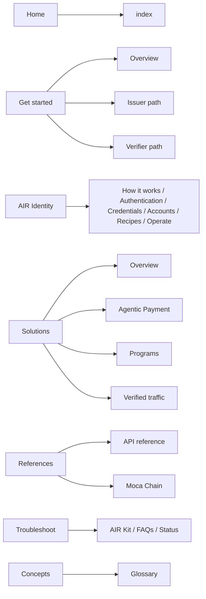

# Docs navigation restructure

## Approach

- Use `tabs` + `menu` (not the `dropdowns` primary pattern) so the top bar survives and the existing `nav-tabs` styling in [custom.css](custom.css) (lines 268-317) keeps working. Each menu item gets its own sidebar.
- **No file moves for kept pages.** Pages are re-homed by editing [docs.json](docs.json) only, so URLs like `/learn/architecture` (17 inbound links) stay valid. Only one new file is created (`concepts/glossary.mdx`).
- AIR Agents is intentionally omitted until content exists.
- Every deleted page gets an explicit `redirects` entry.

## 1. New navigation (docs.json)

**Home** — unchanged (`index`).

**Get started** (`menu`):

- *Overview*: `airkit/index`, `airkit/usage/getting-started`, `learn/when-to-use-airkit`, `airkit/environments`, `airkit/platform-matrix`, `airkit/usage/installation`, `airkit/usage/initialization`, `airkit/integrating-using-ai`
- *Issuer path*: `airkit/quickstart/index`, `airkit/quickstart/issue-credentials`, `recipes/kyc-credential-on-event`, `recipes/loyalty-points-issuance`
- *Verifier path*: `airkit/quickstart/verify-credentials`, `recipes/verify-credential-in-app`

**AIR Identity** (groups):

- *How it works* (new group, from Understand): `learn/architecture`, `learn/airkit/credentials`, `learn/airkit/integration-workflow`, `learn/advanced-topics/zktls`, `learn/advanced-topics/privacy-and-compliance`
- *Security*: `learn/security/overview`, `credential-security`, `data-privacy`, `security-checklist`
- *Authentication*, *Credentials*, *Accounts & wallet*: unchanged from the current AIR Kit tab
- *Recipes*: `recipes/index`, `recipes/wagmi-integration`, `recipes/custom-auth-integration`
- *Operate*: `airkit/airkit-dashboard`, `jwks-setup`, `backend-hosting`, `config-theming`, `config-language` (troubleshooting sub-group removed, moves to Troubleshoot)

**Solutions** (`menu`):

- *Overview*: `solutions/index`, `solutions/partner-economics`, `solutions/compliance-faq`
- *Agentic Payment*: `solutions/fintech` (placeholder; current content is compliance gating and investor proofs, not agent payments, so replace or re-scope when Agentic Payment docs exist)
- *Programs*: `solutions/loyalty`, `solutions/gaming`, `solutions/ticketing`, `solutions/telco`
- *Verified traffic*: `solutions/advertising`, `solutions/identity`, group "KYC (Veriff powered by zkMe)" with `kyc/`*

**References** (`menu`, renamed from Reference):

- *API reference*: groups `REST API` / `Web SDK` / `Flutter SDK` each with `"tag": "Identity"`; `Releases` (`airkit/release-notes`, `airkit/usage/migration-compatibility`). `airkit/flutter/troubleshooting` removed from Flutter SDK group.
- *Moca Chain*: current Moca Chain groups, with `learn/moca-coin` added to *Introduction*, `mocachain/help/faq` removed (to Troubleshoot), `mocachain/native-dapps/airkit-dashboard` removed (deleted, duplicate).

**Troubleshoot** (groups):

- *AIR Kit*: `airkit/troubleshooting/common-errors`, `sdk-issues`, `credential-issues`, `airkit/flutter/troubleshooting`
- *FAQs*: `learn/help/faq`, `mocachain/help/faq`
- *Status*: `status`

**Concepts**: `concepts/glossary` (single page).

Remove the `Understand`, `AIR Kit`, `Moca Chain`, `Reference` tabs. Navbar links (Changelog, Status, Partner with us, Dashboard) unchanged.

## 2. New page: `concepts/glossary.mdx`

Thin alphabetical glossary (AIR Account, AIR Credential, CAK, Issuer, Verifier, Verification Program, Schema, Verifiable Presentation, ZK proof, zkTLS, Moca Chain, $MOCA, DStorage, Paymaster, Session key, Smart account). Seed definitions from `learn/airkit/key-features.mdx` and `learn/airkit/features-developer-benefits.mdx` before deleting them. Each term links to its canonical page.

## 3. Content edits

- [airkit/usage/account/supported-chains.mdx](airkit/usage/account/supported-chains.mdx): add a `<Note>` or "Related" line linking to `/mocachain/using-moca-chain/network-information` (RPC/chain details for Moca Chain).
- [index.mdx](index.mdx) line 69: repoint `href="/learn/index"` to `/solutions` (learn/index is deleted).
- [learn/airkit/integration-workflow.mdx](learn/airkit/integration-workflow.mdx): repoint link to `/airkit/how-to-use` to `/airkit/usage/getting-started` (how-to-use is deleted).
- Optional: check `learn/use-cases/identity-verification.mdx` (555 words) for anything not already in `solutions/identity.mdx` before deleting; merge if so.

## 4. Deletions (28 files) and redirects

**Hidden today (21):** `airkit/how-to-use`, `airkit/solutions/index`, `learn/advanced-topics/scaling-and-performance`, `learn/airkit/about-airkit`, `learn/airkit/features-developer-benefits`, `learn/build-on-moca`, `learn/core-problems-addressed`, `learn/integrating-using-ai`, `learn/use-cases/{identity-verification,programmable-money,verifiable-user-onboarding}`, `learn/vision/{index,comparison-with-centralized-identity-systems}`, `learn/why-now/{index,digital-identity,privacy-security,regulatory-landscape}`, `mocachain/native-dapps/{air-wallet,moca-proof}`, `mocachain/technical-details/zktls`, `mocachain/using-moca-chain/build-on-mocachain`.

**Currently in nav, retired (7):** `learn/index`, `learn/target-users-stakeholders`, `learn/moca-chain`, `learn/vision/ecosystem`, `learn/programs-events`, `learn/airkit/key-features`, `mocachain/native-dapps/airkit-dashboard`.

**Redirect targets** (add to `redirects` in docs.json):

- Vision/marketing (`why-now/*`, `vision/*`, `core-problems-addressed`, `target-users-stakeholders`, `build-on-moca`, `programs-events`, `learn/index`) -> `/solutions`
- `learn/moca-chain`, `mocachain/using-moca-chain/build-on-mocachain` -> `/mocachain`
- `learn/airkit/about-airkit`, `airkit/how-to-use`, `airkit/solutions/index` -> `/airkit`
- `learn/integrating-using-ai` -> `/airkit/integrating-using-ai`
- `learn/airkit/key-features`, `learn/airkit/features-developer-benefits` -> `/concepts/glossary`
- `learn/use-cases/identity-verification`, `verifiable-user-onboarding` -> `/solutions/identity`; `programmable-money` -> `/solutions/fintech`
- `learn/advanced-topics/scaling-and-performance` -> `/mocachain/technical-details/architecture`
- `mocachain/technical-details/zktls` -> `/learn/advanced-topics/zktls`; `mocachain/native-dapps/air-wallet`, `moca-proof` -> `/mocachain`; `mocachain/native-dapps/airkit-dashboard` -> `/airkit/airkit-dashboard`
- Fix existing broken redirect: `/airkit/templates/plug-and-play` currently points to non-existent `/airkit/templates/plug-and-play-verifier`; change destination to `/airkit/quickstart/verify-credentials`.

Keep `snippets/*` untouched (they are imports, not pages).

## 5. Verification

- `mint validate` (schema: a tab may hold `menu` OR `groups`, not both at the same level).
- `mint broken-links`.
- `mint dev` visual check: top-bar dropdowns render for Get started / Solutions / References; `custom.css` tab styling intact on desktop and mobile; menu item hover state acceptable or add minimal CSS.
- Confirm no page appears in two nav locations (`rg` for duplicate paths in docs.json).

