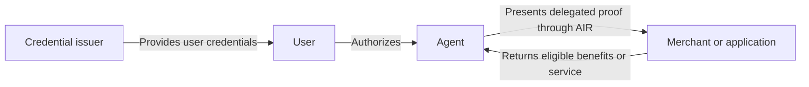

import AgenticIdentityAvailability from "/snippets/agentic-identity-availability.mdx";

AIR Agent's product model connects an agent to the person it represents. Account binding and credential verification, available through the [Agent APIs](/agentic-identity/partner-agent-api), provide the starting point. The target delegated flow adds scoped authority and user-bound proof handoff so applications can evaluate the relationship between agent and user.

Agentic Identity is the core focus. Agentic identity for commerce is the first validation wedge: helping agents carry the verified context that lets merchants recognize a customer, apply the right benefits, and respond safely to a purchase request.

<AgenticIdentityAvailability />

## Why identity matters for agent traffic

When a person shops directly, a merchant can recognize their account, membership, and entitlements. When an agent shops for them, that context needs to travel with the request.

A customer should be able to use a shopping agent and still receive their member price. A merchant should be able to verify eligibility and the agent's authority before applying that benefit. AIR provides the identity connection between the two.

In the target commerce flow, a user authorizes an agent to present their loyalty tier to a merchant. The merchant verifies the claim and, where supported, the delegated authority before applying an accepted member benefit. The agent remains identifiable as the actor, while the user remains the person who granted authority. The binding and delegation chain establish that relationship; an agent identity alone does not.

## Where you fit

| If you have… | Your role | What AIR adds |
| --- | --- | --- |
| An agent platform or personal assistant | Help users discover and complete tasks | User-approved identity and benefits that agents can present to applications. |
| A publisher, marketplace, or application with agent traffic | Connect users and agents with relevant services | A way to recognize permitted claims behind an agent interaction. |
| Products, services, or a merchant network | Serve customers arriving through agents | Verification of eligibility, membership, and delegated authority. |
| An existing identity or loyalty program | Issue facts about your users | Credentials that users can present through their agents to accepting applications. |

One organization can fill several roles. A marketplace might distribute agent experiences, verify customers, and issue its own loyalty credentials.

Start with [Partner fit](/agentic-identity/partners) to identify an initial integration.

## What AIR connects

The diagram shows the target relationship between participants, rather than a released end-to-end contract.

AIR Identity provides the user identity and credential layer, with account and credential services exposed through [AIR Kit](/airkit/index). Issuers sign facts they can support. Users control the approved disclosure. Applications verify the evidence and apply their own acceptance rules.

The agent platform provides the assistant experience. Merchants provide products and benefits. Payment providers handle the payment flow selected for the integration. AIR connects identity and authority across these interactions.

## From recognition to relevant offers

The starting point is recognizing benefits a user already holds: membership, loyalty status, or eligibility. The longer-term direction is for merchants to make offers available to agents based on verified, user-approved eligibility.

A merchant could offer a first-purchase discount to eligible customers while an agent is finding products for its user. The offer becomes information the agent can consider alongside price, quality, and the user's preferences.

Read [Offers for agents](/agentic-identity/offers-for-agents) for this proposed model and its boundaries.

## Explore

- [How it works](/agentic-identity/how-it-works): account binding, delegation, and verification.
- [Delegation and consent](/agentic-identity/delegation-and-consent): what an agent may disclose and do.
- [Commerce use cases](/agentic-identity/use-cases): membership pricing, eligibility, and travel.
- [Integration options](/agentic-identity/integration-options): Plugin, SDK, Agent APIs, and planned Widget.
- [Agent API quickstart](/agentic-identity/partner-agent-api): bind an agent, then list and verify credentials.
