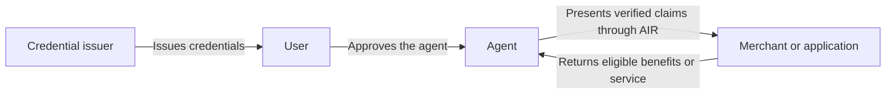

import AgenticIdentityAvailability from "/snippets/agentic-identity-availability.mdx";

AIR Agents connects an AI agent to the person it represents. An application that receives a request from the agent can check whom the agent acts for, what it may do, and which verified claims apply, such as a membership tier or an age threshold.

One of the most common use cases is Commerce. Agents carry the verified context that lets a merchant recognize a customer, apply the right benefits, and respond safely to a purchase request.

<AgenticIdentityAvailability />

## Why identity matters for agent traffic

When a person shops directly, a merchant can recognize their account, membership, and entitlements. When an agent shops for them, that context needs to travel with the request.

A customer using a shopping agent should still receive their member price. The merchant should be able to check eligibility and the agent's authority before applying it. AIR provides the identity link between the two.

For example, a user lets an agent present their loyalty tier to a merchant. The merchant checks the claim and the agent's authority, then applies the member benefit. The agent stays identifiable as the actor, and the user stays the person who granted the authority. An agent identity on its own does not establish that relationship; the agent's binding to the user's AIR Account does.

## Where you fit

| If you have… | Your role | What AIR adds |
| --- | --- | --- |
| An agent platform or personal assistant | Help users discover and complete tasks | User-approved identity and benefits that agents can present to applications. |
| A publisher, marketplace, or application with agent traffic | Connect users and agents with relevant services | A way to recognize permitted claims behind an agent interaction. |
| Products, services, or a merchant network | Serve customers arriving through agents | Verification of eligibility, membership, and the agent's authority. |
| An existing identity or loyalty program | Issue facts about your users | Credentials that users can present through their agents to accepting applications. |

One organization can fill several roles. A marketplace might distribute agent experiences, verify customers, and issue its own loyalty credentials.

Start with [Partner fit](/agentic-identity/partners) to identify an initial integration.

## What AIR connects

AIR provides the user identity and credential layer, through [AIR Kit](/airkit/index) and the [Agent APIs](/agentic-identity/partner-agent-api). Issuers sign facts they can support. Users approve what is disclosed. Applications verify the evidence and apply their own acceptance rules.

The agent platform provides the assistant experience. Merchants provide products and benefits. Payment providers handle the payment flow chosen for the integration.

## From recognition to relevant offers

The starting point is recognizing benefits a user already holds: membership, loyalty status, or eligibility. Later, merchants could make offers available to agents based on verified, user-approved eligibility.

For example, a merchant could offer a first-purchase discount to eligible customers while an agent is finding products for its user. The agent weighs the offer alongside price, quality, and the user's preferences. See [Offers for agents](/agentic-identity/offers-for-agents).

## Explore

- [How it works](/agentic-identity/how-it-works): binding, authority, and verification.
- [Delegation and consent](/agentic-identity/delegation-and-consent): what an agent may disclose and do, and how users approve and withdraw access.
- [Commerce use cases](/agentic-identity/use-cases): membership pricing, eligibility, and travel.
- [Integration options](/agentic-identity/integration-options): Agent APIs, Plugin and SDK.
- [Agent API quickstart](/agentic-identity/partner-agent-api): bind an agent, then list and verify credentials.
