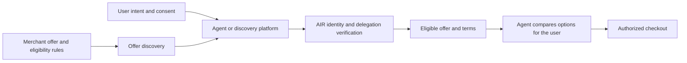

<Note>
  This page describes the longer-term product direction for identity-based offers. It is not documentation for a released advertising marketplace or campaign API.
</Note>

| Area | Current position |
| --- | --- |
| Membership or entitlement recognition | Suitable starting point for pilots. |
| Merchant offer discovery | Proposed model. |
| Campaign API or marketplace | Not released. |
| Attribution and revenue sharing | Not defined. |
| AIR Agent Coupon | Candidate concept; no coupon format or API. |

An agent helping someone shop can consider merchant offers as part of its product search. The proposed offers model connects those offers to verified eligibility, with the user's consent.

The merchant defines the audience and benefit. The user authorizes the necessary proof. The agent receives an eligible offer and evaluates it against the user's request.

## From verified traffic to agentic commerce

AIR's [verified audience model](/solutions/advertising) uses credentials to support consent-based audience decisions. AIR Agents extends that to an agent acting for the user: the receiving application can evaluate both the user's claims and the agent's authority.

The proposed commerce model brings that evidence into product discovery. Publishers and agent platforms provide distribution, merchants provide eligible offers, and AIR connects the identity and verification steps. An offer can reach the agent while it is working on the user's purchase intent.

## Example: a first-purchase offer

A user in Hong Kong asks an agent to find a skincare product. A merchant wants to introduce its product to eligible first-time customers and offers a one-time 50% discount.

In this illustrative flow:

1. The merchant defines the offer, eligibility conditions, expiry, and redemption terms.
2. The agent identifies the offer as potentially relevant to the user's request.
3. The user authorizes the evidence needed to check eligibility, such as a supported location claim.
4. The merchant verifies that evidence and determines first-purchase eligibility using an agreed source or its own customer records.
5. The agent receives the eligible price and terms, then compares the product with other options.
6. The user or authorized agent completes checkout under the applicable purchase permissions.

The example does not assume that a first-time-customer credential already exists. The merchant and integration team must agree how that condition is established and how one-time use is enforced.

## How the participants connect

The flow is conceptual. There is no discovery API, matching service, or payment protocol for it yet.

## Why merchants participate

A merchant can make its acquisition offer available at the moment an agent is looking for a product. Eligibility evidence can support a specific benefit without requiring the merchant to receive the user's entire profile.

The intended commercial model connects distribution from agent platforms and publishers with merchant-funded acquisition. Pricing, settlement between participants, attribution, and revenue sharing are not yet defined.

## The agent's responsibility to the user

An offer is information for the agent to evaluate. A large discount does not establish that a product is suitable. The agent should consider the user's requirements, total price, quality, delivery, and offer restrictions, and make any sponsored treatment clear.

Later purchases require their own valid authority. A successful first purchase does not create consent for recurring orders, continued disclosure, or ongoing advertising.

## What a pilot must define

To run this model as a pilot, agree how offers are published and discovered, which claims and issuers are accepted, what the user approves, and how the merchant verifies eligibility. Also define redemption limits, attribution, handling of disclosed data, and what happens when evidence is unavailable.

Existing [membership-pricing flows](/agentic-identity/use-cases#membership-pricing) provide a narrower starting point: verify an entitlement the user already holds and return the corresponding benefit.
