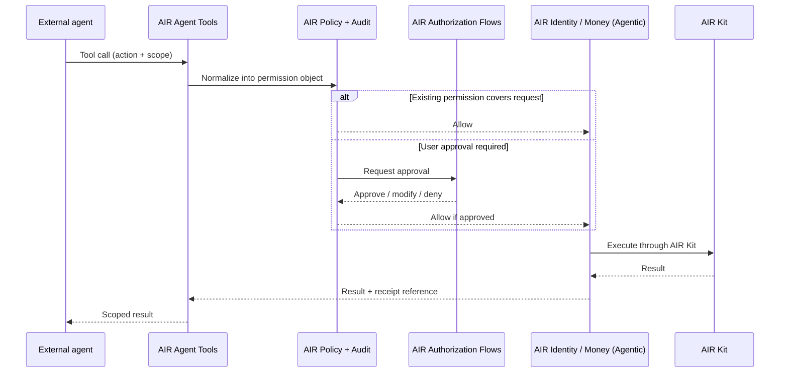
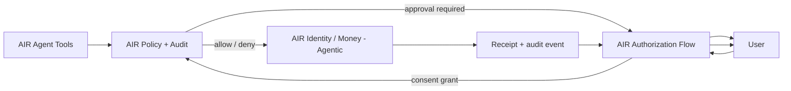

Builder surfaces are how you make an agent, app, or workflow AIR-capable without
rebuilding AIR's identity, wallet, credential, or payment stack. They package AIR's
capabilities into four things: a way to **bind** an agent, **tools** the agent calls,
**authorization flows** the user approves, and **integration assets** that get you to a
working integration fast.

<Info>
**Positioning.** Builder surfaces plug into existing agents, apps, and frameworks —
they are **not** an agent framework and don't replace yours. Pick a delivery path
(Skill / Plugin or AIR AI SDK) on [Integration paths](/airai/integration-paths).
</Info>

<a id="air-account-binding" />

## AIR Account Binding

Before an agent can call anything, the user connects their AIR account to that external
agent through **AIR Account Binding** — a scoped grant that records who owns the agent
(Butler or Concierge) and what it is allowed to do.

Once bound, the agent gets scoped access to:

- manage AIR account funds across Web3 and Web2 rails,
- match status or gate access using the user's identity,
- share identity data within the scope it was granted.

Binding establishes the relationship; the tools below expose the capabilities.

## AIR Agent Tools

AIR Agent Tools expose AIR's identity, money, consent, policy, and audit capabilities in
formats agents can call directly. An agent issues a structured tool call; AIR normalizes
it into a permission object, runs it through policy, and returns a result the agent can
consume.

### Surfaces

<CardGroup cols={2}>
  <Card title="MCP tools and servers" icon="plug">
    Model Context Protocol tools and servers for agent-callable identity, credential, wallet, payment, policy, and audit actions.
  </Card>
  <Card title="Agent-callable APIs" icon="code">
    REST and SDK APIs agents can call directly, with the same permission and audit semantics as MCP tools.
  </Card>
  <Card title="Plugin interfaces" icon="puzzle-piece">
    Plugin surfaces for agents, chatbots, apps, and workflows that need lightweight, scoped capability access.
  </Card>
  <Card title="Tool schemas and sandbox actions" icon="vial">
    Schemas, sample agent actions, and a sandbox to develop and test integrations safely before going live.
  </Card>
</CardGroup>

### What an agent can call

| Domain | Example tool calls |
| --- | --- |
| **Identity — get user data** | Request preferences, profile fields, loyalty status, eligibility, traveler details, or delivery address under policy. |
| **Identity — share data / proofs onward** | Request a proof, generate a verifiable presentation, send an encrypted payload, run a freshness or revocation check. |
| **Money — spend mandates** | Request a spend mandate with budget, merchant scope, category scope, expiry, and approval threshold. |
| **Money — payment authorization** | Request a merchant-bound payment authorization within an existing mandate. |
| **Money — receipts and refunds** | Retrieve a payment receipt, request a refund, or open a dispute. |
| **Policy and audit** | Check binding status, list active permissions, fetch audit events for a user, agent, or task. |

### What an agent receives

Agent Tools return **scoped capabilities, not raw secrets**. Every tool call resolves
into one of: a permission grant; a proof, attestation, or verifiable presentation; an
encrypted payload addressed to a third party; a delivery confirmation; a spend mandate
or payment authorization; a payment instrument or token reference; a receipt; or a
policy decision (allow / deny / approval required / expired / revoked).

<Warning>
Agents never receive raw user keys, credential issuer keys, wallet signing keys, card
numbers, or rail credentials. They receive the **result** of a permitted action.
</Warning>

### How a tool call flows through AIR

Every tool call produces an audit event. See [AIR Policy + Audit](/airai/policy-audit)
for the event model.

<a id="authorization-flows" />

## AIR Authorization Flows

AIR Authorization Flows are the embeddable user approval and control surface. Drop them
into your agent, app, or partner surface and users can approve, limit, revoke, and audit
what an agent does. They are signed and rendered by AIR, so users see a consistent
approval experience even when the embedding surface is third-party.

### Approval flows

Ask the user to approve a sensitive agent action before it executes.

| Flow | What the user approves |
| --- | --- |
| **Data-access approval** | What context the agent can read — fields, scope, purpose, retention. |
| **Proof-sharing approval** | A specific proof or attestation being shared to a named recipient. |
| **Spend mandate approval** | A budget cap, merchant scope, category scope, expiry, and approval threshold. |
| **Payment confirmation** | A specific charge — amount, merchant, rail — within an existing mandate. |

### Control flows

Let the user manage what already exists.

| Flow | What the user controls |
| --- | --- |
| **Revocation** | Cancel an individual permission, mandate, or proof reference. |
| **Receipts** | Inspect machine-readable evidence for any past action. |
| **Audit trail** | Browse the history of every identity disclosure, payment, mandate, and revocation. |
| **Budgets and limits** | Adjust caps, thresholds, and category scope on active mandates. |
| **Permission state** | See active grants, expirations, and active agent bindings at a glance. |

### What an approval prompt shows

Every approval prompt presents the same essential context — whether it's for data, a
proof, or a payment: **what** is being requested, **why** (the stated purpose, bound to
the permission for later audit), **who** receives it, and **when** it expires (plus any
approval thresholds). The user can **approve**, **modify the scope**, or **deny** — and
the result becomes a consent record bound to the permission object.

### How they fit with Agent Tools and Policy + Audit

Approval flows are triggered by AIR Policy + Audit when an action requires confirmation.
Control flows are user-initiated. What partners can embed:

| Surface | What partners can embed |
| --- | --- |
| **Web app** | Drop-in components for approval, payment confirmation, revocation, receipt views. |
| **Mobile app** | Native approval and control surfaces through SDKs or webview. |
| **Agent runtime** | Out-of-band approval prompts triggered from the agent's tool call. |
| **Enterprise console** | Audit trail and revocation surfaces for managed users. |

<a id="integration-assets" />

## AI Integration Assets

Integration Assets are the materials that turn AIR's existing developer platform into
something an AI coding agent — or a developer using one — can integrate against quickly.
This is **not a separate developer platform**; these assets are added into the existing
[AIR Developer Platform](https://developers.sandbox.air3.com/dashboard) and the AIR Kit docs.

### AI-specific implementation assets

- **AI-consumable docs** — structured documentation an AI coding agent can read and act on.
- **Tool schemas** — machine-readable schemas for every AIR Agent Tool.
- **Integration recipes** — opinionated, end-to-end paths for common integrations.
- **Examples** — annotated code samples for identity, money, and audit flows.
- **Test flows** — runnable test scripts for sandbox integration.

### Developer platform additions

- **CLI flows** — install, scaffold, test, and deploy AIR-enabled agents.
- **SDK wrappers** — language-specific wrappers for AIR Agent Tools.
- **Sandbox** — isolated environment for end-to-end identity, money, and audit testing.
- **Local testing** — run AIR flows locally before connecting to live services.
- **Reference integrations** — full sample projects integrators can fork.

<Tip>
**Use AIR's contextual options.** The docs site supports copy-to-LLM and direct
integration with ChatGPT, Claude, Perplexity, Grok, and the AIR MCP server. Use the
contextual menu to pull AIR documentation straight into the AI coding agent you're
building with.
</Tip>

## Building with builder surfaces

<Steps>
  <Step title="Bind your agent to AIR">
    Register your agent in the AIR Developer Platform and obtain agent credentials. This
    [AIR Account Binding](#air-account-binding) establishes who owns the agent (Butler or
    Concierge) and what relationship type AIR applies.
  </Step>
  <Step title="Pick a surface — MCP, API, or plugin">
    For LLM-native agents, MCP is usually fastest. For server-side workflows, the REST
    API is more direct. As a rule of thumb, **Butler agents** install a lightweight
    [Skill / Plugin](/airai/integration-paths) while **Concierge agents** build against
    the fuller **AIR AI SDK**.
  </Step>
  <Step title="Wire up Authorization Flows">
    Pair Agent Tools with [Authorization Flows](#authorization-flows) so users can
    approve, limit, or revoke what the agent does.
  </Step>
  <Step title="Use the sandbox">
    Run end-to-end identity, money, and audit calls against the sandbox before going live.
  </Step>
</Steps>

<Note>
**Example — travel agent.** A travel agent calls Agent Tools to request a user
eligibility proof, payment authorization, and receipt. The user sees a single approval
prompt covering the data, the payment scope, and the expiry. The merchant receives a
proof and a payment authorization in agreed formats. The agent receives the booking
result and a machine-readable receipt.
</Note>

## How this relates to AIR Kit

[AIR Kit](/airkit/index) is the base SDK and infrastructure layer — auth, credentials,
wallet, payments, loyalty, and APIs. Builder surfaces don't replace it; they make the
AIR Kit surface usable for agent builders by adding agent-native binding, tools, approval
flows, schemas, recipes, and sandbox flows on top. For underlying SDK reference, see
[AIR Kit overview](/airkit/index), [Quick setup](/airkit/usage/getting-started),
[Recipes](/recipes/index), and the [API reference](/api-reference/introduction).

## Next

- [Integration paths](/airai/integration-paths) — choose Skill / Plugin or AIR AI SDK and get started.
- [AIR Policy + Audit](/airai/policy-audit) — the layer that decides when an Authorization Flow is required.
- [Reference architecture](/airai/concepts/architecture) — where these surfaces sit in the full AIR AI stack.
