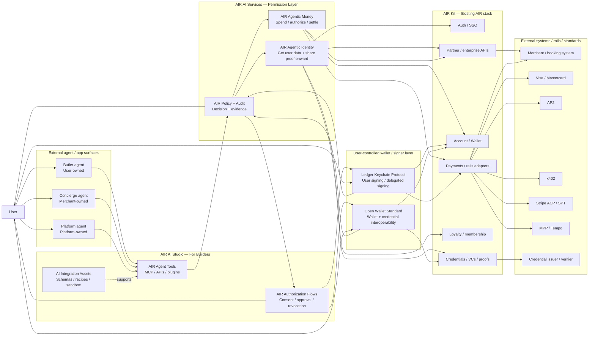

The AIR AI reference architecture composes existing AIR capabilities — identity, account, wallet, credentials, payments, loyalty, APIs, and developer platform — and exposes them to agents through AIR AI Services and AIR AI Studio.

<Info>
**Architecture stance.** AIR does not build the agent, the payment rail, or a new commerce protocol. AIR uses the existing AIR stack and exposes it to agents through a permission, policy, and audit layer.
</Info>

## Architecture principles

1. **Use the existing AIR stack first.** Compose existing identity, money, credential, wallet, payment, loyalty, and API capabilities before inventing new systems.
2. **Build infrastructure, not agents.** Butler, Concierge, and Platform agents are external surfaces. AIR provides the permissioned identity, money, policy, audit, and integration layers those agents call.
3. **Don't build new rails or commerce protocols.** AIR integrates with x402, AP2, Stripe ACP / SPT, Visa TAP, Mastercard Agent Pay / KYA, and MPP / Tempo. AIR provides the identity, money, policy, and audit layer above them.
4. **Identity and money are separate authorities, governed by one policy layer.** Identity controls what an agent can know, prove, collect, store, or share. Money controls what an agent can spend, authorize, hold, route, or settle.
5. **Every sensitive action is permissioned and auditable.** No sensitive agent action bypasses consent, policy, revocation, and audit.
6. **Minimize raw data exposure.** Use proof-only disclosure, selective disclosure, encrypted payloads, attestations, and freshness checks wherever raw data is not required.
7. **Design for all three agent relationships.** Butler (user-owned), Concierge (merchant / enterprise-owned), Platform agent (platform / network / verifier-owned).

## System overview

AIR AI has product-facing, permission, signer, base infrastructure, and external integration layers.

| Layer | Role | What it owns technically |
| --- | --- | --- |
| **External agent / app surface** | Butler, Concierge, or Platform agent interface that initiates a task. | User intent, task context, merchant / platform requirement, agent runtime, app UX. |
| **AIR AI Studio** | Builder-facing integration layer. | AIR Agent Tools, AIR Authorization Flows, AI Integration Assets, MCP / API / plugin surfaces, schemas, sandbox, recipes. |
| **AIR AI Services** | User-and-agent-facing permission model. | AIR Agentic Identity, AIR Agentic Money, AIR Policy + Audit. |
| **User-controlled wallet / signer layer** | User approval, signing, custody, and wallet / credential interoperability boundary. | Ledger Keychain Protocol, Open Wallet Standard, signer UX, wallet authority, credential presentation, transaction intent, delegated signing. |
| **AIR Kit** | Base AIR SDK / infrastructure layer. | Auth / SSO, credentials, wallet, account, payments, loyalty, APIs, enterprise integrations. |
| **External systems and rails** | Systems AIR integrates with, not replaces. | Merchants, booking systems, credential issuers, verifiers, Visa, Mastercard, AP2, x402, Stripe, MPP / Tempo, enterprise APIs. |

## The architectural invariant

Every sensitive agent action flows through the same control pattern.

> **External agent request → AIR Agent Tools → AIR Policy + Audit decision → AIR Authorization Flow / signer action if required → AIR Agentic Identity or AIR Agentic Money execution through AIR Kit → External system / rail / verifier → audit receipt**

This produces four outputs every time:

1. **Permission check** — was the agent allowed to ask?
2. **Identity / money action** — what data, proof, payment, mandate, or receipt was created?
3. **Policy decision** — allowed, denied, expired, revoked, or user approval required.
4. **Audit evidence** — user receipt, merchant receipt, audit event, proof, revocation status, or compliance artifact.

## Component map

## Key and custody boundary

AIR does not expose raw user keys, wallet keys, payment credentials, partner API secrets, or sensitive data encryption keys to agents. **Agents receive scoped capabilities, not raw secrets.**

Examples of scoped capabilities:

- permission grants
- proof requests and proof results
- encrypted payloads
- delegated session or task authority
- spend mandates
- payment authorizations
- signed receipts
- revocation and freshness results

<Info>
**Architecture rule.** Agents can trigger approved actions, but they should not directly hold the underlying keys or credentials that make those actions possible.
</Info>

The Ledger Keychain Protocol and Open Wallet Standard sit in the user-controlled signer / wallet authority boundary — not in the same architectural bucket as payment rails. They are ways for the user, wallet, or delegated signer to approve, sign, present credentials, or hand off transaction intent before AIR Kit executes against credentials, wallets, payments, or external rails.

## Primary components

| Component | Purpose | What it outputs |
| --- | --- | --- |
| **AIR Agent Tools** | Agent-callable interface for identity, money, consent, policy, and audit actions. | Structured tool calls into AIR AI Services. |
| **AIR Authorization Flows** | Embeddable UX for consent, proof-sharing approval, spend mandate approval, payment confirmation, revocation, and audit. | User approval, denial, revocation, receipt view. |
| **AIR Agentic Identity** | Controls how an agent gets user data and shares the right data or proof onward. | Data release, proof, VP, attestation, encrypted payload, freshness / revocation result. |
| **AIR Agentic Money** | Controls what an agent can spend, authorize, hold, route, or settle. | Spend mandate, payment authorization, payment instrument, transaction, receipt, refund / dispute object. |
| **AIR Policy Engine** | Evaluates whether identity or money actions are allowed. | Allow, deny, require approval, require stronger verification, expired, revoked. |
| **AIR Audit / Receipts** | Records what happened and produces evidence for users, merchants, platforms, and compliance. | User receipt, merchant receipt, audit event, compliance artifact, machine-readable receipt. |
| **AIR Kit** | Base SDK / infrastructure that AIR AI Services and AIR AI Studio compose with. | Underlying auth, credential, wallet, payment, loyalty, and API operations. |

## Data and authority model

AIR AI separates **identity authority** from **money authority**, but enforces both through the same policy and audit layer.

### Identity authority

Two streams (see [AIR Agentic Identity](/airai/services/agentic-identity)):

1. **Get user data** — preferences, profile, loyalty status, eligibility, credentials, travel details, delivery address, payment rules.
2. **Share data / proofs onward** — raw field disclosure when required, selective disclosure, proof-only disclosure, encrypted payload, signed attestation, verifiable presentation, freshness / revocation check.

### Money authority

(See [AIR Agentic Money](/airai/services/agentic-money).)

- spend mandate, budget cap, merchant scope, category scope, expiry
- approval threshold
- wallet / account reference, sub-account, burner card / virtual card
- payment authorization, rail selection
- receipt, refund / dispute

### Shared policy object

Every sensitive action is evaluated against a shared policy object containing:

- user, agent, agent relationship, task
- requested permission, requested data / proof / payment
- merchant / counterparty, purpose, expiry
- risk level, approval requirement, revocation state, audit requirements

## Agent relationship architecture

| Relationship | Identity pattern | Money pattern | Policy emphasis |
| --- | --- | --- | --- |
| **Butler** | Richer user context and private data under delegation. | Bounded spend mandates, sub-accounts, payment authority. | User delegation, persistent access, budget caps, revocation, audit. |
| **Concierge** | Service-specific data or proofs only. | Payment for the merchant's product or service. | Purpose binding, proof-only disclosure, retention limits, payment confirmation. |
| **Platform** | Minimize raw data, relay proofs, attestations, encrypted payloads, freshness, revocation. | Route payment intent, proof of payment capability, escrow, settlement metadata. | Trust-minimized handoff, verifiability, freshness, revocation, limited exposure. |

## Next

- [Canonical flows](/airai/concepts/canonical-flows) — end-to-end sequences for Butler, Concierge, Platform agent, and spend mandate.
- [Existing frameworks](/airai/concepts/frameworks) — how AIR maps to x402, AP2, Stripe, Visa, Mastercard, MPP / Tempo, Ledger Keychain Protocol, and Open Wallet Standard.
- [Glossary](/airai/concepts/glossary) — canonical terminology and core technical objects.
