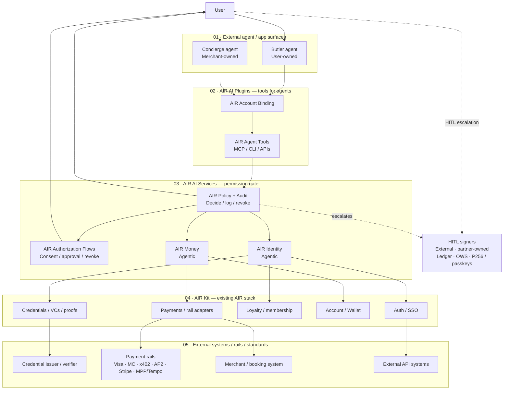

The AIR AI reference architecture composes existing AIR capabilities — identity, account, wallet, credentials, payments, loyalty, APIs, and developer platform — and exposes them to agents through AIR AI Services and AIR AI Studio.

<Info>
**Architecture stance.** AIR does not build the agent, the payment rail, or a new commerce protocol. AIR uses the existing AIR stack and exposes it to agents through a permission, policy, and audit layer.
</Info>

## Architecture principles

1. **Use the existing AIR stack first.** Compose existing identity, money, credential, wallet, payment, loyalty, and API capabilities before inventing new systems.
2. **Build infrastructure, not agents.** Butler and Concierge agents are external surfaces. AIR provides the permissioned identity, money, policy, audit, and integration layers those agents call.
3. **Don't build new rails or commerce protocols.** AIR integrates with x402, AP2, Stripe ACP / SPT, Visa TAP, Mastercard Agent Pay / KYA, and MPP / Tempo. AIR provides the identity, money, policy, and audit layer above them.
4. **Identity and money are separate authorities, governed by one policy layer.** Identity controls what an agent can know, prove, collect, store, or share. Money controls what an agent can spend, authorize, hold, route, or settle.
5. **Every sensitive action is permissioned and auditable.** No sensitive agent action bypasses consent, policy, revocation, and audit.
6. **Minimize raw data exposure.** Use proof-only disclosure, selective disclosure, encrypted payloads, attestations, and freshness checks wherever raw data is not required.
7. **Design for both agent relationships.** Butler (user-owned) and Concierge (merchant / enterprise-owned). See [Agent taxonomy](/airai/concepts/agent-taxonomy).

## Component architecture

AIR AI products are composed from five layers. User-facing agents reach AIR through plugins, every request is gated by the AIR AI Services permission layer, and the existing AIR Kit stack executes against external rails. Human-in-the-loop (HITL) approval sits to the side as an external escalation path.

<Frame caption="The five-layer AIR AI component architecture, with the HITL escalation lane. Click to zoom.">
  
</Frame>

| Layer | Role | What it owns |
| --- | --- | --- |
| **01 · External agent / app surfaces** | Where the user starts — their own agent or a merchant-owned one. | Butler agent (user-owned) and Concierge agent (merchant-owned), agent runtime, app UX, user intent, task context. |
| **02 · AIR AI Plugins — tools for agents** | How an external agent reaches AIR, under a scoped grant. | **AIR Account Binding** (connect an AIR account to an external agent) and **AIR Agent Tools** (MCP / CLI / APIs). Agents get scoped access to manage funds, match status or gate access, and share identity data within the granted scope. |
| **03 · AIR AI Services — permission gate** | The trust boundary — every agent request is checked, logged, and revocable. | AIR Authorization Flows (consent / approval / revoke), AIR Policy + Audit (decide / log / revoke), AIR Identity (Agentic), AIR Money (Agentic). |
| **04 · AIR Kit — existing AIR stack** | The platform AIR already runs — reused, not rebuilt. | Auth / SSO, Credentials (VCs, proofs, loyalty checks), Loyalty (membership and tier credentials), Account / Wallet (balances, sub-accounts), Payments (rail adapters). |
| **05 · External systems / rails / standards** | What AIR connects out to. | Credential issuer / verifier (Moca Chain), payment rails (Visa, Mastercard, x402, AP2, Stripe, MPP / Tempo), merchant / booking systems, external API systems. |

### HITL signers and the custody boundary

High-risk and out-of-scope actions escalate to **HITL signers**, which are **external and partner-owned** — they are not part of AIR Services. They hold final approval through signing protocols (Ledger, Open Wallet Standard) and standard keychains (P256, passkeys).

<Info>
**Escalation rule.** AIR Policy + Audit handles every *in-scope* AIR action. Anything above policy thresholds — high-value, high-risk, or outside a pre-authorized grant — escalates to the user's HITL signers for real-time approval.
</Info>

AIR does not expose raw user keys, wallet keys, payment credentials, partner API secrets, or data encryption keys to agents. **Agents receive scoped capabilities, not raw secrets** — permission grants, proof requests and results, encrypted payloads, delegated session or task authority, spend mandates, payment authorizations, signed receipts, and revocation / freshness results.

## The five-stage lifecycle

Every sensitive agent action flows through the same five stages — **Intent → Permission →
Authorize → Execute → Settle** — with **AIR Audit / Receipts** capturing an event at each
stage.

For the full stage-by-stage breakdown, the lifecycle diagram, and the status-matched
checkout worked example, see [How it works](/airai/how-it-works).

## Component map

## Primary components

| Component | Purpose | What it outputs |
| --- | --- | --- |
| **AIR Account Binding** | Connects a user's AIR account to an external agent under a scoped grant. | Agent binding, scoped grant, session / task authority. |
| **AIR Agent Tools** | Agent-callable interface for identity, money, consent, policy, and audit actions. | Structured tool calls into AIR AI Services. |
| **AIR Authorization Flows** | Embeddable UX for consent, proof-sharing approval, spend mandate approval, payment confirmation, revocation, and audit. | User approval, denial, revocation, receipt view. |
| **AIR Identity (Agentic)** | Controls how an agent gets user data and shares the right data or proof onward. | Data release, proof, VP, attestation, encrypted payload, freshness / revocation result. |
| **AIR Money (Agentic)** | Controls what an agent can spend, authorize, hold, route, or settle. | Spend mandate, payment authorization, payment instrument, transaction, receipt, refund / dispute object. |
| **AIR Policy + Audit** | Evaluates whether identity or money actions are allowed and records evidence. | Allow, deny, require approval, require stronger verification, expired, revoked — plus receipts and audit events. |
| **AIR Kit** | Base SDK / infrastructure that AIR AI Services and AIR AI Studio compose with. | Underlying auth, credential, wallet, payment, loyalty, and API operations. |

## Data and authority model

AIR AI separates **identity authority** from **money authority**, but enforces both through the same policy and audit layer.

### Identity authority

Two streams (see [AIR Identity (Agentic)](/airai/identity)):

1. **Get user data** — preferences, profile, loyalty status, eligibility, credentials, travel details, delivery address, payment rules.
2. **Share data / proofs onward** — raw field disclosure when required, selective disclosure, proof-only disclosure, encrypted payload, signed attestation, verifiable presentation, freshness / revocation check.

### Money authority

(See [AIR Money (Agentic)](/airai/money).)

- spend mandate, budget cap, merchant scope, category scope, expiry
- approval threshold
- wallet / account reference, sub-account, burner card / virtual card
- payment authorization, rail selection
- receipt, refund / dispute

### Shared policy object

Every sensitive action is evaluated against a shared policy object containing:

- user, agent, agent relationship, task
- requested permission, requested data / proof / payment
- merchant / counterparty, purpose, expiry
- risk level, approval requirement, revocation state, audit requirements

## Agent relationship architecture

| Relationship | Identity pattern | Money pattern | Policy emphasis |
| --- | --- | --- | --- |
| **Butler** | Richer user context and private data under delegation. | Bounded spend mandates, sub-accounts, payment authority. | User delegation, persistent access, budget caps, revocation, audit. |
| **Concierge** | Service-specific data or proofs only. | Payment for the merchant's product or service. | Purpose binding, proof-only disclosure, retention limits, payment confirmation. |

## Next

- [Canonical flows](/airai/concepts/canonical-flows) — end-to-end sequences for Butler, Concierge, proof handoff, and spend mandate.
- [Existing frameworks](/airai/concepts/frameworks) — how AIR maps to x402, AP2, Stripe, Visa, Mastercard, MPP / Tempo, Ledger Keychain Protocol, and Open Wallet Standard.
- [Glossary](/airai/concepts/glossary) — canonical terminology and core technical objects.
