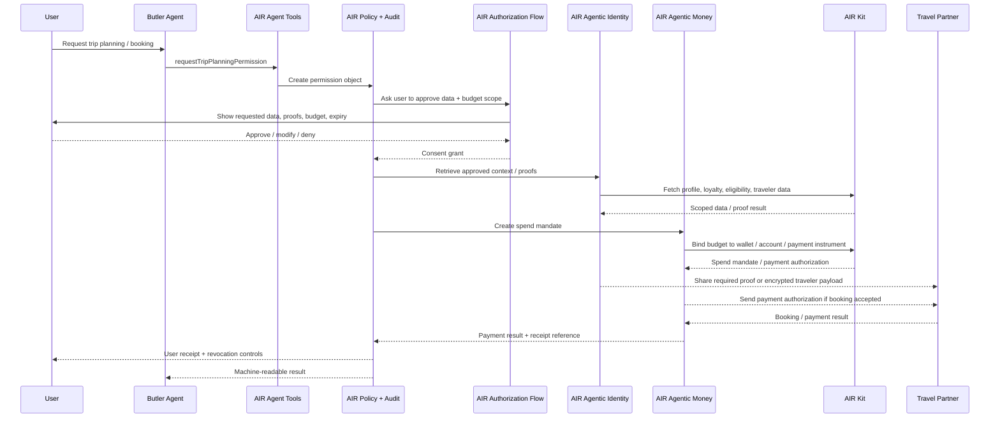
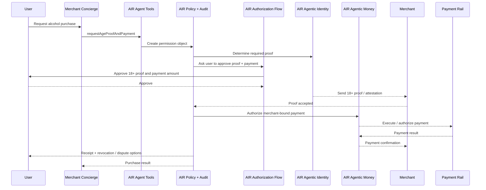
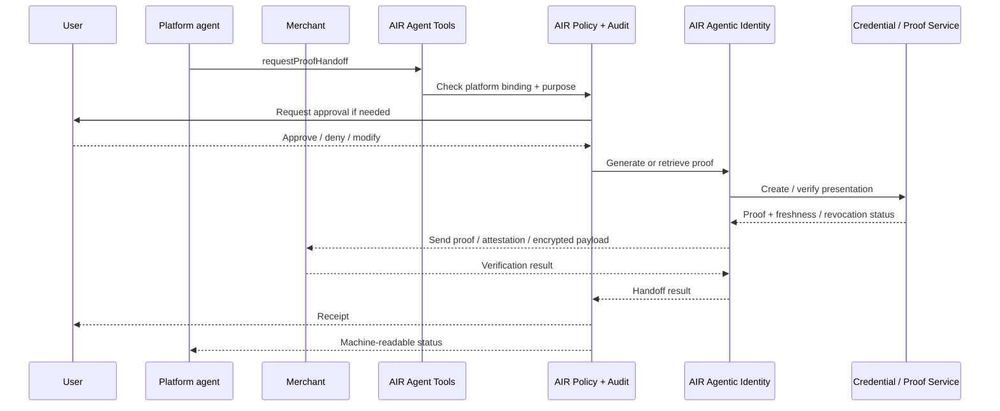
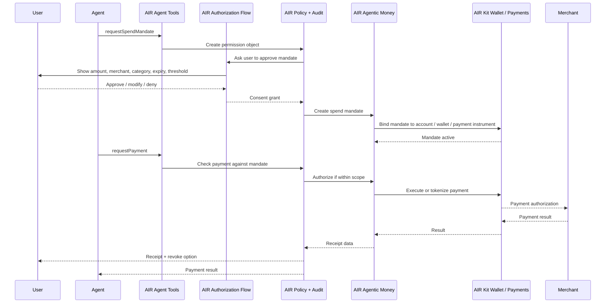

These are the canonical end-to-end flows that exercise the full AIR AI stack — Agent Tools, Authorization Flows, Agentic Identity, Agentic Money, Policy + Audit, AIR Kit, and external partners.

Each flow follows the same architectural invariant:

> Agent request → AIR Agent Tools → AIR Policy + Audit decision → AIR Authorization Flow / signer action if required → AIR Agentic Identity or AIR Agentic Money execution through AIR Kit → External system / rail / verifier → audit receipt.

## Flow A — Butler / Holiday Agent

A user-owned travel assistant plans and books a trip on the user's behalf.

**Trigger.** "Book me a four-day trip to Tokyo next month within $3,000, using my airline loyalty where possible."

**Identity actions**

| Action | Example | Preferred disclosure mode |
| --- | --- | --- |
| Know | Travel preferences, loyalty memberships, preferred airports. | Permissioned context access. |
| Collect | Missing passport number, traveler date of birth, visa details. | User-entered via Authorization Flow. |
| Prove | Loyalty status, eligibility, KYC / age / residency if needed. | Proof or attestation before raw data. |
| Share | Traveler fields required by airline / hotel / insurance provider. | Encrypted payload or scoped field release. |
| Store | Updated trip preference or loyalty number. | Only if user approves retention. |

**Money actions**

| Action | Pattern | Controls |
| --- | --- | --- |
| Spend | Trip budget mandate. | Amount cap, currency, merchant category, expiry. |
| Authorize | Booking payment authorization. | Approval threshold, merchant binding, receipt requirement. |
| Hold | Optional reservation / deposit hold. | Time limit, cancellation rule, release event. |
| Route | Rail adapter or payment path. | Policy-controlled rail selection. |
| Settle | External payment rail. | Receipt, refund, dispute path. |

## Flow B — Concierge / age-gated purchase

A merchant-owned alcohol concierge verifies the user is 18+ before selling alcohol.

**Trigger.** User asks a merchant concierge to buy alcohol.

**Identity actions**

- **Prove** the user is 18+.
- **Share** a proof or attestation to the merchant.
- **Avoid** sharing raw date of birth unless required.
- **Store** only a compliance receipt or proof reference, not unnecessary identity data.

**Money actions**

- Merchant-bound payment request, amount confirmation, rail selection, receipt, refund / dispute reference.

## Flow C — Platform agent / proof handoff

A platform verifies the user once and passes a signed proof or attestation to a merchant or service provider — without exposing raw user data and without requiring a new verification flow.

**Trigger.** A merchant needs to know the user satisfies a requirement, but should not receive raw user data.

**Identity actions**

- **Prove** the user satisfies a requirement.
- **Share** proof, attestation, encrypted payload, freshness, or revocation state.
- **Avoid** raw data exposure unless explicitly required.
- **Revoke** — user or policy can invalidate future reliance.

**Money actions (optional)**

Proof of payment capability, payment intent routing, escrow instructions, settlement metadata.

<a id="spend-mandate" />

## Flow D — Spend mandate

A user grants an agent bounded spend authority and the agent transacts within that mandate.

**Trigger.** Agent needs payment authority to complete a task.

**Policy checks at each request**

- Is the mandate active?
- Is the merchant allowed?
- Is the category allowed?
- Is the amount within cap?
- Is the amount above approval threshold?
- Is the mandate expired or revoked?
- Is the rail allowed?
- Is the payment credential protected from the agent?
- Is a receipt produced?

**Failure cases**

| Failure | Expected behavior |
| --- | --- |
| User denies approval | No mandate created; agent receives denial reason. |
| Amount exceeds cap | Deny or request additional approval. |
| Merchant outside scope | Deny; optionally ask user to amend mandate. |
| Expired / revoked mandate | Deny and return revocation / expiry status. |
| Insufficient funds | Deny or request funding source update. |
| Rail failure | Return failure receipt and retry / fallback option if policy permits. |

## Cross-flow audit events

Every flow produces machine-readable audit evidence. See [AIR Policy + Audit](/airai/services/policy-and-audit) for the full event model.

## Next

- [Reference architecture](/airai/concepts/architecture) — the layers these flows traverse.
- [Existing frameworks](/airai/concepts/frameworks) — how identity and money map to x402, AP2, Stripe, Visa, Mastercard, MPP / Tempo, Ledger, and Open Wallet Standard.
- [Glossary](/airai/concepts/glossary) — canonical terminology used across flows.
