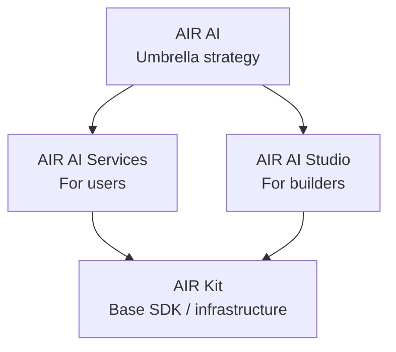

AIR AI is the umbrella for how AIR enables AI agents to safely act on behalf of users — verifying identity, moving money, and accessing services — with the user staying sovereign over data and delegation.

We build **infrastructure** (plugins, MCP tools, SDKs) — not agents. Any agent can integrate with AIR's identity and finance layers. The user stays sovereign; the agent becomes their trusted delegate.

## The hypothesis

AI agents won't scale until they can **act, be trusted, and interoperate**. Intelligence and memory will be solved by the AI labs. What's missing is the stack that lets agents safely carry identity, move money, and access data across the existing internet.

### The gaps we're closing

<CardGroup cols={3}>
  <Card title="Identity gap" icon="id-badge">
    No portable standard for proving *who* an agent acts for and *what* it's authorized to do. Fragmented solutions (Visa TAP, Mastercard Agent Pay, Google AP2) — none interoperable.
  </Card>
  <Card title="Integration gap" icon="puzzle-piece">
    The N×M integration problem. Brittle, doesn't scale. Every agent rebuilding identity, payment, and consent from scratch.
  </Card>
  <Card title="Finance gap" icon="coin">
    Unbounded spend risks. No policy enforcement for agent transactions. No standard receipts, refunds, or revocation.
  </Card>
</CardGroup>

## The hierarchy

AIR AI is not a standalone product. It is composed of two product lines that sit on top of the existing AIR Kit infrastructure.

<CardGroup cols={2}>
  <Card title="AIR AI Services" icon="user-shield" href="/airai/services/index">
    User-facing permission model: AIR Agentic Identity, AIR Agentic Money, and AIR Policy + Audit. Defines what an agent can know, prove, share, collect, store, spend, authorize, hold, route, or settle.
  </Card>
  <Card title="AIR AI Studio" icon="rectangle-terminal" href="/airai/studio/index">
    Builder-facing product line: AIR Agent Tools, AIR Authorization Flows, and AI Integration Assets. Makes agents, AI products, apps, and workflows AIR-capable.
  </Card>
</CardGroup>

## What we build

<Columns cols={2}>
  

    <Check>**MCP servers, CLIs, and plugins**</Check>
    <Check>**Flexible infrastructure** for one-to-many agent use cases</Check>
    <Check>**Identity, money, and reputation capabilities**</Check>
    <Check>**`npm install` today, no-code / 1-click later**</Check>
    <Check>**A user permission control surface** to approve, monitor, limit, and revoke agent access</Check>
  

  

    <Warning>We don't build our own AI agents</Warning>
    <Warning>We don't build our own agent frameworks</Warning>
    <Warning>We don't build agent skills or execution logic — we ship plugins, not skills</Warning>
    <Warning>We don't build agent orchestration or memory</Warning>
  

</Columns>

## Where to go next

<CardGroup cols={2}>
  <Card title="Agent taxonomy" icon="sitemap" href="/airai/agent-taxonomy">
    Butler, Concierge, and Platform agents — and how AIR's permission layer applies to each.
  </Card>
  <Card title="Reference architecture" icon="diagram-project" href="/airai/concepts/architecture">
    The six-layer model from external agent surface down to external rails, and the architectural invariant every sensitive action follows.
  </Card>
  <Card title="Canonical flows" icon="route" href="/airai/concepts/canonical-flows">
    End-to-end sequences: Holiday Agent (Butler), age-gated purchase (Concierge), and proof handoff (Platform agent).
  </Card>
  <Card title="Existing frameworks" icon="layer-group" href="/airai/concepts/frameworks">
    How AIR maps to x402, AP2, Stripe ACP/SPT, Visa TAP, Mastercard Agent Pay/KYA, MPP/Tempo, Ledger Keychain Protocol, and Open Wallet Standard.
  </Card>
</CardGroup>
