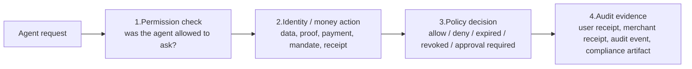

AIR Policy + Audit is the shared control layer that sits across both AIR Identity
(Agentic) and AIR Money (Agentic). It evaluates whether a sensitive agent action is
allowed, surfaces user approval when required, records what happened, and produces
evidence.

<Info>
**Architectural rule.** No sensitive agent action bypasses consent, policy, revocation,
and audit. Every identity or money action produces a machine-readable decision and a
user-visible evidence trail.
</Info>

## What this layer governs

- **What an agent can know, prove, collect, store, share, spend, authorize, hold, route, or settle.**
- **When consent, approval, or user confirmation is required** — based on amount, category, merchant, data sensitivity, or risk signals.
- **Purpose binding** — every permission is tied to a stated purpose, not a blanket grant.
- **Expiry** — every grant has a time bound.
- **Budgets and limits** — total cap, per-transaction cap, recurring cap, approval threshold.
- **Revocation** — users (and policy) can invalidate any permission, mandate, or proof reference.
- **Receipts and logs** — user-visible receipts, merchant receipts, and machine-readable audit events.
- **Compliance evidence** — artifacts a partner or regulator can verify independently.

## Every sensitive action produces four outputs

This pattern applies whether the agent is asking for data, for a proof, for a spend
mandate, or for a payment authorization.

## Permission verbs

Every agent request maps to one of eleven canonical verbs — **know, prove, share,
collect, store, spend, authorize, hold, route, settle, revoke** — and the policy engine
evaluates the verb plus its scope. Full definitions and examples live in the
[glossary](/airai/concepts/glossary#permission-verbs).

## Policy decisions

Every check returns one of:

- **Allow** — the action proceeds; an audit event is emitted.
- **Deny** — the action is blocked; the agent receives the denial reason.
- **Require approval** — user confirmation is needed before proceeding.
- **Require stronger verification** — a higher-assurance signing path is needed (passkey, hardware, Ledger).
- **Expired** — the permission, mandate, or proof has timed out.
- **Revoked** — the permission, mandate, or proof has been explicitly invalidated.

## Audit events

A minimum event model produces machine-readable evidence for users, merchants,
platforms, and compliance.

| Event | When it's emitted |
| --- | --- |
| `agent.binding.created` | An agent is bound to a user, session, or task. |
| `permission.requested` | An agent asks to know, prove, share, spend, or authorize. |
| `permission.approved` | A user or policy approves scope. |
| `permission.denied` | A user or policy denies scope. |
| `permission.revoked` | A user or policy revokes permission. |
| `identity.data.accessed` | AIR accesses approved user data. |
| `identity.proof.generated` | A proof, VP, or attestation is created. |
| `identity.payload.shared` | Data, proof, or encrypted payload is shared onward. |
| `money.mandate.created` | A spend mandate is created. |
| `money.payment.authorized` | A payment authorization is created. |
| `money.payment.completed` | A payment succeeds. |
| `money.payment.failed` | A payment fails. |
| `receipt.generated` | A user, merchant, or machine-readable receipt is produced. |

## What users see, control, and revoke

Through embeddable [Authorization Flows](/airai/builder-surfaces#authorization-flows),
users can:

- Approve, modify, or deny any permission request
- See an active list of grants, mandates, and bindings
- Revoke individual permissions or whole agent bindings
- Audit the history of every identity and money action

Through the policy engine, partners and merchants get:

- Machine-readable decisions and evidence
- Compliance receipts
- Revocation status they can verify independently

## Next

- [AIR Identity (Agentic)](/airai/identity) and [AIR Money (Agentic)](/airai/money) — the two authorities Policy + Audit governs.
- [Reference architecture](/airai/concepts/architecture) — where Policy + Audit sits in the full system.
- [Glossary](/airai/concepts/glossary) — canonical objects (permission object, consent record, spend mandate, receipt, revocation status).
