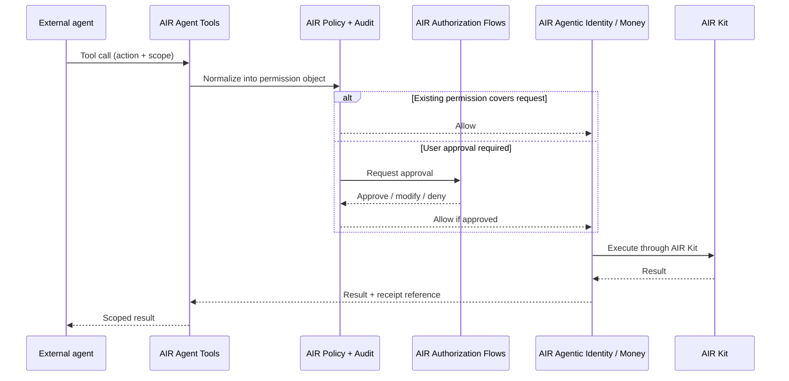

AIR Agent Tools expose AIR's identity, money, consent, policy, and audit capabilities in formats that agents and AI products can call directly. An agent issues a structured tool call; AIR normalizes it into a permission object, runs it through policy, and returns a result the agent can consume.

<Info>
**The core question.** How does an agent call AIR identity, money, consent, policy, and audit capabilities directly?
</Info>

## Surfaces

<CardGroup cols={2}>
  <Card title="MCP tools and servers" icon="plug">
    Model Context Protocol tools and servers for agent-callable identity, credential, wallet, payment, policy, and audit actions.
  </Card>
  <Card title="Agent-callable APIs" icon="code">
    REST and SDK APIs that agents and AI products can call directly, with the same permission and audit semantics as MCP tools.
  </Card>
  <Card title="Plugin interfaces" icon="puzzle-piece">
    Plugin surfaces for agents, chatbots, apps, and workflows that need lightweight, scoped capability access.
  </Card>
  <Card title="Tool schemas and sandbox actions" icon="vial">
    Schemas, sample agent actions, and a sandbox to develop and test agent integrations safely before going live.
  </Card>
</CardGroup>

## What an agent can call

Agent Tools group AIR capabilities by domain. The exact surface depends on the framework (MCP, REST, plugin), but the canonical capabilities are the same.

| Domain | Example tool calls |
| --- | --- |
| **Identity — get user data** | Request preferences, profile fields, loyalty status, eligibility, traveler details, or delivery address under policy. |
| **Identity — share data / proofs onward** | Request a proof, generate a verifiable presentation, send an encrypted payload, run a freshness or revocation check. |
| **Money — spend mandates** | Request a spend mandate with budget, merchant scope, category scope, expiry, and approval threshold. |
| **Money — payment authorization** | Request a merchant-bound payment authorization within an existing mandate. |
| **Money — receipts and refunds** | Retrieve a payment receipt, request a refund, or open a dispute. |
| **Policy and audit** | Check binding status, list active permissions, fetch audit events for a user, agent, or task. |

## What an agent receives

Agent Tools return **scoped capabilities, not raw secrets**. Every tool call resolves into one of:

- a permission grant
- a proof, attestation, or verifiable presentation
- an encrypted payload addressed to a third party
- a delivery confirmation
- a spend mandate or payment authorization
- a payment instrument or token reference
- a receipt
- a policy decision (allow / deny / approval required / expired / revoked)

<Warning>
Agents never receive raw user keys, credential issuer keys, wallet signing keys, card numbers, or rail credentials. They receive the **result** of a permitted action.
</Warning>

## How a tool call flows through AIR

Every tool call produces an audit event. See [AIR Policy + Audit](/airai/services/policy-and-audit) for the event model.

## Building with Agent Tools

A typical integration:

<Steps>
  <Step title="Bind your agent to AIR">
    Register your agent in the AIR Developer Platform and obtain agent credentials. The binding establishes who owns the agent (Butler, Concierge, or Platform) and what relationship type AIR should apply.
  </Step>
  <Step title="Pick a surface — MCP, API, or plugin">
    For LLM-native agents, MCP is usually the fastest path. For server-side workflows, the REST API is more direct. For embedded experiences, plugins keep latency low.
  </Step>
  <Step title="Wire up Authorization Flows">
    Pair Agent Tools with [AIR Authorization Flows](/airai/studio/authorization-flows) so users can approve, limit, or revoke what the agent does.
  </Step>
  <Step title="Use the sandbox">
    Run end-to-end identity, money, and audit calls against the sandbox before going live. Reference flows are available as [AI Integration Assets](/airai/studio/integration-assets).
  </Step>
</Steps>

## Example — travel agent

<Note>
A travel agent calls AIR Agent Tools to request a user eligibility proof, payment authorization, and receipt. The user sees a single approval prompt covering the data, the payment scope, and the expiry. The merchant receives a proof and a payment authorization in agreed formats. The agent receives the booking result and a machine-readable receipt.
</Note>

## Next

- [AIR Authorization Flows](/airai/studio/authorization-flows) — embeddable user approval and control to pair with Agent Tools.
- [AI Integration Assets](/airai/studio/integration-assets) — schemas, recipes, sandbox, and reference integrations.
- [Reference architecture](/airai/concepts/architecture) — where Agent Tools sit in the full AIR AI stack.
