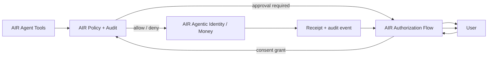

AIR Authorization Flows are the embeddable user approval and control surface for AIR-powered identity and money actions. Drop them into your agent, app, or partner surface and users can approve, limit, revoke, and audit what an agent does.

<Info>
**The core question.** How does a user approve, limit, revoke, and audit what an agent can do inside another app or agent surface?
</Info>

## Two flow categories

### Approval flows

Surfaces that ask the user to approve a sensitive agent action before it executes.

| Flow | What the user approves |
| --- | --- |
| **Data-access approval** | What context the agent can read — fields, scope, purpose, retention. |
| **Proof-sharing approval** | A specific proof or attestation being shared to a named recipient. |
| **Spend mandate approval** | A budget cap, merchant scope, category scope, expiry, and approval threshold. |
| **Payment confirmation** | A specific charge — amount, merchant, rail — within an existing mandate. |

### Control flows

Surfaces that let the user manage what already exists.

| Flow | What the user controls |
| --- | --- |
| **Revocation** | Cancel an individual permission, mandate, or proof reference. |
| **Receipts** | Inspect machine-readable evidence for any past action. |
| **Audit trail** | Browse the history of every identity disclosure, payment, mandate, and revocation. |
| **Budgets and limits** | Adjust caps, thresholds, and category scope on active mandates. |
| **Permission state** | See active grants, expirations, and active agent bindings at a glance. |

## What an approval prompt shows

Every approval prompt presents the user with the same essential context, regardless of whether it's for data, a proof, or a payment.

<CardGroup cols={2}>
  <Card title="What is being requested" icon="circle-info">
    The action the agent wants to take and the data, proof, mandate, or amount involved.
  </Card>
  <Card title="Why it's being requested" icon="bullseye">
    The stated purpose, bound to the resulting permission so it can be audited later.
  </Card>
  <Card title="Who receives it" icon="building">
    The counterparty, merchant, or platform on the other end of the action.
  </Card>
  <Card title="When it expires" icon="hourglass-half">
    The time bound on the grant, plus any approval thresholds for higher-value follow-up actions.
  </Card>
</CardGroup>

The user can **approve**, **modify the scope**, or **deny** — and the result becomes a consent record bound to the permission object.

## Where they live

Authorization Flows are designed to be embedded in any surface that hosts an agent or AI product:

- A consumer app where the user has invited an agent in
- A merchant checkout where a Concierge agent collects approval for a purchase
- A platform surface where a Platform agent routes a proof handoff
- A wallet app where a Butler agent requests payment authority
- An enterprise workflow where a service agent acts on behalf of a managed user

They are signed and rendered by AIR so users see a consistent approval experience even when the embedding surface is third-party.

## How they fit with Agent Tools and Policy + Audit

Approval flows are triggered by AIR Policy + Audit when an action requires user confirmation. Control flows are user-initiated and let the user manage existing grants and inspect evidence.

## Example — embedded mandate approval

<Note>
A commerce app embeds an AIR Authorization Flow so the user can authorize an agent to spend up to **$50** with a specific merchant, in the **office supplies** category, with **24-hour expiry** and **$25** approval threshold. The user sees the full scope in one prompt, approves, and the agent receives a mandate it can use within those bounds. The user can revoke or adjust the mandate from the same surface at any time.
</Note>

## What partners get

| Surface | What partners can embed |
| --- | --- |
| **Web app** | Drop-in components for approval, payment confirmation, revocation, receipt views. |
| **Mobile app** | Native approval and control surfaces through SDKs or webview. |
| **Agent runtime** | Out-of-band approval prompts triggered from the agent's tool call. |
| **Enterprise console** | Audit trail and revocation surfaces for managed users. |

## Next

- [AIR Agent Tools](/airai/studio/agent-tools) — the agent-callable surface that triggers approvals.
- [AIR Policy + Audit](/airai/services/policy-and-audit) — the layer that decides when an Authorization Flow is required.
- [AI Integration Assets](/airai/studio/integration-assets) — recipes and reference apps that show approval flows in context.
