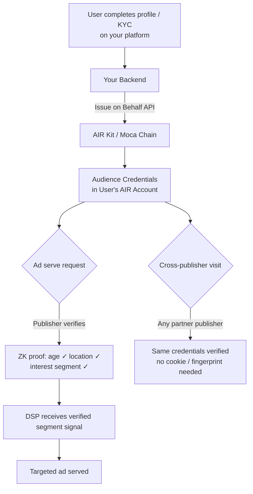

Post-cookie advertising is broken in one specific way: every replacement (contextual, cohort, data clean rooms) still requires someone to hold raw user data and vouch for it. AIR Kit takes a different approach — **users hold their own verified attribute credentials**, and publishers verify them at ad-serve time via ZK proof. The advertiser gets a signal they can trust. No data broker in the middle. No raw data leaves the user's account.

## What You Can Build

- **Verified audience segments** — Issue demographic and interest credentials on profile completion or KYC; advertisers target against cryptographic proof, not self-reported fields
- **Consent-portable targeting** — User consents once; that consent credential is verifiable by any publisher in the ecosystem without a consent management platform re-prompt
- **Age-verified ad targeting** — Gate alcohol, gambling, and adult ad categories behind a ZK age proof — no DOB ever transmitted to the ad server
- **Cross-publisher identity** — A user's verified attributes follow them across publisher sites without third-party cookies or device fingerprinting
- **Bot and fraud resistance** — Issue a "verified human" credential after KYC or passkey authentication; DSPs and SSPs can filter on-credential instead of on-signal
- **Brand safety compliance** — Verify user age and location at serve time without storing the data, satisfying COPPA, GDPR Article 8, and regional ad regulations

## Architecture



## Recommended Schemas

### Verified Audience Segment

```json
{
  "title": "Audience Segment",
  "description": "Publisher-verified user audience attributes — no raw PII included",
  "properties": {
    "publisherId": {
      "type": "string",
      "description": "Issuing publisher identifier"
    },
    "ageRange": {
      "type": "string",
      "enum": ["18-24", "25-34", "35-44", "45-54", "55+"],
      "description": "Verified age bracket — never the actual age or DOB"
    },
    "isOver18": {
      "type": "boolean"
    },
    "isOver21": {
      "type": "boolean"
    },
    "countryCode": {
      "type": "string",
      "description": "ISO 3166-1 alpha-2 — verified registration country"
    },
    "interestSegments": {
      "type": "array",
      "items": { "type": "string" },
      "description": "IAB content categories — e.g. ['IAB19', 'IAB9'] — derived from behaviour, not declared"
    },
    "verifiedAt": {
      "type": "string",
      "format": "date-time"
    }
  },
  "required": ["publisherId", "isOver18", "countryCode", "verifiedAt"]
}
```

### Consent Credential

```json
{
  "title": "Ad Consent",
  "description": "Verifiable record of user consent for personalised advertising",
  "properties": {
    "publisherId": { "type": "string" },
    "consentedTo": {
      "type": "array",
      "items": {
        "type": "string",
        "enum": ["personalised_ads", "cross_site_tracking", "interest_inference"]
      }
    },
    "consentVersion": {
      "type": "string",
      "description": "CMP policy version the user consented to"
    },
    "consentedAt": {
      "type": "string",
      "format": "date-time"
    },
    "expiresAt": {
      "type": "string",
      "format": "date-time",
      "description": "Consent expiry — re-issue when user re-confirms"
    }
  },
  "required": ["publisherId", "consentedTo", "consentVersion", "consentedAt"]
}
```

<Warning>
  Never include name, email address, IP address, device ID, or precise location in `credentialSubject`. Use only **derived, aggregated attributes** — `ageRange`, `countryCode`, `interestSegments`. The ZK proof lets the ad server confirm `isOver18 === true` without ever receiving the subscriber's date of birth.
</Warning>

## Implementation

### Step 1 — Issue audience credentials on profile completion

```javascript
// profile-complete-handler.js
const { getPartnerJwt } = require('./lib/jwt');

const BASE_URL = 'https://api.sandbox.mocachain.org/v1';

async function issueAudienceCredential({ userEmail, profile }) {
  const token = await getPartnerJwt(userEmail);

  const res = await fetch(`${BASE_URL}/credentials/issue-on-behalf`, {
    method: 'POST',
    headers: {
      'Content-Type': 'application/json',
      'x-partner-auth': token,
    },
    body: JSON.stringify({
      issuerDid: process.env.ISSUER_DID,
      credentialId: process.env.AUDIENCE_CREDENTIAL_ID,
      credentialSubject: {
        publisherId: process.env.PUBLISHER_ID,
        ageRange: getAgeRange(profile.birthYear),    // "25-34" — NOT the DOB
        isOver18: profile.age >= 18,
        isOver21: profile.age >= 21,
        countryCode: profile.countryCode,
        interestSegments: profile.iabSegments,       // e.g. ['IAB19', 'IAB9-30']
        verifiedAt: new Date().toISOString(),
      },
      onDuplicate: 'revoke', // refresh when profile or interests update
    }),
  });

  if (!res.ok) throw new Error(`Audience credential issuance failed: ${res.status}`);
  return res.json();
}

function getAgeRange(birthYear) {
  const age = new Date().getFullYear() - birthYear;
  if (age < 25) return '18-24';
  if (age < 35) return '25-34';
  if (age < 45) return '35-44';
  if (age < 55) return '45-54';
  return '55+';
}

// Fire on profile completion and on interest segment updates
userEvents.on('profile:completed', ({ userEmail, profile }) =>
  issueAudienceCredential({ userEmail, profile })
);
userEvents.on('interests:updated', ({ userEmail, profile }) =>
  issueAudienceCredential({ userEmail, profile })
);
```

### Step 2 — Issue consent credential when user accepts CMP

```javascript
// consent-handler.js
async function issueConsentCredential({ userEmail, consentRecord }) {
  const token = await getPartnerJwt(userEmail);

  const expiresAt = new Date();
  expiresAt.setFullYear(expiresAt.getFullYear() + 1); // 1-year consent window

  await fetch(`${BASE_URL}/credentials/issue-on-behalf`, {
    method: 'POST',
    headers: { 'Content-Type': 'application/json', 'x-partner-auth': token },
    body: JSON.stringify({
      issuerDid: process.env.ISSUER_DID,
      credentialId: process.env.CONSENT_CREDENTIAL_ID,
      credentialSubject: {
        publisherId: process.env.PUBLISHER_ID,
        consentedTo: consentRecord.purposes,       // ["personalised_ads", ...]
        consentVersion: consentRecord.policyVersion,
        consentedAt: new Date().toISOString(),
        expiresAt: expiresAt.toISOString(),
      },
      onDuplicate: 'revoke', // replace on re-consent or withdrawal
    }),
  });
}

// Wire into your CMP callback
cmp.on('consent:granted', ({ userEmail, purposes, policyVersion }) =>
  issueConsentCredential({
    userEmail,
    consentRecord: { purposes, policyVersion },
  })
);

// Revoke consent credential on withdrawal
cmp.on('consent:withdrawn', async ({ userEmail }) => {
  // Issue credential with empty consentedTo to effectively invalidate
  // Or call the revoke endpoint directly — see Issue on Behalf API reference
});
```

### Step 3 — Verify audience attributes at ad-serve time

```javascript
// ad-server-verify.js (publisher ad server / prebid adapter)
import { AirService } from '@mocanetwork/airkit';

import { AirService, BUILD_ENV } from "@mocanetwork/airkit";

const airService = new AirService({ partnerId: process.env.PUBLISHER_PARTNER_ID });
await airService.init({ buildEnv: BUILD_ENV.PRODUCTION });

async function getVerifiedAudienceSignal() {
  // Check age compliance for restricted category
  const ageResult = await airService.verifyCredential({
    programId: process.env.AGE_18_VERIFY_PROGRAM_ID,
    // Program rule: isOver18 === true
    // Verifier receives only: COMPLIANT / NON_COMPLIANT
  });

  // Check consent for personalised ads
  const consentResult = await airService.verifyCredential({
    programId: process.env.CONSENT_VERIFY_PROGRAM_ID,
    // Program rule: "personalised_ads" in consentedTo AND expiresAt > now
  });

  return {
    ageVerified: ageResult.status === 'COMPLIANT',
    consentVerified: consentResult.status === 'COMPLIANT',
    // Pass these as verified signals to your DSP bid request
    // No raw age, no raw consent record — just provable booleans
  };
}

// Enrich bid request with verified signals
async function buildBidRequest(adSlot, user) {
  const signals = await getVerifiedAudienceSignal();

  return {
    ...adSlot,
    user: {
      ...user,
      ext: {
        airkit: {
          ageVerified: signals.ageVerified,
          consentVerified: signals.consentVerified,
          // DSP can bid higher on verified signals vs. unverified
        },
      },
    },
  };
}
```

### Step 4 — Cross-publisher audience verification (partner publisher)

Partner publishers integrate AIR Kit as a verifier. One SDK call replaces the cookie sync / data clean room round-trip.

```javascript
// partner-publisher.js
import { AirService } from '@mocanetwork/airkit';

// The PARTNER publisher uses their own Partner ID
const airService = new AirService({ partnerId: 'PARTNER_PUBLISHER_PARTNER_ID' });
await airService.init({ buildEnv: BUILD_ENV.PRODUCTION });

async function verifyAudienceForPartner() {
  const result = await airService.verifyCredential({
    programId: process.env.CROSS_PUB_AUDIENCE_VERIFY_PROGRAM_ID,
    // Program checks: isOver18 === true AND countryCode in allowed list
    // The partner publisher never receives the user's raw profile data
    // They get: COMPLIANT / NON_COMPLIANT — that's it
  });
  return result.status === 'COMPLIANT';
}
```

## Key Patterns

| Pattern | `onDuplicate` | When to Use |
|---------|:-------------:|-------------|
| Initial audience credential | `"ignore"` | Issue once on first profile completion |
| Interest segment refresh | `"revoke"` | Monthly or on significant interest drift |
| Consent granted | `"revoke"` | Always replace with latest consent record |
| Consent withdrawn | Revoke via API | Immediately invalidate consent credential |
| KYC-backed audience | `"revoke"` | Re-issue when KYC result updates |

## Privacy Guarantee

No raw user data — no DOB, no email, no IP, no browsing history — is transmitted during ad verification. The ZK proof flow means the verifier (DSP, SSP, partner publisher) receives only boolean results.

| What the Verifier Sees | What Stays Private |
|------------------------|--------------------|
| `COMPLIANT / NON_COMPLIANT` | Date of birth, exact age |
| `ageRange` (`25-34`) | Full name, email address |
| `isOver18: true` | IP address, device ID |
| `countryCode` (`AU`) | Precise location |
| IAB segment IDs | Browsing history, clickstream |
| Consent expiry date | Declared interests |

## Regulatory Alignment

- **GDPR Article 8** — Age verification without storing DOB satisfies child protection obligations
- **CCPA / CPRA** — Consent credential provides an auditable, user-owned record of opt-in; revocation is instant and on-chain
- **COPPA** — ZK age gate (isOver18 === false blocks serve) without collecting minor data
- **TCF 2.2** — Consent credentials can encode TCF purpose IDs; verifiers check compliance without a centralised CMP dependency

## Examples

The repo uses a venue check-in and merch store; the same event-triggered pattern applies to ad engagement (publisher issues, ad server verifies). Adapt via schema and branding — see the README's "Adapting to Your Vertical" section.

<CardGroup cols={2}>
  <Card title="Fan Attendance — Issuer" icon="github" href="https://github.com/MocaNetwork/air-examples/tree/main/fan-attendance/issuer">
    Venue check-in app: issues attendance credential when the fan scans in at the event.
  </Card>
  <Card title="Fan Attendance — Verifier" icon="github" href="https://github.com/MocaNetwork/air-examples/tree/main/fan-attendance/verifier">
    Merch store app: verifies attendance and unlocks rewards (e.g. discount, exclusive offer).
  </Card>
</CardGroup>

## Next Steps

<Columns cols={2}>
  <Card title="Issue on Behalf — Concepts" icon="book" href="/airkit/usage/credential/issue-on-behalf">
    Server-side issuance without user presence.
  </Card>
  <Card title="Issue on Behalf — API" icon="code" href="/airkit/usage/credential/issue-on-behalf-api">
    Full endpoint reference with error codes.
  </Card>
  <Card title="AIR for Fintech & Payments" icon="credit-card" href="/airkit/guides/air-for-fintech">
    KYC portability and age verification patterns.
  </Card>
  <Card title="Schema Use Cases" icon="list" href="/airkit/usage/credential/schema-use-cases">
    More credential schema examples.
  </Card>
</Columns>
