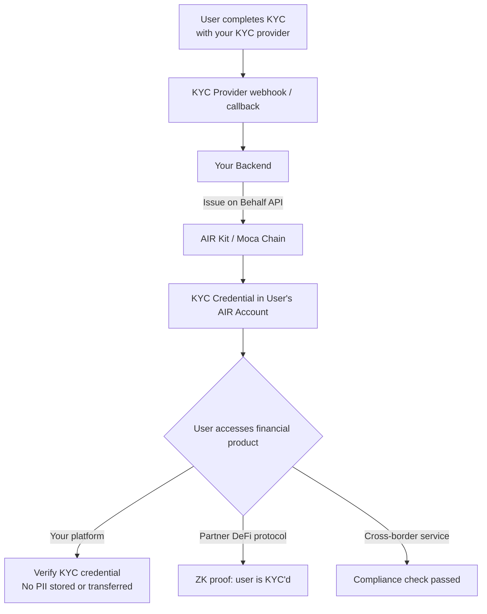

Traditional KYC and compliance verification requires every platform to collect, store, and protect sensitive personal data — creating liability, compliance risk, and repeated friction for users. AIR Kit lets you **issue a KYC credential once**, and any partner platform can verify it via zero-knowledge proof without ever accessing raw PII.

## What You Can Build

- **KYC credentials** — Issue a verified identity attestation the moment a user passes KYC; partner platforms accept it without re-running the check
- **Income / accreditation proofs** — Issue an "Accredited Investor" credential backed by income verification, provable via ZK proof
- **Compliance gating** — Gate DeFi pools, financial products, or high-value transactions behind credential checks
- **Age verification** — Prove a user is 18+ or 21+ without revealing their birthdate to the verifier
- **Cross-border compliance** — One credential, accepted at every partner service in the ecosystem

## Architecture



## Recommended Schema

### KYC Attestation

```json
{
  "title": "KYC Attestation",
  "description": "Identity verification attestation — no raw PII included",
  "properties": {
    "kycLevel": {
      "type": "string",
      "enum": ["basic", "enhanced", "institutional"],
      "description": "Level of KYC verification completed"
    },
    "kycProvider": {
      "type": "string",
      "description": "Name of the KYC provider (e.g. 'Jumio', 'Onfido')"
    },
    "verifiedAt": {
      "type": "string",
      "format": "date-time"
    },
    "countryCode": {
      "type": "string",
      "description": "ISO 3166-1 alpha-2 country code"
    },
    "isOver18": {
      "type": "boolean"
    },
    "isOver21": {
      "type": "boolean"
    }
  },
  "required": ["kycLevel", "kycProvider", "verifiedAt", "isOver18"]
}
```

<Warning>
  Never include raw PII — full name, passport number, date of birth, address — in `credentialSubject`. Store only **attestations and derived facts**. ZK proofs let verifiers confirm `isOver18 === true` without seeing any underlying data.
</Warning>

## Implementation

### Step 1 — Issue KYC credential from your KYC webhook

```javascript
// kyc-webhook.js  — called when your KYC provider sends a completion event
const { getPartnerJwt } = require('./lib/jwt');

async function issueKycCredential({ userEmail, kycResult }) {
  if (kycResult.status !== 'APPROVED') return; // only issue on success

  const token = await getPartnerJwt(userEmail);

  const res = await fetch('https://api.sandbox.mocachain.org/v1/credentials/issue-on-behalf', {
    method: 'POST',
    headers: {
      'Content-Type': 'application/json',
      'x-partner-auth': token,
    },
    body: JSON.stringify({
      issuerDid: process.env.ISSUER_DID,
      credentialId: process.env.KYC_CREDENTIAL_ID,
      credentialSubject: {
        kycLevel: kycResult.level,             // "basic" | "enhanced" | "institutional"
        kycProvider: 'YourKYCProvider',
        verifiedAt: new Date().toISOString(),
        countryCode: kycResult.countryCode,    // e.g. "US", "GB"
        isOver18: kycResult.age >= 18,
        isOver21: kycResult.age >= 21,
      },
      onDuplicate: 'revoke', // re-issue if KYC level upgrades
    }),
  });

  if (!res.ok) throw new Error(`KYC credential issuance failed: ${res.status}`);
  return res.json();
}

// Express webhook endpoint
app.post('/webhooks/kyc', async (req, res) => {
  const { userEmail, kycResult } = req.body;
  await issueKycCredential({ userEmail, kycResult });
  res.json({ ok: true });
});
```

### Step 2 — Gate financial products with credential verification

```javascript
// fintech-gate.js  (frontend)
import { AirService } from '@mocanetwork/airkit';

import { AirService, BUILD_ENV } from "@mocanetwork/airkit";

const airService = new AirService({ partnerId: process.env.PARTNER_ID });
await airService.init({ buildEnv: BUILD_ENV.SANDBOX });

async function requireKyc() {
  const result = await airService.verifyCredential({
    programId: process.env.KYC_VERIFY_PROGRAM_ID,
    // Verifier program rule: kycLevel is "enhanced" or "institutional"
  });

  if (result.status !== 'COMPLIANT') {
    throw new Error('KYC_REQUIRED');
  }
  return result;
}

// Gate a high-value transaction
try {
  await requireKyc();
  proceedWithTransaction();
} catch (err) {
  if (err.message === 'KYC_REQUIRED') showKycOnboarding();
}
```

### Step 3 — Age verification gate (no birthdate exposed)

```javascript
// age-gate.js  (frontend)
async function requireAgeVerification() {
  const result = await airService.verifyCredential({
    programId: process.env.AGE_18_VERIFY_PROGRAM_ID,
    // Program checks: isOver18 === true  — verifier never sees the actual age/DOB
  });
  return result.status === 'COMPLIANT';
}
```

## Privacy Guarantee

The ZK proof flow means the verifier receives **only a boolean result**. No raw KYC data, no PII, no liability for the verifier to store sensitive documents.

| What the Verifier Sees | What Stays Private |
|-----------------------|--------------------|
| `COMPLIANT / NON_COMPLIANT` | Full name, passport / ID number |
| Credential expiry date | Date of birth |
| KYC level (`basic` / `enhanced`) | Residential address |
| Issuer DID | Income figures, net worth |
| `isOver18: true` | Actual age |

## Examples

<CardGroup cols={2}>
  <Card title="KYC Passport — Issuer" icon="github" href="https://github.com/MocaNetwork/air-examples/tree/main/kyc-passport/issuer">
    KYC provider app: issues credentials once; user carries the proof to other platforms.
  </Card>
  <Card title="KYC Passport — Verifier" icon="github" href="https://github.com/MocaNetwork/air-examples/tree/main/kyc-passport/verifier">
    Lending platform app: verifies the credential and accepts the proof without re-running KYC.
  </Card>
  <Card title="ZK Age Verification — Issuer" icon="github" href="https://github.com/MocaNetwork/air-examples/tree/main/zk-age-verification/issuer">
    Identity provider app: issues age credential; user proves 18+ without revealing date of birth.
  </Card>
  <Card title="ZK Age Verification — Verifier" icon="github" href="https://github.com/MocaNetwork/air-examples/tree/main/zk-age-verification/verifier">
    iGaming platform app: verifies age-gate (e.g. 18+) via ZK proof; no PII received.
  </Card>
</CardGroup>

## Next Steps

<Columns cols={2}>
  <Card title="Issue on Behalf — Concepts" icon="book" href="/airkit/usage/credential/issue-on-behalf">
    Server-side issuance without user presence.
  </Card>
  <Card title="Architecture & Data Flow" icon="diagram-project" href="/airkit/guides/overview">
    ZK proof flow end-to-end.
  </Card>
  <Card title="Partner Authentication" icon="key" href="/airkit/usage/partner-authentication">
    JWT signing setup for your backend.
  </Card>
  <Card title="Verifying Credentials" icon="shield-check" href="/airkit/usage/credential/verify">
    SDK verification reference.
  </Card>
</Columns>
