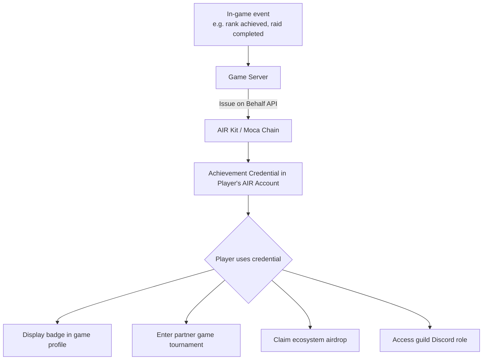

In gaming, players rebuild their reputation from zero every time they switch titles. AIR Kit lets you **make achievements, badges, and identities portable** — a player's rank in your game becomes a credential they carry to partner games, tournaments, communities, and airdrops.

## What You Can Build

- **Achievement badges** — Issue on-chain proof that a player reached Diamond rank, completed a raid, or earned a title
- **Cross-game identity** — Let players carry their AIR Account identity and credentials into any game in the Moca ecosystem
- **Anti-cheat / bot gating** — Verify a player holds a "verified human" or KYC credential before allowing tournament entry
- **Airdrop gating** — Reward only players who hold specific credentials (e.g. "played > 100 hrs", "held NFT for 90 days")
- **Guild / DAO membership** — Issue guild membership credentials that gate Discord roles, in-game benefits, and governance votes

## Architecture



## Recommended Schema

```json
{
  "title": "Game Achievement",
  "description": "On-chain proof of a player achievement or rank",
  "properties": {
    "gameId": {
      "type": "string",
      "description": "Unique identifier of the game"
    },
    "achievementId": {
      "type": "string",
      "description": "Unique identifier of the achievement"
    },
    "achievementName": {
      "type": "string",
      "description": "Display name — e.g. 'Diamond Rank Season 3'"
    },
    "tier": {
      "type": "string",
      "enum": ["Bronze", "Silver", "Gold", "Platinum", "Diamond"],
      "description": "Achievement tier"
    },
    "earnedAt": {
      "type": "string",
      "format": "date-time"
    },
    "season": {
      "type": "string",
      "description": "Game season, e.g. 'Season 3'"
    }
  },
  "required": ["gameId", "achievementId", "achievementName", "earnedAt"]
}
```

## Implementation

### Step 1 — Issue an achievement credential on rank-up

```javascript
// game-server.js
const { getPartnerJwt } = require('./lib/jwt');

async function issueAchievement({ playerEmail, achievement }) {
  const token = await getPartnerJwt(playerEmail);

  const res = await fetch('https://api.sandbox.mocachain.org/v1/credentials/issue-on-behalf', {
    method: 'POST',
    headers: {
      'Content-Type': 'application/json',
      'x-partner-auth': token,
    },
    body: JSON.stringify({
      issuerDid: process.env.ISSUER_DID,
      credentialId: process.env.ACHIEVEMENT_CREDENTIAL_ID,
      credentialSubject: {
        gameId: process.env.GAME_ID,
        achievementId: achievement.id,
        achievementName: achievement.name,
        tier: achievement.tier,
        earnedAt: new Date().toISOString(),
        season: 'Season 3',
      },
      onDuplicate: 'ignore', // achievements are one-time — don't re-issue
    }),
  });

  if (!res.ok) throw new Error(`Achievement issuance failed: ${res.status}`);
  return res.json();
}

// Wire into your game's rank-up event system
gameEvents.on('player:rank_up', async ({ playerEmail, newRank }) => {
  await issueAchievement({
    playerEmail,
    achievement: {
      id: `rank-${newRank.toLowerCase()}`,
      name: `${newRank} Rank`,
      tier: newRank,
    },
  });
  console.log(`Achievement issued to ${playerEmail}: ${newRank}`);
});
```

### Step 2 — Gate tournament entry with credential check

```javascript
// tournament-gate.js  (frontend or server)
import { AirService } from '@mocanetwork/airkit';

import { AirService, BUILD_ENV } from "@mocanetwork/airkit";

const airService = new AirService({ partnerId: process.env.PARTNER_ID });
await airService.init({ buildEnv: BUILD_ENV.SANDBOX });

async function canJoinTournament() {
  const result = await airService.verifyCredential({
    programId: process.env.TOURNAMENT_VERIFY_PROGRAM_ID,
    // Verifier program rule: tier === "Diamond" AND gameId === process.env.GAME_ID
  });
  return result.status === 'COMPLIANT';
}

const eligible = await canJoinTournament();
if (!eligible) {
  showMessage('Reach Diamond rank to enter this tournament.');
}
```

### Step 3 — Cross-game SSO with AIR Account

Partner games authenticate using the same AIR Account — no new signup required.

```javascript
// partner-game.js  (any game integrating AIR Kit)
import { AirService } from '@mocanetwork/airkit';

const airService = new AirService({ partnerId: 'PARTNER_GAME_PARTNER_ID' });
await airService.init({ buildEnv: BUILD_ENV.SANDBOX });

await airService.login(); // player logs in with existing AIR Account
const user = await airService.getUserInfo();
// user.email is the same across all games — portable, unified identity
```

### Step 4 — Bot-resistant airdrop gating

Only distribute tokens to players who provably hold a real game achievement — filtered on-chain.

```javascript
// airdrop.js  (server-side)
async function getEligiblePlayers(allPlayers) {
  const eligible = [];
  for (const { email } of allPlayers) {
    const token = await getPartnerJwt(email);
    // Use your verifier program to check credential status per player
    // In production, batch this with your own DB query first to reduce API calls
    const res = await fetch(
      `https://api.sandbox.mocachain.org/v1/credentials/status?...`,
      { headers: { 'x-partner-auth': token } }
    );
    const { vcStatus } = await res.json();
    if (vcStatus === 'ONCHAIN') eligible.push(email);
  }
  return eligible;
}
```

## Examples

<CardGroup cols={2}>
  <Card title="ZK Age Verification — Issuer" icon="github" href="https://github.com/MocaNetwork/air-examples/tree/main/zk-age-verification/issuer">
    Identity provider app: issues age credential; user proves 18+ without revealing date of birth.
  </Card>
  <Card title="ZK Age Verification — Verifier" icon="github" href="https://github.com/MocaNetwork/air-examples/tree/main/zk-age-verification/verifier">
    iGaming or age-gated app: verifies age via ZK proof and grants access; no PII received.
  </Card>
</CardGroup>

## Next Steps

<Columns cols={2}>
  <Card title="Issue on Behalf API" icon="code" href="/airkit/usage/credential/issue-on-behalf-api">
    Full endpoint reference and error codes.
  </Card>
  <Card title="Issuing Credentials (SDK)" icon="badge-check" href="/airkit/usage/credential/issuing-credentials">
    User-initiated issuance for in-game claim flows.
  </Card>
  <Card title="Schema Use Cases" icon="list" href="/airkit/usage/credential/schema-use-cases">
    More schema examples including event pass.
  </Card>
  <Card title="AIR for Ticketing & Events" icon="ticket" href="/airkit/guides/air-for-ticketing">
    Attendance credentials for live events.
  </Card>
</Columns>
