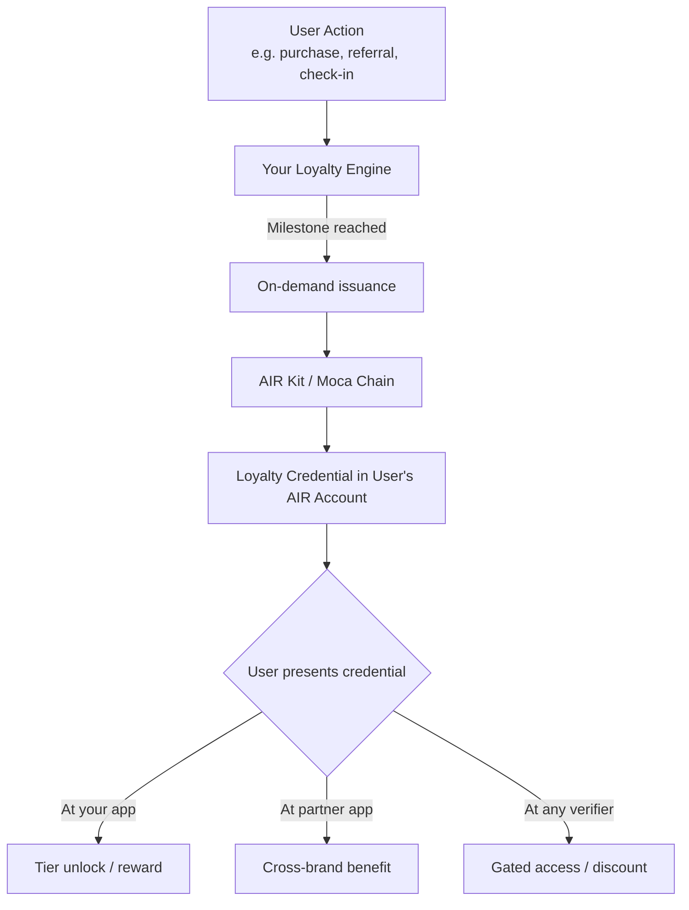

Loyalty programs today are siloed — a user's Gold status with one brand is invisible to another. AIR Kit lets you issue **verifiable loyalty credentials** that users carry in their AIR Account and present anywhere in the ecosystem, across brands, apps, and chains.

## What You Can Build

- **Tier credentials** — Issue a "Gold Member" or "VIP" badge that upgrades or revokes automatically as status changes
- **Milestone badges** — Issue a credential when a user reaches 1,000 points, 10 purchases, or any event-driven threshold
- **Cross-platform loyalty** — Allow partner apps to accept your loyalty credentials as proof of status, no API integration required
- **Zero-friction issuance** — Trigger credential issuance from your loyalty engine backend; the user doesn't need to open a wallet or take any action

## Architecture


```mermaid
graph TD
    A["User Action\ne.g. purchase, referral, check-in"] --> B[Your Loyalty Engine]
    B -->|Milestone reached| C[On-demand issuance]
    C --> D[AIR Kit / Moca Chain]
    D --> E[Loyalty Credential in User's AIR Account]

    E --> F{User presents credential}
    F -->|At your app| G[Tier unlock / reward]
    F -->|At partner app| H[Cross-brand benefit]
    F -->|At any verifier| I[Gated access / discount]
```

## Recommended Schema

Create this schema in the [AIR Kit Dashboard](https://developers.sandbox.air3.com/dashboard) under **Issuer → Schema Builder**.

```json
{
  "title": "Loyalty Tier",
  "description": "Brand loyalty membership tier credential",
  "properties": {
    "tier": {
      "type": "string",
      "enum": ["Bronze", "Silver", "Gold", "Platinum"],
      "description": "Current loyalty tier"
    },
    "totalPoints": {
      "type": "number",
      "description": "Lifetime points accumulated"
    },
    "memberSince": {
      "type": "string",
      "format": "date",
      "description": "Date of first loyalty enrollment"
    },
    "brandId": {
      "type": "string",
      "description": "Issuing brand identifier"
    }
  },
  "required": ["tier", "totalPoints", "brandId"]
}
```

## Implementation

### Step 1 — Issue a loyalty credential on milestone

Use **On-demand issuance** to issue silently when a backend event fires. The user's session is not required.

```javascript
// loyalty-engine.js
const { getPartnerJwt } = require('./lib/jwt'); // see Partner Authentication
// issuer-controlled helpers backed by your signing keys
const { buildVc, signVc, encryptToHolder } = require('./lib/credential');

const BASE_URL = 'https://api.sandbox.mocachain.org/v1'; // swap for prod URL on launch

async function issueLoyaltyCredential({ userEmail, tier, totalPoints, memberSince }) {
  const token = await getPartnerJwt(); // JWT must include scope: "issue"

  // Resolve the member's AIR Account
  const init = await fetch(`${BASE_URL}/auth/initialize-user`, {
    method: 'POST',
    headers: { 'Content-Type': 'application/json', 'x-partner-auth': token },
    body: JSON.stringify({ email: userEmail }),
  }).then((r) => r.json());

  // Build, sign (BJJ_SIG_2021), and encrypt the credential to the holder
  const schemaId = process.env.LOYALTY_CRED_ID; // Dashboard → Issuer → Programs
  const vc = buildVc({
    holderDid: init.did,
    schemaId,
    credentialSubject: { tier, totalPoints, memberSince, brandId: process.env.BRAND_ID },
  });
  const encrypted = encryptToHolder(signVc(vc), init.publicKey);

  // Store the encrypted envelope in DStorage
  const res = await fetch(`${BASE_URL}/dstorage/vcs`, {
    method: 'POST',
    headers: { 'Content-Type': 'application/json', 'x-partner-auth': token },
    body: JSON.stringify({
      holderDid: init.did,
      schemaId,
      expiresAt: vc.expirationDate,
      data: encrypted.encryptedData,
      iv: encrypted.iv,
      authTag: encrypted.authTag,
      encryptedKey: encrypted.dataEncPublicKey,
      externalId: vc.id,
    }),
  });
  if (!res.ok) throw new Error(`Issuance failed: ${res.status}`);
  const { storagePath } = await res.json();
  return storagePath;
}

// Hook into your existing loyalty event pipeline
loyaltyEngine.on('tier:upgrade', async ({ userEmail, newTier, totalPoints }) => {
  const storagePath = await issueLoyaltyCredential({
    userEmail,
    tier: newTier,
    totalPoints,
    memberSince: new Date().toISOString().split('T')[0],
  });
  console.log(`Loyalty credential issued: ${storagePath}`);
});
```

### Step 2 — Verify loyalty tier at point of benefit

On your frontend, verify the user holds the required tier before granting access or rewards.

```javascript
// loyalty-gate.js  (frontend)
import { AirService } from '@mocanetwork/airkit';

import { AirService, BUILD_ENV } from "@mocanetwork/airkit";

const airService = new AirService({ partnerId: process.env.PARTNER_ID });
await airService.init({ buildEnv: BUILD_ENV.SANDBOX }); // or BUILD_ENV.PRODUCTION

async function checkLoyaltyTier() {
  const result = await airService.verifyCredential({
    programId: process.env.LOYALTY_VERIFY_PROGRAM_ID, // Dashboard → Verifier → Programs
  });
  // Your verifier program rule: tier === "Gold" (or higher)
  return result.status === 'COMPLIANT';
}

const hasGoldStatus = await checkLoyaltyTier();
if (hasGoldStatus) {
  unlockPremiumContent();
} else {
  showUpgradePrompt();
}
```

## Key Patterns

| Pattern | Reissue behavior | When to Use |
|---------|:-------------------:|-------------|
| Tier upgrade | Revoke + reissue | Always revoke old credential and issue new one |
| One-time milestone badge | Skip if exists | Don't re-issue if credential already held |
| Time-boxed VIP | Set `expirationDate` in subject | Seasonal or campaign-based access |
| Retroactive bulk issuance | Loop `issueLoyaltyCredential` | Migrating existing loyalty members |

## Issuance result

Issuance completes in ~1–4 seconds and returns a `storagePath` once the encrypted credential is stored in DStorage. Use that result to confirm success to the user — no status polling required. The credential is immediately available for the member to present at any verifier.

## Examples

<CardGroup cols={2}>
  <Card title="VIP Status Portability — Issuer" icon="github" href="https://github.com/MocaNetwork/air-examples/tree/main/vip-status-portability/issuer">
    Airline loyalty app: issues tier credential; user carries status to partner brands.
  </Card>
  <Card title="VIP Status Portability — Verifier" icon="github" href="https://github.com/MocaNetwork/air-examples/tree/main/vip-status-portability/verifier">
    Hotel chain app: verifies tier and grants equivalent perks (e.g. room upgrade, lounge).
  </Card>
</CardGroup>

## Next Steps

<Columns cols={2}>
  <Card title="On-demand Issuance — Concepts" icon="book" href="/airkit/usage/credential/issuing-credentials#on-demand-issuance">
    Understand when and why to use On-demand issuance.
  </Card>
  <Card title="On-demand Issuance — API" icon="code" href="/airkit/usage/credential/issuance-api">
    Full endpoint reference with error codes.
  </Card>
  <Card title="Schema Use Cases" icon="list" href="/airkit/usage/credential/schema-use-cases">
    More schema examples including membership and event pass.
  </Card>
  <Card title="Verifying Credentials" icon="shield-check" href="/airkit/usage/credential/verify">
    SDK verification flow reference.
  </Card>
</Columns>
