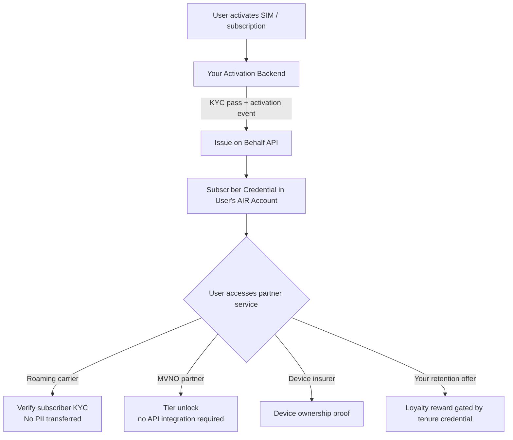

Carriers run identity verification for every new subscriber, but that verified status stays locked inside each operator's silo. A prepaid user who passes KYC at one carrier starts from zero at a roaming partner. AIR Kit lets you **issue a subscriber credential at activation** — so your KYC investment travels with the user across carriers, MVNOs, and partner services.

## What You Can Build

- **Subscriber credentials** — Issue a verified subscriber attestation the moment a user activates; roaming and partner carriers accept it without re-running identity checks
- **Plan tier credentials** — Issue a "Premium" or "Business" tier badge that unlocks partner benefits automatically, with no bilateral API required
- **Device ownership proofs** — Issue a verified device credential (IMEI-bound) for device insurance, warranty, and repair partner integrations
- **Churn intervention** — Trigger a "Loyalty Reward" credential when a subscriber hits a retention milestone; partner services can verify and honour the benefit
- **Roaming partner verification** — Let partner carriers verify a subscriber's KYC status via ZK proof; no PII crosses operator boundaries
- **Age-gated service access** — Gate adult content, gambling, or age-restricted add-ons behind an age credential without storing birthdates

## Architecture



## Recommended Schemas

### Subscriber Credential

```json
{
  "title": "Subscriber Credential",
  "description": "Verified mobile subscriber attestation — no raw PII included",
  "properties": {
    "carrierId": {
      "type": "string",
      "description": "Issuing carrier identifier"
    },
    "planType": {
      "type": "string",
      "enum": ["prepaid", "postpaid", "business", "iot"],
      "description": "Subscription plan category"
    },
    "kycLevel": {
      "type": "string",
      "enum": ["basic", "enhanced", "full"],
      "description": "Level of identity verification completed at activation"
    },
    "activatedAt": {
      "type": "string",
      "format": "date-time"
    },
    "isOver18": {
      "type": "boolean"
    },
    "countryCode": {
      "type": "string",
      "description": "ISO 3166-1 alpha-2 — subscriber's registration country"
    }
  },
  "required": ["carrierId", "planType", "kycLevel", "activatedAt", "isOver18"]
}
```

### Subscriber Loyalty Tier

```json
{
  "title": "Subscriber Loyalty Tier",
  "description": "Carrier loyalty tier based on tenure and spend",
  "properties": {
    "carrierId": { "type": "string" },
    "tier": {
      "type": "string",
      "enum": ["Standard", "Silver", "Gold", "Platinum"],
      "description": "Current loyalty tier"
    },
    "tenureMonths": {
      "type": "number",
      "description": "Months as active subscriber"
    },
    "memberSince": {
      "type": "string",
      "format": "date"
    }
  },
  "required": ["carrierId", "tier", "tenureMonths"]
}
```

<Warning>
  Never include MSISDN (phone number), IMSI, full name, or address in `credentialSubject`. Store only **attestations and derived facts** — `isOver18`, `kycLevel`, `planType`. ZK proofs let partner services confirm subscriber attributes without receiving any underlying data.
</Warning>

## Implementation

### Step 1 — Issue subscriber credential at activation

Your activation system already fires an event when a subscriber passes KYC and activates. Add one Issue on Behalf call to that event handler.

```javascript
// activation-handler.js
const { getPartnerJwt } = require('./lib/jwt');

const BASE_URL = 'https://api.sandbox.mocachain.org/v1';

async function issueSubscriberCredential({ userEmail, activation }) {
  if (activation.kycStatus !== 'APPROVED') return;

  const token = await getPartnerJwt(userEmail);

  const res = await fetch(`${BASE_URL}/credentials/issue-on-behalf`, {
    method: 'POST',
    headers: {
      'Content-Type': 'application/json',
      'x-partner-auth': token,
    },
    body: JSON.stringify({
      issuerDid: process.env.ISSUER_DID,
      credentialId: process.env.SUBSCRIBER_CREDENTIAL_ID,
      credentialSubject: {
        carrierId: process.env.CARRIER_ID,
        planType: activation.planType,          // "prepaid" | "postpaid" | "business"
        kycLevel: activation.kycLevel,          // "basic" | "enhanced" | "full"
        activatedAt: new Date().toISOString(),
        isOver18: activation.age >= 18,
        countryCode: activation.countryCode,    // e.g. "AU", "SG"
      },
      onDuplicate: 'revoke', // re-issue if subscriber upgrades plan / re-verifies
    }),
  });

  if (!res.ok) throw new Error(`Subscriber credential issuance failed: ${res.status}`);
  return res.json();
}

// Hook into your existing activation pipeline
activationPipeline.on('subscriber:activated', async ({ userEmail, activationData }) => {
  await issueSubscriberCredential({ userEmail, activation: activationData });
});
```

### Step 2 — Issue loyalty tier on tenure milestone

```javascript
// churn-prevention.js — runs nightly or on billing cycle
async function issueLoyaltyTierIfEligible({ userEmail, tenureMonths }) {
  const tier =
    tenureMonths >= 36 ? 'Platinum' :
    tenureMonths >= 24 ? 'Gold' :
    tenureMonths >= 12 ? 'Silver' : 'Standard';

  const token = await getPartnerJwt(userEmail);

  await fetch(`${BASE_URL}/credentials/issue-on-behalf`, {
    method: 'POST',
    headers: { 'Content-Type': 'application/json', 'x-partner-auth': token },
    body: JSON.stringify({
      issuerDid: process.env.ISSUER_DID,
      credentialId: process.env.LOYALTY_TIER_CREDENTIAL_ID,
      credentialSubject: {
        carrierId: process.env.CARRIER_ID,
        tier,
        tenureMonths,
        memberSince: getMemberSinceDate(userEmail),
      },
      onDuplicate: 'revoke', // always replace with updated tier
    }),
  });
}

// Run on each billing cycle to keep tiers current
billingCycle.on('invoice:settled', async ({ userEmail, tenureMonths }) => {
  await issueLoyaltyTierIfEligible({ userEmail, tenureMonths });
});
```

### Step 3 — Verify subscriber KYC at a roaming partner

The roaming partner integrates AIR Kit as a verifier. They call one SDK method — they never receive subscriber PII, only a COMPLIANT/NON_COMPLIANT result plus the KYC level.

```javascript
// roaming-partner.js (frontend — partner carrier's app)
import { AirService } from '@mocanetwork/airkit';

import { AirService, BUILD_ENV } from "@mocanetwork/airkit";

const airService = new AirService({ partnerId: process.env.ROAMING_PARTNER_ID });
await airService.init({ buildEnv: BUILD_ENV.PRODUCTION });

async function verifyRoamingSubscriber() {
  const result = await airService.verifyCredential({
    programId: process.env.ROAMING_VERIFY_PROGRAM_ID,
    // Verifier program rule: kycLevel === "enhanced" OR "full"
    // The verifier sees only: COMPLIANT / NON_COMPLIANT
    // No MSISDN, no name, no raw subscriber data
  });

  if (result.status !== 'COMPLIANT') {
    throw new Error('SUBSCRIBER_KYC_REQUIRED');
  }
  return result;
}
```

### Step 4 — Gate age-restricted services

```javascript
// age-restricted-service.js (frontend)
async function requireAgeVerification() {
  const result = await airService.verifyCredential({
    programId: process.env.AGE_18_VERIFY_PROGRAM_ID,
    // Program checks: isOver18 === true — subscriber's birthdate never exposed
  });
  return result.status === 'COMPLIANT';
}

const allowed = await requireAgeVerification();
if (!allowed) showAgeVerificationPrompt();
```

## Key Patterns

| Pattern | `onDuplicate` | When to Use |
|---------|:-------------:|-------------|
| Initial activation | `"ignore"` | Issue once at first activation; don't re-issue if user reinstalls |
| Plan upgrade / re-KYC | `"revoke"` | Always reissue with updated `kycLevel` or `planType` |
| Loyalty tier update | `"revoke"` | Monthly billing cycle refresh |
| Device credential | `"ignore"` | One credential per device — immutable proof of ownership |

## Privacy Guarantee

The roaming partner or MVNO receives **only a boolean result** from the ZK proof. No MSISDN, no IMSI, no subscriber identity document data crosses operator boundaries.

| What the Verifier Sees | What Stays Private |
|------------------------|--------------------|
| `COMPLIANT / NON_COMPLIANT` | MSISDN / phone number |
| `kycLevel` (`basic` / `enhanced` / `full`) | IMSI / SIM data |
| `isOver18: true` | Full name, date of birth |
| `planType` | Address, national ID |
| Credential expiry | Billing history |

## Examples

The repo uses fintech and loyalty app names (KYC provider, lending platform, airline, hotel). The same code adapts to telco (carrier, roaming partner) via schema and branding — see each example's `schema.json` and the README's "Adapting to Your Vertical" section.

<CardGroup cols={2}>
  <Card title="KYC Passport — Issuer" icon="github" href="https://github.com/MocaNetwork/air-examples/tree/main/kyc-passport/issuer">
    KYC provider app: issues credentials once; user carries the proof to other platforms.
  </Card>
  <Card title="KYC Passport — Verifier" icon="github" href="https://github.com/MocaNetwork/air-examples/tree/main/kyc-passport/verifier">
    Lending platform app: verifies the credential and accepts the proof without re-running KYC.
  </Card>
  <Card title="VIP Status Portability — Issuer" icon="github" href="https://github.com/MocaNetwork/air-examples/tree/main/vip-status-portability/issuer">
    Airline loyalty app: issues tier credential; user carries status to partner brands.
  </Card>
  <Card title="VIP Status Portability — Verifier" icon="github" href="https://github.com/MocaNetwork/air-examples/tree/main/vip-status-portability/verifier">
    Hotel chain app: verifies tier and grants equivalent perks (e.g. room upgrade, lounge).
  </Card>
</CardGroup>

## Next Steps

<Columns cols={2}>
  <Card title="Issue on Behalf — Concepts" icon="book" href="/airkit/usage/credential/issue-on-behalf">
    Server-side issuance without user presence.
  </Card>
  <Card title="Issue on Behalf — API" icon="code" href="/airkit/usage/credential/issue-on-behalf-api">
    Full endpoint reference with error codes.
  </Card>
  <Card title="AIR for Fintech & Payments" icon="credit-card" href="/airkit/guides/air-for-fintech">
    KYC portability patterns used in financial services.
  </Card>
  <Card title="Architecture & Data Flow" icon="diagram-project" href="/airkit/guides/overview">
    ZK proof flow end-to-end.
  </Card>
</Columns>
