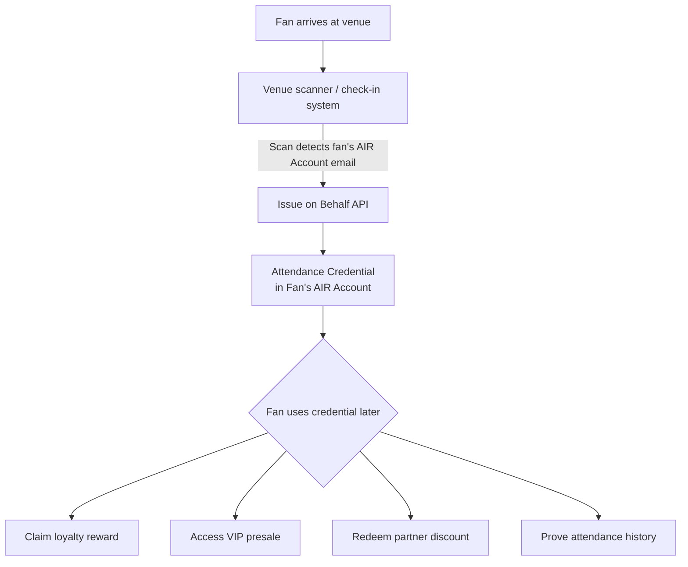

Traditional event tickets are one-time-use and forgotten after the show. AIR Kit lets you transform every venue scan into a **permanent, portable attendance credential** — proof the fan was there, reusable for loyalty rewards, presale access, partner discounts, and cross-brand partnerships.

## What You Can Build

- **Attendance credentials** — Issue a verifiable "I attended X event" badge at check-in
- **Fan loyalty tiers** — Auto-upgrade fans after 5 attended events to "Loyal Fan" credential
- **Exclusive access gating** — Gate VIP lounges, artist meet-and-greets, and presales to verified attendees
- **Cross-brand fan credentials** — Share attendance proof with partner brands (merchandise, hotels, streaming)
- **Anti-scalping** — Gate secondary ticket access behind an attendance credential from a prior event

## Architecture



## Recommended Schema

```json
{
  "title": "Event Attendance",
  "description": "Verifiable proof of physical attendance at a live event",
  "properties": {
    "eventId": {
      "type": "string",
      "description": "Unique event identifier"
    },
    "eventName": {
      "type": "string",
      "description": "Display name — e.g. 'Coachella 2025 Day 1'"
    },
    "venue": {
      "type": "string",
      "description": "Venue name and city"
    },
    "attendedAt": {
      "type": "string",
      "format": "date-time",
      "description": "Timestamp of check-in scan"
    },
    "ticketTier": {
      "type": "string",
      "enum": ["General", "VIP", "Backstage", "Artist"],
      "description": "Ticket category"
    },
    "organizerId": {
      "type": "string",
      "description": "Issuing organizer / promoter identifier"
    }
  },
  "required": ["eventId", "eventName", "attendedAt", "organizerId"]
}
```

## Implementation

### Step 1 — Issue attendance credential at check-in

Your venue scanner calls your backend on each valid scan. The backend issues via Issue on Behalf — the fan does nothing, no wallet open, no UX friction at the door.

```javascript
// venue-checkin.js
const { getPartnerJwt } = require('./lib/jwt');

async function issueAttendanceCredential({ fanEmail, eventDetails }) {
  const token = await getPartnerJwt(fanEmail);

  const res = await fetch('https://api.sandbox.mocachain.org/v1/credentials/issue-on-behalf', {
    method: 'POST',
    headers: {
      'Content-Type': 'application/json',
      'x-partner-auth': token,
    },
    body: JSON.stringify({
      issuerDid: process.env.ISSUER_DID,
      credentialId: process.env.ATTENDANCE_CREDENTIAL_ID,
      credentialSubject: {
        eventId: eventDetails.id,
        eventName: eventDetails.name,
        venue: eventDetails.venue,
        attendedAt: new Date().toISOString(),
        ticketTier: eventDetails.ticketTier,   // "General" | "VIP" | "Backstage"
        organizerId: process.env.ORGANIZER_ID,
      },
      onDuplicate: 'ignore', // one credential per event per fan
    }),
  });

  if (!res.ok) throw new Error(`Attendance issuance failed: ${res.status}`);
  const { coreClaimHash } = await res.json();
  return coreClaimHash;
}

// Called by your ticketing system on each valid scan
app.post('/api/checkin', async (req, res) => {
  const { fanEmail, eventId } = req.body;
  const event = await getEventDetails(eventId);
  const hash = await issueAttendanceCredential({ fanEmail, eventDetails: event });
  res.json({ success: true, coreClaimHash: hash });
});
```

### Step 2 — Gate VIP presale to verified attendees

```javascript
// presale-gate.js  (frontend)
import { AirService } from '@mocanetwork/airkit';

import { AirService, BUILD_ENV } from "@mocanetwork/airkit";

const airService = new AirService({ partnerId: process.env.PARTNER_ID });
await airService.init({ buildEnv: BUILD_ENV.SANDBOX });

async function canAccessPresale() {
  const result = await airService.verifyCredential({
    programId: process.env.PRESALE_VERIFY_PROGRAM_ID,
    // Verifier program rule: organizerId === process.env.ORGANIZER_ID
    // (attended at least 1 prior event by this organizer)
  });
  return result.status === 'COMPLIANT';
}

const isVerifiedFan = await canAccessPresale();
if (isVerifiedFan) {
  showPresaleRegistration();
} else {
  showMessage('Presale access requires verified attendance at a prior event.');
}
```

### Step 3 — Auto-upgrade fans to loyalty tiers after N events

```javascript
// loyalty-tier-check.js — called after each attendance credential issuance
async function checkAndIssueLoyaltyTier(fanEmail) {
  const attendedCount = await getAttendanceCount(fanEmail); // your DB

  if (attendedCount === 5)  await issueLoyaltyTier({ fanEmail, tier: 'Loyal Fan' });
  if (attendedCount === 20) await issueLoyaltyTier({ fanEmail, tier: 'Super Fan' });
}

// issueLoyaltyTier uses the same Issue on Behalf pattern — see AIR for Loyalty guide
```

## Zero-Friction Fan UX

The key advantage for events: **fans never interact with the credential system at the door**. They scan their ticket as normal, the credential lands in their AIR Account in the background, and they use it the next time they want a reward or presale.

<Steps>
  <Step title="Fan scans ticket at the door">
    No app to open, no wallet prompt. Exactly the same experience as today.
  </Step>
  <Step title="Your backend issues the attendance credential">
    Issue on Behalf fires silently. The fan's AIR Account receives the credential on-chain.
  </Step>
  <Step title="Fan opens the app the next day">
    Sees a notification: "You earned a Verified Attendee credential for Coachella 2025."
  </Step>
  <Step title="Fan uses the credential">
    One tap to register for the presale, claim a merchandise discount, or prove their fan tier to a partner brand.
  </Step>
</Steps>

## Examples

<CardGroup cols={2}>
  <Card title="Fan Attendance — Issuer" icon="github" href="https://github.com/MocaNetwork/air-examples/tree/main/fan-attendance/issuer">
    Venue check-in app: issues attendance credential when the fan scans in at the event.
  </Card>
  <Card title="Fan Attendance — Verifier" icon="github" href="https://github.com/MocaNetwork/air-examples/tree/main/fan-attendance/verifier">
    Merch store app: verifies attendance and unlocks rewards (e.g. discount, exclusive offer).
  </Card>
  <Card title="VIP Status Portability — Issuer" icon="github" href="https://github.com/MocaNetwork/air-examples/tree/main/vip-status-portability/issuer">
    Airline loyalty app: issues tier credential; user carries status to partner brands.
  </Card>
  <Card title="VIP Status Portability — Verifier" icon="github" href="https://github.com/MocaNetwork/air-examples/tree/main/vip-status-portability/verifier">
    Hotel chain app: verifies tier and grants equivalent perks (e.g. room upgrade, lounge).
  </Card>
</CardGroup>

## Next Steps

<Columns cols={2}>
  <Card title="AIR for Loyalty & Rewards" icon="gift" href="/airkit/guides/air-for-loyalty">
    Build tier-based loyalty on top of attendance credentials.
  </Card>
  <Card title="Issue on Behalf — API" icon="code" href="/airkit/usage/credential/issue-on-behalf-api">
    Full endpoint reference and error handling.
  </Card>
  <Card title="Issue on Behalf — Concepts" icon="book" href="/airkit/usage/credential/issue-on-behalf">
    When to use server-side vs. user-initiated issuance.
  </Card>
  <Card title="Architecture & Data Flow" icon="diagram-project" href="/airkit/guides/overview">
    End-to-end system overview.
  </Card>
</Columns>
