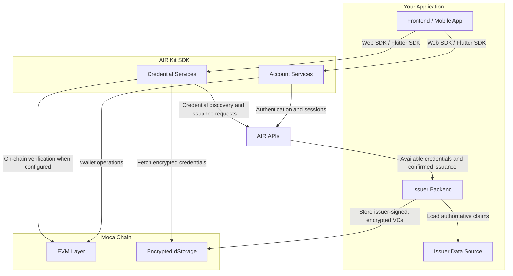
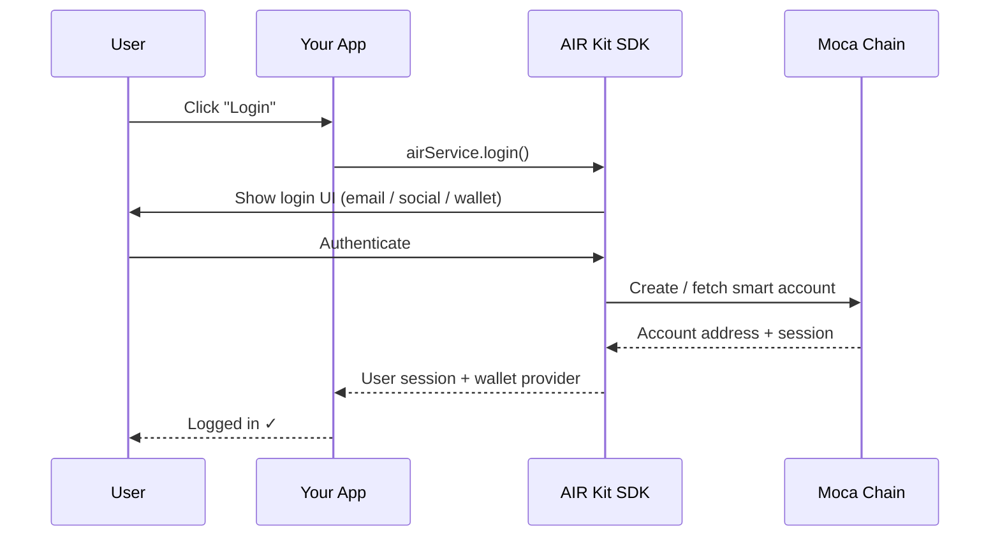
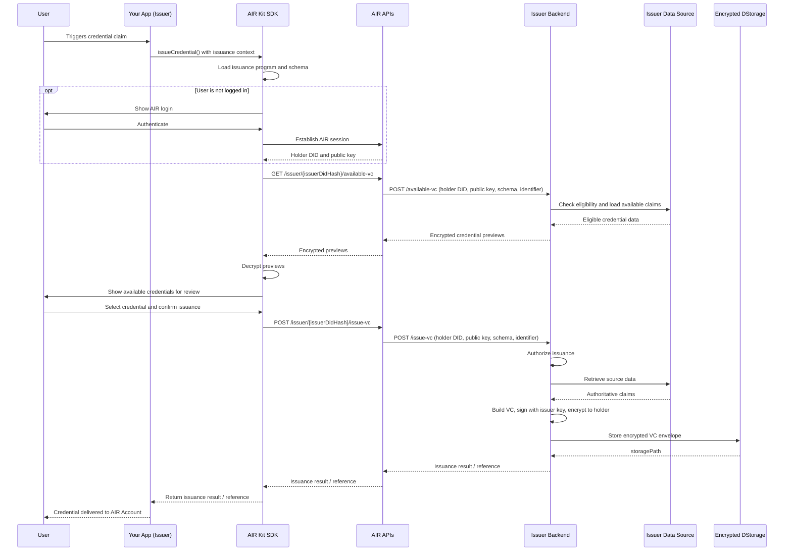
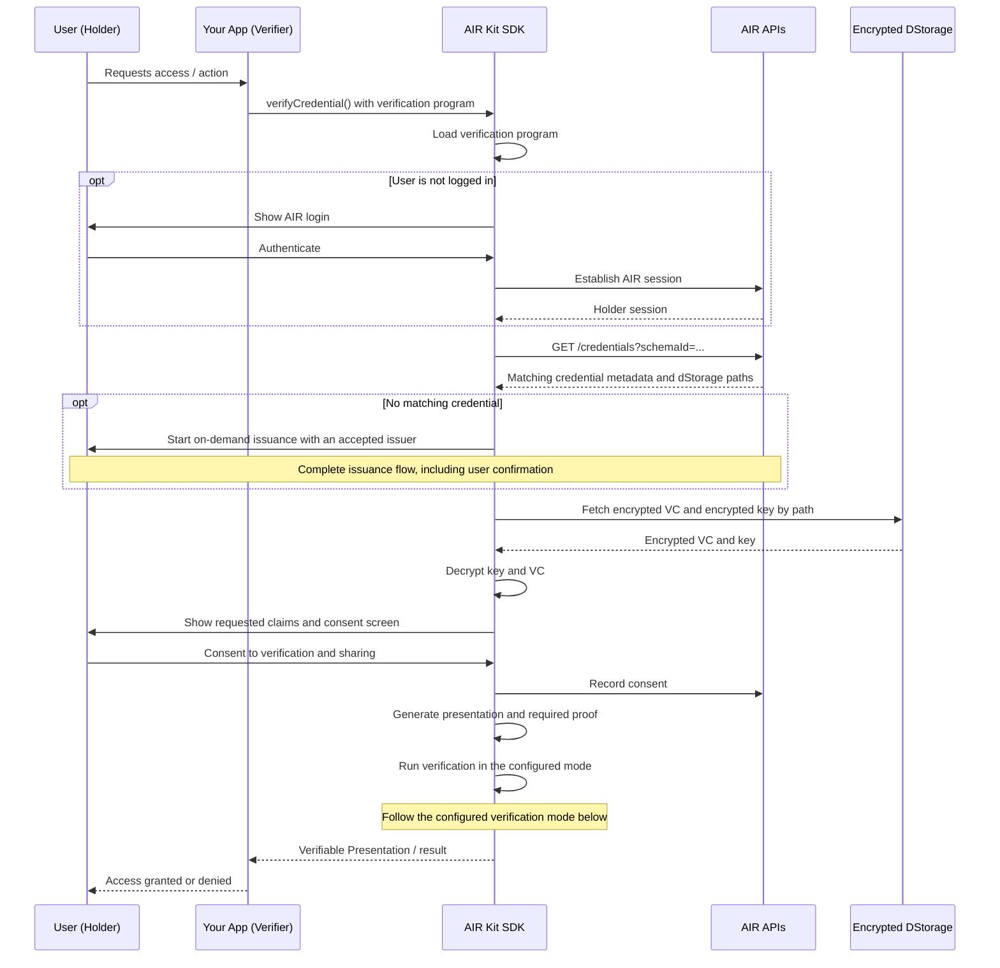
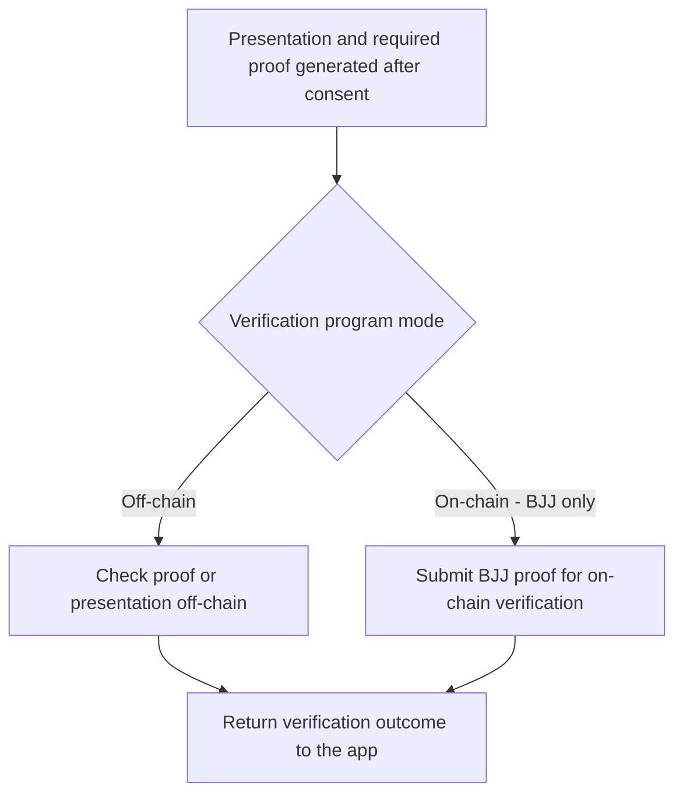
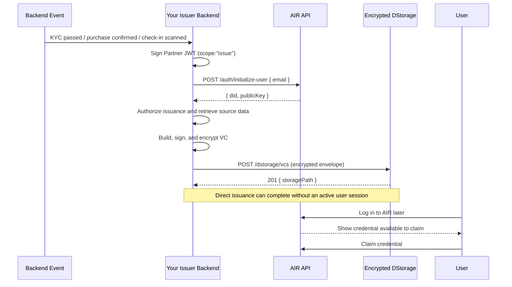
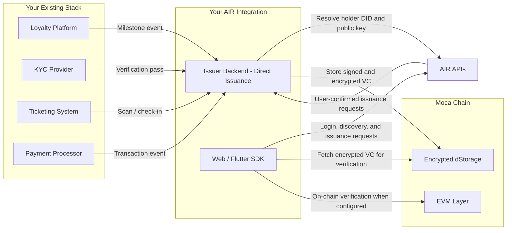

AIR Kit connects your application to AIR services and Moca Chain. It exposes **Account Services** for authentication and wallet operations and **Credential Services** for orchestrating issuance and verification. Your issuer backend owns credential authorization, source data, signing, encryption, and storage.

## System overview

```mermaid
graph TD
    subgraph YourApp["Your Application"]
      A[Frontend / Mobile App]
      B[Issuer Backend]
      DATA[Issuer Data Source]
    end

    subgraph SDK["AIR Kit SDK"]
      C[Account Services]
      D[Credential Services]
    end

    API[AIR APIs]

    subgraph Chain["Moca Chain"]
      F[EVM Layer]
      G[Encrypted dStorage]
    end

    A -->|Web SDK / Flutter SDK| C
    A -->|Web SDK / Flutter SDK| D
    C -->|Authentication and sessions| API
    C -->|Wallet operations| F
    D -->|Credential discovery and issuance requests| API
    API -->|Available credentials and confirmed issuance| B
    B -->|Load authoritative claims| DATA
    B -->|Store issuer-signed, encrypted VCs| G
    D -->|Fetch encrypted credentials| G
    D -->|On-chain verification when configured| F
```

The SDK manages user interaction and calls AIR APIs. AIR routes issuance requests to the registered issuer backend. The issuer backend creates and signs credentials, encrypts them to the holder, and stores them in dStorage. Credential storage and on-chain proof verification are separate operations.

## Account services flow

Account Services handles user authentication, smart account creation, and wallet operations.

```mermaid
sequenceDiagram
    participant U as User
    participant App as Your App
    participant SDK as AIR Kit SDK
    participant Chain as Moca Chain

    U->>App: Click "Login"
    App->>SDK: airService.login()
    SDK->>U: Show login UI (email / social / wallet)
    U->>SDK: Authenticate
    SDK->>Chain: Create / fetch smart account
    Chain-->>SDK: Account address + session
    SDK-->>App: User session + wallet provider
    App-->>U: Logged in ✓
```

## Issuance modes

| Mode | User presence | How it works |
| --- | --- | --- |
| **On-demand issuance** | User present | The user reviews available credentials and confirms issuance through the SDK. |
| **Direct issuance** | Can run without the user present | The issuer creates and stores the credential; the user claims it when they log in to AIR. |
| **Pre-issue** | Can run before the user logs in | Uses Direct Issuance to prepare credentials for the user to claim later. |

## On-demand issuance flow (user-initiated)

Your app calls `issueCredential()` with the issuance program/schema context and an optional identifier. This is the client-side entry point: the SDK ensures AIR login, discovers available credentials, obtains the user's confirmation, and requests issuance through AIR.

The issuance program identifies the configured flow; the schema defines the credential's data structure. They are distinct identifiers. The sequence below describes the orchestration, rather than an SDK parameter signature.

```mermaid
sequenceDiagram
    participant U as User
    participant App as Your App (Issuer)
    participant SDK as AIR Kit SDK
    participant AIR as AIR APIs
    participant Iss as Issuer Backend
    participant Data as Issuer Data Source
    participant DS as Encrypted DStorage

    U->>App: Triggers credential claim
    App->>SDK: issueCredential() with issuance context
    SDK->>SDK: Load issuance program and schema
    opt User is not logged in
        SDK->>U: Show AIR login
        U->>SDK: Authenticate
        SDK->>AIR: Establish AIR session
        AIR-->>SDK: Holder DID and public key
    end
    SDK->>AIR: GET /issuer/{issuerDidHash}/available-vc
    AIR->>Iss: POST /available-vc (holder DID, public key, schema, identifier)
    Iss->>Data: Check eligibility and load available claims
    Data-->>Iss: Eligible credential data
    Iss-->>AIR: Encrypted credential previews
    AIR-->>SDK: Encrypted previews
    SDK->>SDK: Decrypt previews
    SDK->>U: Show available credentials for review
    U->>SDK: Select credential and confirm issuance
    SDK->>AIR: POST /issuer/{issuerDidHash}/issue-vc
    AIR->>Iss: POST /issue-vc (holder DID, public key, schema, identifier)
    Iss->>Iss: Authorize issuance
    Iss->>Data: Retrieve source data
    Data-->>Iss: Authoritative claims
    Iss->>Iss: Build VC, sign with issuer key, encrypt to holder
    Iss->>DS: Store encrypted VC envelope
    DS-->>Iss: storagePath
    Iss-->>AIR: Issuance result / reference
    AIR-->>SDK: Issuance result / reference
    SDK-->>App: Return issuance result / reference
    App-->>U: Credential delivered to AIR Account
```

`available-vc` discovers credentials and returns encrypted previews. It does not issue a credential. The SDK calls `issue-vc` only after the user confirms. The issuer backend remains responsible for authorization, data retrieval, VC generation and signing, encryption, and storage; `issueCredential()` orchestrates these steps without creating or signing the VC itself.

## Credential verification flow

The SDK loads the verification program and ensures the user is logged in to AIR. It discovers matching credentials through AIR, fetches and decrypts the selected credential, and displays the requested data for consent. After the user agrees, the SDK records consent and generates the verifiable presentation and any required proof.

```mermaid
sequenceDiagram
    participant U as User (Holder)
    participant App as Your App (Verifier)
    participant SDK as AIR Kit SDK
    participant AIR as AIR APIs
    participant DS as Encrypted DStorage

    U->>App: Requests access / action
    App->>SDK: verifyCredential() with verification program
    SDK->>SDK: Load verification program
    opt User is not logged in
        SDK->>U: Show AIR login
        U->>SDK: Authenticate
        SDK->>AIR: Establish AIR session
        AIR-->>SDK: Holder session
    end
    SDK->>AIR: GET /credentials?schemaId=...
    AIR-->>SDK: Matching credential metadata and dStorage paths
    opt No matching credential
        SDK->>U: Start on-demand issuance with an accepted issuer
        Note over U,AIR: Complete issuance flow, including user confirmation
    end
    SDK->>DS: Fetch encrypted VC and encrypted key by path
    DS-->>SDK: Encrypted VC and key
    SDK->>SDK: Decrypt key and VC
    SDK->>U: Show requested claims and consent screen
    U->>SDK: Consent to verification and sharing
    SDK->>AIR: Record consent
    SDK->>SDK: Generate presentation and required proof
    SDK->>SDK: Run verification in the configured mode
    Note over SDK: Follow the configured verification mode below
    SDK-->>App: Verifiable Presentation / result
    App-->>U: Access granted or denied
```

If the user declines consent, the flow stops before generating or sharing the presentation. If no matching credential can be issued, verification cannot proceed with that credential.

### Off-chain and on-chain verification

The verification program selects the mode. Both paths use the credential discovery, decryption, and consent steps above.

| Mode | Where verification runs | What the app receives |
| --- | --- | --- |
| **Off-chain** | The proof or presentation is checked outside a blockchain transaction against the program's requirements. | Verification status and the presentation/proof material applicable to the program. |
| **On-chain** | The proof is submitted for verification on-chain. This mode is available only for BJJ credentials. | The verification outcome and applicable on-chain transaction information. |

```mermaid
flowchart TD
    P[Presentation and required proof generated after consent]
    M{Verification program mode}
    OFF[Check proof or presentation off-chain]
    ON[Submit BJJ proof for on-chain verification]
    RESULT[Return verification outcome to the app]
    P --> M
    M -->|Off-chain| OFF
    M -->|On-chain - BJJ only| ON
    OFF --> RESULT
    ON --> RESULT
```

Using dStorage or anchoring issuer state does not, by itself, mean that verification runs on-chain. The verification mode describes where the proof is checked. The app uses the returned outcome to decide whether to grant access.

{/* TODO: Confirm detailed proof-verification contracts and the consent-recording endpoint when the V2 integration specification defines them. */}

## Direct issuance and pre-issue flow

Use Direct Issuance when a backend event or batch job should issue a credential without requiring the user to be present. The issuer backend resolves the recipient's holder DID and public key, authorizes issuance, retrieves the source data, then builds, signs, encrypts, and stores the VC. The user claims the credential when they log in to AIR.

**Pre-issue uses Direct Issuance** to prepare credentials ahead of that login and claim step.

```mermaid
sequenceDiagram
    participant Event as Backend Event
    participant Server as Your Issuer Backend
    participant API as AIR API
    participant DS as Encrypted DStorage
    participant U as User

    Event->>Server: KYC passed / purchase confirmed / check-in scanned
    Server->>Server: Sign Partner JWT (scope:"issue")
    Server->>API: POST /auth/initialize-user { email }
    API-->>Server: { did, publicKey }
    Server->>Server: Authorize issuance and retrieve source data
    Server->>Server: Build, sign, and encrypt VC
    Server->>DS: POST /dstorage/vcs (encrypted envelope)
    DS-->>Server: 201 { storagePath }
    Note over Server,DS: Direct issuance can complete without an active user session
    U->>API: Log in to AIR later
    API-->>U: Show credential available to claim
    U->>API: Claim credential
```

## Multi-vendor stack integration

Your issuer backend connects to existing loyalty platforms, KYC providers, ticketing systems, and payment processors. Backend events can trigger Direct Issuance, while the SDK supports user-present issuance, later credential claims, and verification.

```mermaid
graph LR
    subgraph Existing["Your Existing Stack"]
      L[Loyalty Platform]
      K[KYC Provider]
      T[Ticketing System]
      P[Payment Processor]
    end

    subgraph Integration["Your AIR Integration"]
      IB[Issuer Backend - Direct Issuance]
      SDK2[Web / Flutter SDK]
    end

    API2[AIR APIs]

    subgraph MocaChain["Moca Chain"]
      STORE[Encrypted dStorage]
      EVM[EVM Layer]
    end

    L -->|Milestone event| IB
    K -->|Verification pass| IB
    T -->|Scan / check-in| IB
    P -->|Transaction event| IB
    IB -->|Resolve holder DID and public key| API2
    IB -->|Store signed and encrypted VC| STORE
    SDK2 -->|Login, discovery, and issuance requests| API2
    API2 -->|User-confirmed issuance requests| IB
    SDK2 -->|Fetch encrypted VC for verification| STORE
    SDK2 -->|On-chain verification when configured| EVM
```

## Service independence and login requirements

Choose the service capabilities your app needs. An AIR login is required for the user-present credential flows below; it does not imply that your app must also integrate wallet operations, gas sponsorship, or other Account Services features.

| Credential flow | Service | AIR login requirement |
| --- | --- | --- |
| On-demand issuance | Credential Services | User logs in before reviewing and confirming issuance. |
| Direct issuance | Credential Services | No active user session required to issue; user logs in to claim later. |
| Pre-issue | Credential Services, using Direct Issuance | No active user session required to pre-issue; user logs in to claim later. |
| SDK verification | Credential Services | User logs in before reviewing the requested data and consenting. |

## Next steps

<Columns cols={2}>
  <Card title="Quick Setup" icon="bolt" href="/airkit/usage/getting-started">
    Install and initialize the SDK in minutes.
  </Card>
  <Card title="Integration Guides" icon="puzzle-piece" href="/airkit/guides/air-for-loyalty">
    Vertical-specific guides with code examples for Loyalty, Fintech, Gaming, and Ticketing.
  </Card>
  <Card title="Quickstart: Issue Credentials" icon="badge-check" href="/airkit/quickstart/issue-credentials">
    Step-by-step credential issuance walkthrough.
  </Card>
  <Card title="Direct Issuance and Pre-issue" icon="server" href="/airkit/guides/overview#direct-issuance-and-pre-issue-flow">
    Issue without an active user session; users claim credentials when they log in.
  </Card>
</Columns>
