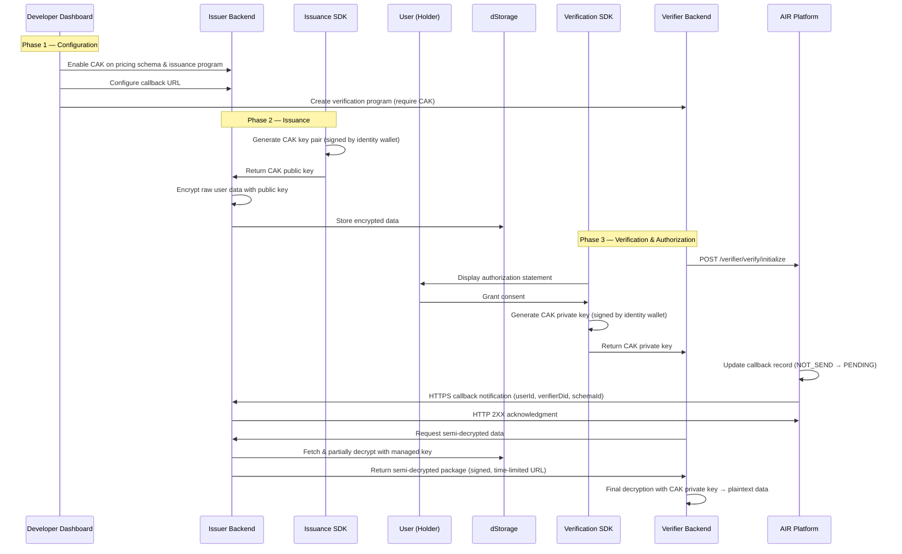

The Compliance Access Key (CAK) is an optional encryption framework that enables regulated data usage without platform-level custody, key escrow, or implicit trust assumptions. When enabled, sensitive user data is encrypted during credential issuance and can only be decrypted by a Verifier who has obtained explicit user consent.

<Info>
  CAK is optional. If your credentials do not contain raw PII or biometric data, or if verifiers only need zero-knowledge proof results, the standard AIR Kit flow is sufficient.
</Info>

---

## When to use CAK

| Scenario | CAK needed? |
|----------|-------------|
| Credential contains raw PII or biometric data that verifiers may need | Yes |
| Multiple verifiers require access to underlying identity data | Yes |
| Regulatory auditability of data access is required | Yes |
| Credential is used purely for ZK-based attribute proofs | No |
| No verifier ever requires access to plaintext data | No |

---

## Three-phase lifecycle

CAK operates across the entire credential lifecycle: configuration, issuance, and verification.

---

## Phase 1: Dashboard configuration

Before any credentials are issued, administrators configure the CAK rules in the Developer Dashboard.

### Issuer setup

1. **Enable CAK on a Pricing Schema** — This is the top-level switch. Only pricing schemas with CAK enabled can produce CAK-encrypted credentials.
2. **Enable CAK on an Issuance Program** — When enabled, the Issuance SDK will generate a CAK key pair during issuance and return the public key to your system for encryption.
3. **Configure a Global Callback URL** — Set an HTTPS endpoint via `POST /issuer/modify` (pass `callbackUrl`). This endpoint receives authorization notifications whenever a Verifier is granted access to your users' data.

### Verifier setup

1. **Require CAK for a Verification Program** — When enabled, only CAK-encrypted credentials are accepted and the user consent flow is mandatory.
2. **Select Issuers** — If your verification program requires CAK, the system only shows Issuers that have enabled the CAK feature.

<Tip>
  For step-by-step configuration instructions, see the [Issuer guide](/airkit/usage/credential/cak-issuer-guide) and [Verifier guide](/airkit/usage/credential/cak-verifier-guide).
</Tip>

---

## Phase 2: Credential issuance

When CAK is enabled for an issuance program, the `issueCredential()` SDK call includes additional encryption steps.

| Step | Party | Action |
|------|-------|--------|
| 1 | Issuance SDK | Generates a temporary CAK key pair locally by signing with the user's identity wallet |
| 2 | Issuance SDK | Returns the CAK public key to the Issuer's backend via callback |
| 3 | Issuer | Encrypts the user's raw sensitive data (ID photo, name, biometrics) with the CAK public key |
| 4 | Issuer | Stores the encrypted ciphertext in dStorage |

The `issueCredential()` response includes a `cakPublicKey` field when CAK is enabled. See [Issuing Credentials](/airkit/usage/credential/issuing-credentials) for the SDK reference.

---

## Phase 3: Verification and authorization

When a user presents a CAK-encrypted credential to a Verifier, the process includes a consent step and a two-stage decryption.

| Step | Party | Action |
|------|-------|--------|
| 1 | Verifier | Calls `POST /verifier/verify/initialize` to start the verification flow |
| 2 | Verification SDK | Detects CAK requirement from program configuration |
| 3 | Verification SDK | Displays a clear authorization statement to the user |
| 4 | User | Grants or denies consent |
| 5 | Verification SDK | On consent, generates the CAK private key locally via identity wallet signing |
| 6 | Verification SDK | Returns the private key to the Verifier backend via callback |
| 7 | Platform | Updates callback record status and sends HTTPS notification to Issuer |
| 8 | Verifier | Requests semi-decrypted data from the Issuer (zkMe) |
| 9 | Issuer (zkMe) | Partially decrypts with managed key, returns semi-decrypted package |
| 10 | Verifier | Performs final decryption with CAK private key to obtain plaintext data |

The `verifyCredential()` response includes a `cakPrivateKey` field when the result is `"Compliant"` and CAK is enabled. See [Verifying Credentials](/airkit/usage/credential/verify) for the SDK reference.

<Warning>
  The CAK private key must be used in-memory only. Never persist it to disk, database, or logs.
</Warning>

---

## Platform responsibilities

The AIR Credential platform provides the following CAK capabilities:

| Responsibility | Description |
|----------------|-------------|
| **SDKs** | Issuance and Verification SDKs include CAK key generation, consent UI, and callback handling |
| **Key derivation** | Deterministic CAK key pairs derived within SDKs via identity wallet signing (EIP-712 structured data) |
| **Authorization UI** | Standard, unified user consent interface in the Verification SDK |
| **Callback dispatch** | Reliable HTTPS notifications to the Issuer's callback URL with retry logic |
| **Record management** | Authorization records and callback statuses maintained for full process traceability |

---

## Cryptographic details

| Property | Value |
|----------|-------|
| Encryption scheme | ECIES (Elliptic Curve Integrated Encryption Scheme) |
| Default curve | SECP256R1 (P-256) |
| Alternative curve | SECP256K1 |
| Key derivation | Deterministic, based on [User - Issuer - Schema] composite identifier |
| Key pair generation | Local, via identity wallet signing (EIP-712) |

---

## Next steps

<CardGroup cols={2}>
  <Card title="Issuer integration" icon="file-certificate" href="/airkit/usage/credential/cak-issuer-guide">
    Dashboard configuration, SDK integration, encryption workflow, and callback endpoint implementation.
  </Card>
  <Card title="Verifier integration" icon="magnifying-glass" href="/airkit/usage/credential/cak-verifier-guide">
    Verification setup, user consent flow, decryption workflow, and security best practices.
  </Card>
</CardGroup>
