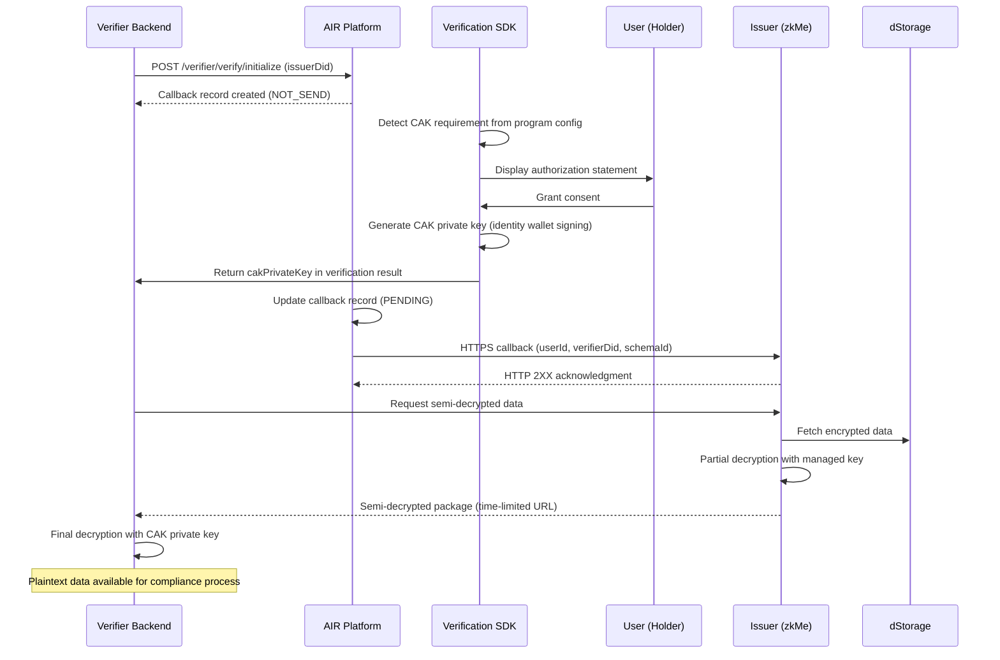

This guide covers everything a Verifier needs to integrate with the Compliance Access Key (CAK) framework: configuring a verification program that requires CAK, handling the user consent flow, receiving the CAK private key, and performing secure decryption of user data.

<Info>
  Before starting, make sure you understand the [CAK lifecycle overview](/airkit/usage/credential/cak-overview).
</Info>

---

## Verifier responsibilities summary

| Responsibility | Description |
|----------------|-------------|
| CAK requirement configuration | Enable CAK requirement for verification programs in the Dashboard |
| Verification initialization | Call the platform's initialization endpoint at the start of each verification flow |
| Private key secure handling | Receive the CAK private key from the SDK and use it in-memory only |
| Data decryption integration | Decrypt the semi-decrypted data package using the CAK private key |
| Data handling compliance | Handle, store, and destroy decrypted data per applicable regulations |

---

## Step 1: Dashboard configuration

### Require CAK for a verification program

In the Developer Dashboard, create or edit a verification program and enable the CAK requirement.

When CAK is required:
- Only CAK-encrypted credentials are accepted for verification
- The user consent flow is mandatory — the Verification SDK displays an authorization statement
- Only Issuers that have enabled CAK are available as partners when configuring the program

When CAK is not required:
- Both CAK-encrypted and standard credentials are accepted
- The consent flow is not triggered, even for CAK-encrypted credentials

### Select Issuers

If your verification program requires CAK, the system only shows Issuers that have the CAK feature enabled. Select the Issuers whose credentials you want to verify.

---

## Step 2: Initialize verification

At the start of each verification flow, your backend must call the platform's initialization endpoint. This creates a callback record that tracks the authorization lifecycle.

```bash
POST /verifier/verify/initialize

{
  "issuerDid": "did:air:id:..."
}
```

Pass the `issuerDid` of the Issuer whose credential is being verified. The platform creates a callback record with an initial `NOT_SEND` (-1) status.

---

## Step 3: User consent and private key

The Verification SDK handles the consent flow automatically when it detects that the verification program requires CAK.

### What happens

1. The SDK reads the verification program configuration and detects the CAK requirement
2. The SDK displays a clear authorization statement to the user, requesting consent to share their encrypted data with your system
3. The user makes a manual choice: **Agree** or **Deny**

### On user consent

When the user grants consent:

1. The SDK generates the corresponding CAK private key locally by signing with the user's identity wallet
2. The SDK returns the private key to your backend via the verification callback
3. The platform updates the callback record from `NOT_SEND` (-1) to `PENDING` (0) and sends a notification to the Issuer

### On user denial

When the user denies consent:

- The verification process is aborted
- No private key is generated or returned
- The user's encrypted data remains inaccessible
- The user may be unable to complete their business with your service

### SDK integration

Call `verifyCredential()` as usual. When CAK is enabled and the verification is successful, the response includes a `cakPrivateKey` field.

```jsx
const result = await airService.verifyCredential({
  authToken,    // Partner JWT with scope=verify
  programId,    // Verification program ID
  redirectUrl,  // Optional: redirect if user lacks the credential
});

if (result.status === "Compliant") {
  const { cakPrivateKey, zkProofs, transactionHash } = result;
  // Use cakPrivateKey to decrypt user data
}
```

**Compliant response fields:**

| Field | Type | Description |
|-------|------|-------------|
| `status` | `"Compliant"` | Credential is valid and meets all verification requirements |
| `zkProofs` | `Record<string, string>` | Zero-knowledge proofs generated for the verification |
| `transactionHash` | `string` | On-chain transaction hash of the verification |
| `cakPrivateKey` | `string` | CAK private key for decrypting the user's encrypted data. Only present when CAK is enabled |

<Warning>
  The `cakPrivateKey` is only returned when **all** of these conditions are met: (1) the verification status is `"Compliant"`, (2) CAK was enabled for the issuance program, and (3) your verification program requires CAK.
</Warning>

---

## Step 4: Decrypt user data

After receiving the CAK private key, you can decrypt the user's sensitive data through a two-stage process.

### Stage 1: Request semi-decrypted data

Call the Issuer's (zkMe) Semi-Decrypted Data API to request the user's encrypted data. This is not a direct download from dStorage — the Issuer partially decrypts the data using their managed key first.

The Issuer:
1. Validates your request (identity, authorization relationship)
2. Fetches the encrypted data from dStorage
3. Performs initial decryption with their managed key to produce a semi-decrypted data package
4. Returns the package via a signed, time-limited download URL
5. Logs the request in the audit trail

### Stage 2: Final decryption with CAK private key

Use the CAK private key to decrypt the semi-decrypted data package. This produces the user's original raw information:

- Full name, date of birth, document numbers
- Identity document images (ID cards, passports)
- Facial biometric photos
- Other structured identity fields

<Note>
  The two-stage decryption ensures that neither the Issuer alone nor the Verifier alone can access the plaintext data. Both must participate, and both stages require prior user consent.
</Note>

---

## Security best practices

<AccordionGroup>
  <Accordion title="Never persist the CAK private key">
    The CAK private key must be used exclusively in-memory. Never write it to disk, database, logs, or any persistent storage. Discard it immediately after decryption is complete.
  </Accordion>
  <Accordion title="Minimize data retention">
    After using the decrypted data for your compliance process (account opening, eligibility check, etc.), destroy it according to your data retention policy. Only keep what your regulatory obligations specifically require.
  </Accordion>
  <Accordion title="Handle decrypted data per GDPR and applicable laws">
    The decrypted data is raw PII. Treat it with the highest level of data protection. Implement access controls, encryption at rest for any required storage, and data subject rights handling (access, deletion).
  </Accordion>
  <Accordion title="Implement secure transport">
    All communication between your systems and the AIR Credential platform must use HTTPS/TLS. The semi-decrypted data download URL is time-limited and pre-signed — use it immediately.
  </Accordion>
  <Accordion title="Audit all data access">
    Log every instance of decryption, including the user ID, timestamp, purpose, and personnel involved. This audit trail is critical for regulatory compliance.
  </Accordion>
</AccordionGroup>

---

## Verification flow diagram



---

## Related pages

- [CAK Overview](/airkit/usage/credential/cak-overview) — Architecture and lifecycle
- [CAK Issuer Guide](/airkit/usage/credential/cak-issuer-guide) — Issuer-side integration
- [Verifying Credentials](/airkit/usage/credential/verify) — Standard verification SDK reference
- [Compliance & Privacy FAQ](/solutions/compliance-faq) — GDPR, CCPA, and data handling questions
