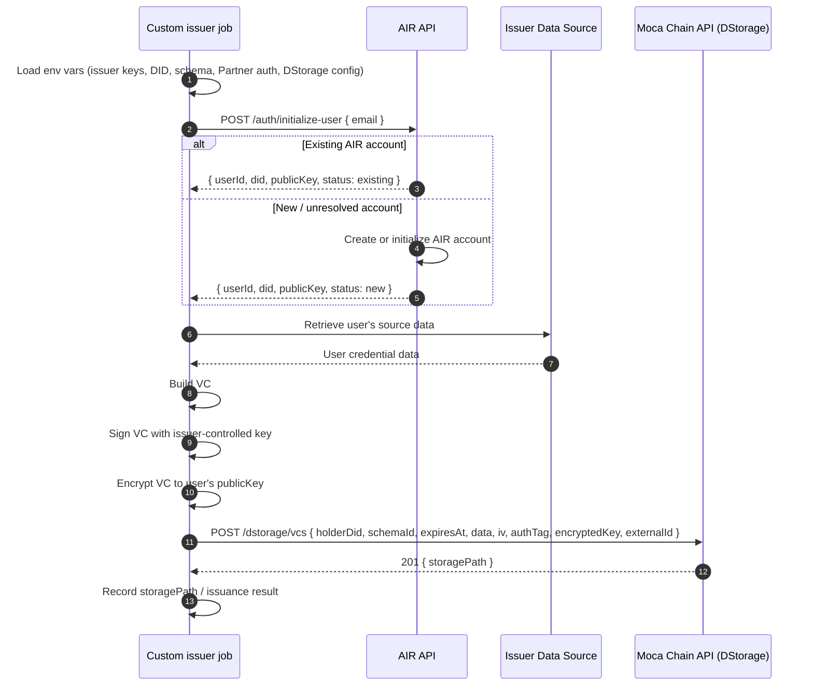

**Direct Issuance** lets your **backend job or a controlled script** issue a credential straight to a user's AIR Account without hosting a live issuer backend and without any action from the user at issuance time. The user doesn't need to be in a session, open a wallet, or interact with any UI. The issuer holds its own keys and data throughout, signing and encrypting each credential before it reaches AIR.

This enables **zero-friction, invisible credential issuance** for use cases like:

- Issuing a KYC credential the moment a user passes identity verification
- Issuing an attendance credential when a venue scan detects a fan's check-in
- Issuing a subscriber tier credential at the end of each billing cycle
- Issuing a loyalty credential triggered by a purchase event

The user simply benefits from the credential next time they interact with a verifier.

<Info>
**Direct issuance vs hosted Issuer Backend**

Use direct issuance when you don't want to run a live backend. If you need queryable available credentials and on-demand issuance triggered through the SDK, use the [hosted Issuer Backend](/airkit/usage/credential/issuing-credentials) instead. Both paths sign with issuer-controlled keys and store an encrypted envelope in DStorage.
</Info>

<Note>
Direct issuance is not a single turnkey API call. You run it through the **`air-issuer-service`** tool — either as a job that reads a CSV of recipients, or as your own script replicating the same logic. Under the hood it calls the AIR issuance endpoints (`initialize-user`, then `dstorage/vcs`); see the [Issuance API Reference](/airkit/usage/credential/issuance-api).
</Note>

## How it works

1. A backend event fires — KYC passed, purchase confirmed, check-in scanned — or your custom batch begins.
2. Your job loads its environment: issuer signing keys and DID, schema and program configuration, Partner auth, DStorage config, and source data access.
3. Your job calls `initialize-user` with the recipient's email to resolve or create the user's AIR Account, receiving the user DID and public key. The email is passed here in the request body — not in the Partner JWT.
4. Your job retrieves the user's source data.
5. Your job builds the VC, signs it with issuer-controlled keys (`BJJ_SIG_2021`), and encrypts it to the returned user public key.
6. Your job stores the encrypted VC envelope via `dstorage/vcs` and records the returned `storagePath`.
7. The user presents the credential later at any verifier; no action needed at issuance time.

The issuer holds the data and keys throughout; AIR stores only the encrypted envelope and metadata.

## Prerequisites

Before running direct issuance you need:

1. **Credential services enabled** — Generate your Issuer DID with `air-issuer-service` and register it with AIR to unlock issuer functionality. See the activation flow in [Issuing Credentials](/airkit/usage/credential/issuing-credentials).
2. **Partner ID and Issuer DID** — Partner ID from the Developer Dashboard (Accounts → General). Your Issuer DID is derived from your own signing keys; AIR does not generate it for you.
3. **Issuance program** — A published credential program in the dashboard (Issuer → Programs).
4. **JWKS endpoint** — A public URL serving your public key for JWT verification. See [Partner Authentication](/airkit/usage/partner-authentication).

## Next Steps

- [Issuance API Reference](/airkit/usage/credential/issuance-api)
- [Partner Authentication](/airkit/usage/partner-authentication)
- [Issuing Credentials (Hosted Issuer Backend)](/airkit/usage/credential/issuing-credentials)
