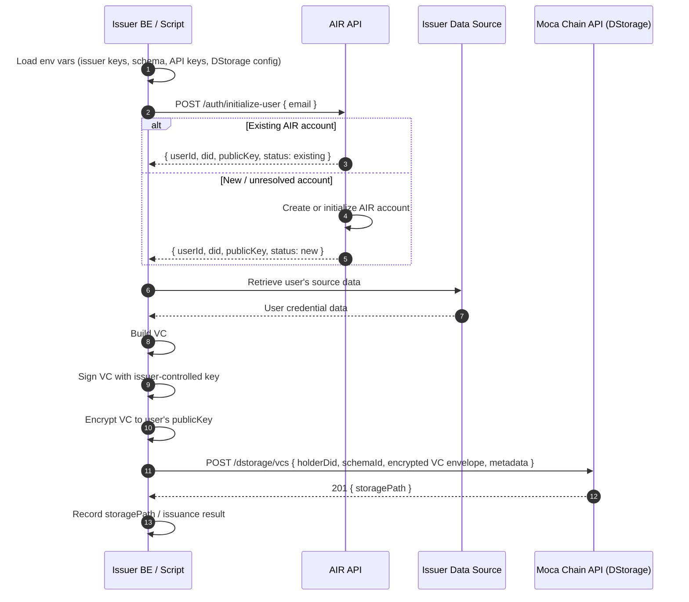

**Issue on Behalf** lets your **backend server or a controlled script** issue a credential directly to a user's AIR Account without hosting an issuer backend and without any action from the user at the time of issuance. The user doesn't need to be in a session, open a wallet, or interact with any UI. This is the equivalent path to direct issuance for teams that prefer a script-driven job over a hosted `available-vc` / `issue-vc` backend.

This enables **zero-friction, invisible credential issuance** for use cases like:

- Issuing a KYC credential the moment a user passes identity verification
- Issuing an attendance credential when a venue scan detects a fan's check-in
- Issuing a subscriber tier credential at the end of each billing cycle
- Issuing a loyalty credential triggered by a purchase event

The user simply benefits from the credential next time they interact with a verifier.

<Info>
**Script-based vs hosted Issuer Backend**

Use this script-based path when you do not want to host an issuer backend. If you need queryable available credentials and on-demand issuance triggered through the SDK, use the [hosted Issuer Backend](/airkit/usage/credential/issuing-credentials) instead. Both paths sign with issuer-controlled keys and store an encrypted envelope in DStorage.
</Info>

<Warning>
**Feature Activation Required**

Issue on Behalf must be enabled for your partner account before use. Enable it in the <a href="https://developers.sandbox.air3.com/dashboard/issuer/advanced" target="_blank" rel="noreferrer">Developer Dashboard</a> (Accounts → Issuer → Advanced).
</Warning>

## How it works

1. A backend event fires — KYC passed, purchase confirmed, check-in scanned.
2. Your script loads its environment: issuer DID / signing keys, schema and program configuration, API keys / partner auth, DStorage config, and source data access.
3. Your script calls `initialize-user(email)` on the AIR API to resolve or create the user's AIR Account, receiving the user DID and public key.
4. Your script retrieves the user's source data.
5. Your script builds the VC, signs it with issuer-controlled keys, and encrypts it to the returned user public key.
6. Your script stores the encrypted VC envelope via `dstorage/vcs` and records the returned `storagePath`.
7. The user presents the credential later at any verifier; no action needed at issuance time.

The issuer holds the data and keys throughout; AIR stores only the encrypted envelope and metadata.

## Prerequisites

Before using Issue on Behalf you need:

1. **Feature activation** — Enable Issue on Behalf for your partner account in the <a href="https://developers.sandbox.air3.com/dashboard" target="_blank" rel="noreferrer">Developer Dashboard</a> (Accounts → General).
2. **Partner ID and Issuer DID** — Partner ID from the Developer Dashboard (Accounts → General). Generate your Issuer DID from your own signing keys and register it with AIR; AIR does not generate it for you.
3. **Issuance program** — A published credential program in the dashboard (Issuer → Programs).
4. **JWKS endpoint** — A public URL serving your public key for JWT verification. See [Partner Authentication](/airkit/usage/partner-authentication).
5. **User email** — The email address of the AIR Account receiving the credential.

## Auth

Issue on Behalf authenticates via a **Partner JWT** attached to each request. The JWT must include the target user's email as a signed claim. For full setup, key generation, and examples see [Partner Authentication](/airkit/usage/partner-authentication).

## Per-recipient email (common mistake)

Each call routes the credential to the AIR Account that matches the `email` claim in the Partner JWT. Because that email is the routing key, **a single reused email sends every credential to the same account**.

Always sign each JWT with the email of the specific user who should receive the credential.

**Safeguards:**

- Resolve the recipient's email from the triggering backend event; never hardcode it.
- Never use a partner, service, admin, or otherwise static/shared email as the `email` claim.
- Dedupe issuance by recipient email + program ID before calling the API, so an event replay or loop can't fan out to the wrong account.

## Next Steps

- [Issuance API Reference](/airkit/usage/credential/issue-on-behalf-api)
- [Partner Authentication](/airkit/usage/partner-authentication)
- [Issuing Credentials (Hosted Issuer Backend)](/airkit/usage/credential/issuing-credentials)
