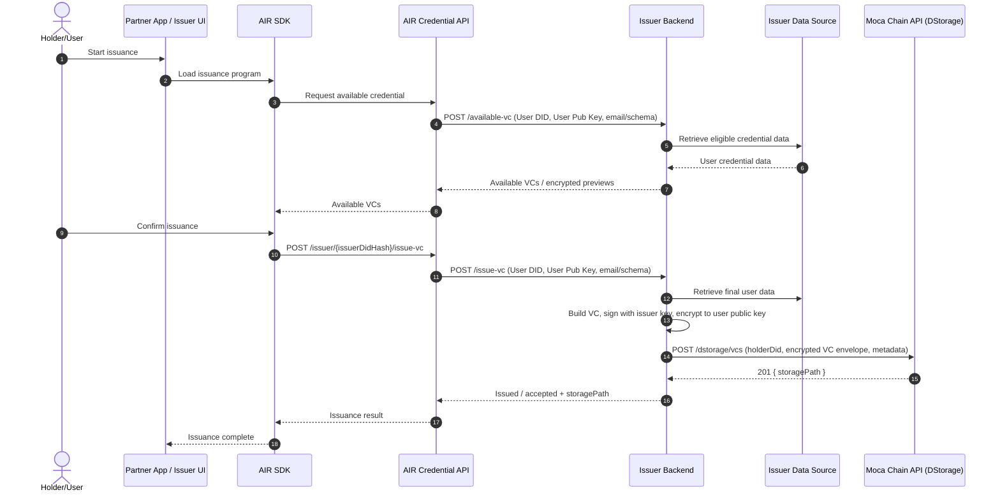

As an Issuer, you own your source data and signing keys. You build the credential, sign it with issuer-controlled keys, encrypt it to the holder's public key, and store the encrypted envelope in DStorage. AIR routes the request and stores opaque ciphertext and metadata — it never handles your plaintext data.

This page covers the **hosted Issuer Backend** path, where AIR and the SDK call your backend to discover available credentials and trigger on-demand issuance. If you would rather run issuance from a controlled script or backend job without hosting an issuer backend, see [Issue on Behalf](/airkit/usage/credential/issue-on-behalf).

<Info>
**When to run an Issuer Backend**

Integrate an Issuer Backend when you need on-demand issuance, queryable available credentials, revocation checks, or issuer-controlled data access. New issuance programs should use the `BJJ_SIG_2021` signature type by default.
</Info>

## Dashboard setup

1. Create or use an AIR Dashboard account. Credential services are gated until your Issuer DID is registered, so the issuer and verifier menus stay hidden until step 2 is complete — contact AIR to enable credential services and register your DID.
2. Configure issuer details:
   - Issuer DID — generated from your own signing keys and registered with AIR. Since you hold your keys, you generate the DID and provide it; AIR does not generate it for you.
   - Supported signature types — `BJJ_SIG_2021`
   - JWKS URL / key information where applicable
   - Optional user identifier type (email, phone, or partner user ID)
3. Select or create a schema.
4. Create an issuance program.
5. Configure your Issuer Backend URL and endpoint paths if you run a hosted backend. Leave these empty if you use script-based direct issuance instead.

## Technical integration

| Capability | Endpoint | Notes |
| --- | --- | --- |
| Initialize / resolve user | `POST /auth/initialize-user` | Partner-authenticated call using the user identifier (typically email). Returns the user DID and public key, creating or resolving the AIR account as needed. |
| Store encrypted VC | `POST /dstorage/vcs` | Stores the issuer-signed, holder-encrypted VC envelope in DStorage. Returns a DStorage path / storage reference. |
| Available credentials | `/available-vc` (issuer-hosted) | AIR / the SDK calls your backend to list eligible credentials for a user. |
| Issue credential | `/issue-vc` (issuer-hosted) | AIR / the SDK calls your backend to build, sign, encrypt, and store the credential. |

See [Issuance API Reference](/airkit/usage/credential/issue-on-behalf-api) for request and response details.

## Hosted Issuer Backend flow

Use this when you can operate a backend for on-demand issuance.

### Step 1 — Configure the backend

Set up your issuer backend / environment with:

- Issuer DID and signing keys
- Schema and program configuration
- API keys / partner auth
- DStorage endpoint configuration
- Issuer data source connection

### Step 2 — Expose `available-vc`

Your backend exposes `available-vc(User DID, User Pub Key, email)`:

- Retrieves the user's eligible credential data from your data source.
- Returns a list of available VCs / encrypted previews.

### Step 3 — Expose `issue-vc`

Your backend exposes `issue-vc(User DID, User Pub Key, email)`:

- Retrieves the final user data.
- Builds the VC and signs it with issuer-controlled keys.
- Encrypts the VC to the user's public key.
- Stores the encrypted VC via DStorage.
- Returns the issued status / DStorage reference.

### Step 4 — Trigger issuance

AIR / the SDK triggers issuance by calling your backend, typically from a user-initiated frontend flow. The user's raw data never leaves your control in plaintext, and AIR stores only the encrypted envelope and metadata.

## Compliance encryption (CAK)

When compliance encryption is enabled for your issuance program (configured in the Developer Dashboard), you can obtain a user-specific public key (`cakPublicKey`) to encrypt additional compliance data for regulated disclosure or threshold decryption. The key is deterministically derived from the [User – Issuer – Schema] composite identifier, so the same key is returned for the same combination.

<Card title="Full CAK Issuer Guide" icon="arrow-right" href="/airkit/usage/credential/cak-issuer-guide">
  For Dashboard configuration, encrypting user data with the CAK public key, and implementing the callback endpoint, see the dedicated CAK Issuer Guide.
</Card>

## View issued credential records

Review the records of every credential you have issued in the <a href="https://developers.sandbox.air3.com/dashboard" target="_blank" rel="noreferrer">Developer Dashboard</a> under **Issuer → Usage Records**. Where a credential needs to be invalidated, use the **Revoke** function in the Dashboard.

<Frame caption="Issuer -> Usage Records in the Developer Dashboard">
  
</Frame>

## Best practices for issuers

- Only issue credentials after thorough validation of submitted evidence or claims.
- Keep source data and signing keys under issuer control; never expose plaintext user data to AIR.
- Minimize personally identifiable information — issue privacy-preserving credentials whenever possible.
- Adopt open, standardized schemas to maximize compatibility across apps.
- Implement robust expiry and revocation processes, and keep holders and verifiers informed of credential status.
- Treat bulk imports as an operational process for large backfills, not the default integration path.

## Next steps

- [Issue on Behalf — Script-based Direct Issuance](/airkit/usage/credential/issue-on-behalf)
- [Issuance API Reference](/airkit/usage/credential/issue-on-behalf-api)
- [Verifying Credentials](/airkit/usage/credential/verify)
