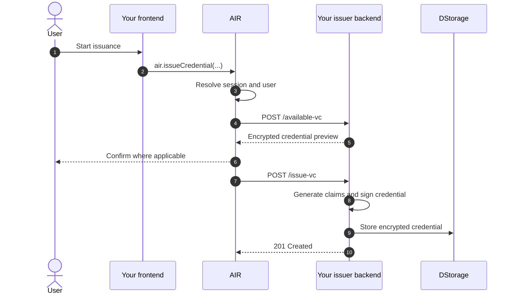

As an issuer, you own the source data and signing keys. Your backend decides
what a user may claim, signs the credential, encrypts it to the holder, and
stores the encrypted envelope in DStorage. AIR stores opaque ciphertext and
metadata; it does not receive your source data in plaintext.

You host one **Issuer Backend**. `air-issuer-service` is a reference
implementation, not a required framework or architecture.

## Credential formats

The issuer backend supports multiple credential formats:

1. **`BJJ_SIG_2021`** — the current primary format for AIR credential
   issuance. The issuer signs the credential with its BJJ issuer identity and
   exposes the status endpoints required for verification and revocation.
2. **`SD_JWT_VC`** — an additional selective-disclosure format. Use it when
   the schema and issuance program are explicitly configured for SD-JWT VC.

The schema, issuance program, `/available-vc` response, and `/issue-vc` request
must all use the same `proofType`. Do not silently switch formats inside the
issuer backend.

There are two supported paths:

- **Hosted SDK issuance** — the user starts issuance in your frontend. AIR
  resolves the authenticated user and calls your configured issuer endpoints.
- **Direct issuance** — your backend responds to an event without
  an active AIR user session. It resolves the recipient through AIR, signs and
  encrypts the credential, and uploads it to DStorage.

## Hosted issuance flow

The canonical hosted flow is: **user starts issuance → AIR resolves
session/user → AIR calls issuer `/available-vc` → user confirms where
applicable → AIR calls issuer `/issue-vc` → issuer signs/stores credential.**

Use this sequence everywhere you implement hosted issuance:

1. The user starts issuance in your frontend through AIR Kit.
2. AIR resolves the authenticated session and user.
3. AIR calls your issuer backend's `POST /available-vc` endpoint.
4. The user confirms the credential where applicable.
5. AIR calls your issuer backend's `POST /issue-vc` endpoint.
6. Your issuer backend generates the authoritative claims, signs the
   credential, encrypts it to the holder, persists its issuance record, and
   uploads the encrypted envelope to DStorage.



Your frontend starts the AIR flow. It does not first call your issuer backend
and manually forward a `credentialSubject`. AIR supplies the resolved
`holderDID`, holder keys, and partner user identifier to the configured issuer
endpoints. Use `userId` to authorize eligibility and load claims from your own
systems; do not authorize from `holderDID` alone.

## Issuer identity and signing

Configure the issuer identifier and signing keys required by your selected
credential format and issuer implementation. Keep private signing keys in a
secrets manager and expose only the public verification material required by
verifiers. `ISSUER_ORIGIN` must be the stable public HTTPS origin of the hosted
issuer service.

- For `BJJ_SIG_2021`, configure the issuer DID and BJJ signing key expected by
  the current issuer implementation. Keep the credential-status and revocation
  endpoints reachable under `ISSUER_ORIGIN`.
- For `SD_JWT_VC`, configure the issuer signing key and publish the public
  verification material required by the SD-JWT issuer metadata contract.

## Configure the issuer backend in the Dashboard

For hosted issuance, use this order:

1. Deploy your issuer backend.
2. Test that the issuer backend and its required public metadata or status
   endpoints are accessible over public HTTPS.
3. Open the Developer Dashboard and go to **Issuer → Settings**.
4. Enter the issuer identifier, Issuer Backend URL, full `/available-vc` and
   `/issue-vc` endpoint URLs, and the API key AIR must send as `x-api-key`.
5. Save the settings.
6. Create or select a schema, create an issuance program using
   `BJJ_SIG_2021` for the current primary path or `SD_JWT_VC` where explicitly
   supported, and run an end-to-end hosted issuance test.

Sandbox configuration is self-service where the Dashboard exposes these
settings. For Mainnet activation, prepare the same deployed endpoint and key
information, then contact the AIR team for production enablement. Sandbox and
Mainnet settings are separate.

## Issuer endpoint contract

AIR calls both issuer-hosted endpoints with:

```http
Content-Type: application/json
x-api-key: <issuerBackendApiKey>
```

The API key must match the value saved in the Dashboard and must never be
exposed to frontend code.

### `POST /available-vc`

AIR calls this endpoint after resolving the holder:

```json
{
  "holderDID": "did:air:...",
  "pubKey": "0x...",
  "userId": "<partner-primary-identifier>",
  "schemaId": "<optional-schema-filter>",
  "proofType": "BJJ_SIG_2021"
}
```

Your backend uses `userId` to evaluate eligibility and generate authoritative
claims. It encrypts each preview to `pubKey` and returns `{ "data": [...] }`.
For an SD-JWT program, AIR sends `"proofType": "SD_JWT_VC"` instead.

### `POST /issue-vc`

After confirmation, AIR calls this endpoint with the selected schema and
holder information:

```json
{
  "holderDID": "did:air:...",
  "pubKey": "0x...",
  "userId": "<partner-primary-identifier>",
  "schemaId": "<schema-id>",
  "proofType": "BJJ_SIG_2021"
}
```

The reference service regenerates the final claims, signs the credential,
encrypts it to the holder, records the issuance, uploads it to DStorage, and
returns `201` with an empty body.

For an SD-JWT program, the request uses `"proofType": "SD_JWT_VC"` and may
include the holder-binding signing key required by that program.

See [Issuance API Reference](/airkit/usage/credential/issuance-api) for the
complete request and response contract.

## On-demand issuance

Use direct issuance when a trusted backend event should issue a credential
without an active AIR session—for example, a completed KYC check, a purchase,
or a venue check-in.

1. Your backend creates a short-lived Partner JWT containing `partnerId`, the
   recipient's `email`, and normal JWT issuer and timing claims.
2. It calls `POST /auth/initialize-user` with `x-partner-id: <Partner ID>` and
   `{ "partnerJwt": "<Partner JWT>" }` in the request body.
3. AIR returns the holder DID and public key.
4. Your backend generates and signs the credential with its issuer signing
   key, encrypts it to the returned public key, and calls
   `POST /dstorage/vcs` with a Partner JWT.
5. Your backend records the returned storage reference and the user can present
   the credential later.

This direct path does not call the issuer-hosted `/available-vc` or `/issue-vc`
routes. Those routes belong to AIR-orchestrated hosted issuance.

## Operational checklist

- Keep source data, issuer signing keys, Partner JWT signing keys, and API keys
  server-side.
- Keep `ISSUER_ORIGIN` stable and publicly reachable over HTTPS.
- Publish the public issuer metadata and status endpoints required by the
  selected credential format.
- Keep the schema, issuance-program proof type, and endpoint configuration
  consistent. Use `BJJ_SIG_2021` for the current primary path and
  `SD_JWT_VC` only for programs configured for it.
- Test the complete AIR-orchestrated flow after saving Dashboard settings.
- Review issuance history and exercise credential revocation before production.

## Next steps

- [Issuance API Reference](/airkit/usage/credential/issuance-api)
- [Quickstart: Issue Credentials](/airkit/quickstart/issue-credentials)
- [Partner Authentication](/airkit/usage/partner-authentication)
- [Verifying Credentials](/airkit/usage/credential/verify)
