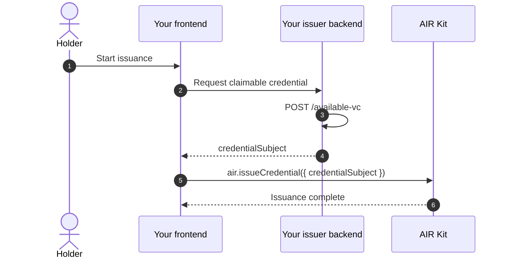
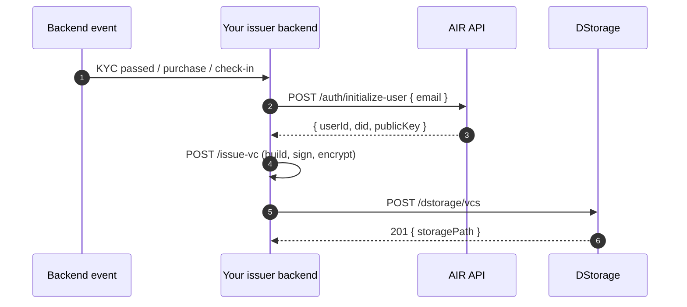

As an Issuer, you own your source data and signing keys. You build the credential, sign it with issuer-controlled keys, encrypt it to the holder's public key, and store the encrypted envelope in DStorage. AIR stores opaque ciphertext and metadata — it never handles your plaintext data.

You host a single **Issuer Backend** (`air-issuer-service` is one reference implementation). Whoever hosts it holds the issuer keys, the data source, and the `x-api-key`. There are two issuance paths on that backend:

- **SDK issuance** — the user is present. Your frontend asks your backend for a claimable `credentialSubject` (via `available-vc`), then calls `air.issueCredential` with that subject.
- **On-demand issuance** — no user interaction with AIR. Your backend resolves the holder, then calls its own `issue-vc` to build, sign, encrypt, and store the credential.

<Info>
**When to run an Issuer Backend**

Integrate an Issuer Backend when you need on-demand issuance, queryable available credentials, revocation checks, or issuer-controlled data access. New issuance programs should use the `BJJ_SIG_2021` signature type by default.
</Info>

## Dashboard setup

Credential services are gated. When you first sign up, the **Issuer and Verifier menus (schemas, programs, and DID settings) stay hidden** until your Issuer DID is registered with AIR.

The setup flow is similar for Sandbox and Mainnet, but there is one important difference:

- **Sandbox**: you can complete the issuer setup directly through the Dashboard
- **Mainnet**: you must generate the required parameters first and then contact us so we can complete the activation and registration on our side.

### Sandbox Setup

1. Create or use an AIR Dashboard account.
2. Download **`air-issuer-service`** and generate a seed. Your signing keys and your Issuer DID are derived from this seed, so keep it secure.
<Note>Do not share the issuer seed with us or expose it in frontend code.</Note>
3. Retrieve your Issuer DID:
  <br/>Use the provided tooling in air-issuer-service to derive and retrieve your Issuer DID.
4. Open the AIR Dashboard. Navigate to **Issuer → Settings**
5. Register your issuer by pasting the **issuerDID** and **API key**, then click **save**.
6. Complete the remaining issuer configuration:
   - Supported signature types — `BJJ_SIG_2021`
   - JWKS URL / key information where applicable
   - Issuer Backend URL and endpoint paths
7. Select or create a schema, then create an issuance program.

### Mainnet Setup

For Mainnet, the process starts similarly, but activation is handled differently.

- Set up **`air-issuer-service`**
- Generate and securely store the issuer seed
- Retrieve your **Issuer DID**
- Generate the required **API Key** and other configuration parameters
- Prepare your Issuer Backend URL and relevant endpoint configuration

Once these details are ready, Please contact the AIR team and provide the required Mainnet configuration details so we can register and activate your issuer on our side.

Typically, we will need:

- **Issuer DID**
- **API Key**
- **Partner ID**
- **Issuer Backend URL**

After the Mainnet issuer has been activated, we will confirm that you can proceed with schemas, issuance programs, and production credential issuance.

> **Important**: Sandbox and Mainnet are separate environments. Configuration created in Sandbox should not be assumed to carry over to Mainnet. Mainnet requires its own issuer configuration and activation.

## Technical integration

| Capability | Endpoint | Notes |
| --- | --- | --- |
| Initialize / resolve user | `POST /auth/initialize-user` | Partner-authenticated call using the user identifier (typically email). Returns the user DID and public key, creating or resolving the AIR account as needed. Used for on-demand issuance when the user has no active session. |
| Store encrypted VC | `POST /dstorage/vcs` | Stores the issuer-signed, holder-encrypted VC envelope in DStorage. Returns a DStorage path / storage reference. Called by your backend as part of `issue-vc`. |
| Available credentials | `POST /available-vc` (issuer-hosted) | Your backend lists eligible credentials for a user and returns the `credentialSubject` for the frontend to pass into `air.issueCredential`. |
| Issue credential | `POST /issue-vc` (issuer-hosted) | Your backend builds, signs, encrypts, and stores the credential. Used for on-demand issuance when the end user does not interact with AIR. |

See [Issuance API Reference](/airkit/usage/credential/issuance-api) for request and response details.

## Configure the backend

Set up your issuer backend / environment with:

- Issuer DID and signing keys
- Schema and program configuration
- API keys / partner auth
- DStorage endpoint configuration
- Issuer data source connection
- A generated **private API key** (`API_KEY`) that protects your issuer-hosted endpoints via the `x-api-key` header

### Expose `available-vc`

Your backend exposes `POST /available-vc` and accepts the holder identity:

```json
{
  "holderDID": "did:air:...",
  "pubKey": "0x...",
  "userId": "<partner primary identifier>",
  "schemaId": "<optional schema filter>",
  "proofType": "BJJ_SIG_2021"
}
```

- Retrieves the user's eligible credential data from your data source.
- Returns `{ data: [...] }`, with each credential subject encrypted to the holder's `pubKey`.
- Accepts optional `schemaId` and `proofType` filters.

### Expose `issue-vc`

Your backend exposes `POST /issue-vc` with the same `holderDID`, `pubKey`, and `userId`, plus the required `schemaId` and optional `proofType`:

- Retrieves the final user data.
- Builds the VC and signs it with issuer-controlled keys.
- Encrypts the VC to the user's public key.
- Stores the encrypted VC via DStorage.
- Returns an empty response body after successful issuance. The issuer backend stores the DStorage response in its issuance record.

Both endpoints require `x-api-key: <issuerBackendApiKey>`. Use `userId`—not `holderDID` alone—to retrieve partner-owned eligibility and claim data.

## SDK issuance

Use this path when the user is present in your app and should confirm issuance through AIR Kit.

1. Your frontend asks your issuer backend for a claimable credential.
2. Your backend calls (or runs the logic of) `POST /available-vc` and returns the `credentialSubject` to the frontend.
3. The frontend calls `air.issueCredential` with that `credentialSubject`, along with the Partner JWT, issuer DID, and program ID.
4. AIR Kit completes the issuance with the logged-in holder. Your backend remains authoritative over the claims it produces.



The user's raw data never leaves your control in plaintext. Your backend derives the claims; the frontend only forwards the subject that your backend returned.

## On-demand issuance

Use this path when a **backend event** should issue a credential with no user interaction with AIR — the end user does not need to be in a session, open a wallet, or interact with any UI. Your backend does the full issuance job.

Typical triggers:

- Issuing a KYC credential the moment a user passes identity verification
- Issuing an attendance credential when a venue scan detects a fan's check-in
- Issuing a subscriber tier credential at the end of each billing cycle
- Issuing a loyalty credential triggered by a purchase event

### How it works

1. A backend event fires — KYC passed, purchase confirmed, check-in scanned — or your batch job begins.
2. Your backend loads its environment: issuer signing keys and DID, schema and program configuration, Partner auth, and DStorage config.
3. Your backend calls `POST /auth/initialize-user` with the recipient's email to resolve or create the user's AIR Account, receiving the user DID and public key. The email is passed in the request body — not in the Partner JWT.
4. Your backend calls its own `POST /issue-vc` (or runs the same logic inline) to build the VC, sign it with issuer-controlled keys (`BJJ_SIG_2021`), encrypt it to the user public key, and store the encrypted envelope via `POST /dstorage/vcs`.
5. The user presents the credential later at any verifier; no action needed at issuance time.



### Prerequisites

1. **Credential services enabled** — Generate your Issuer DID with `air-issuer-service` and register it with AIR to unlock issuer functionality.
2. **Partner ID and Issuer DID** — Partner ID from the Developer Dashboard (Accounts → General). Your Issuer DID is derived from your own signing keys; AIR does not generate it for you.
3. **Issuance program** — A published credential program in the dashboard (Issuer → Programs).
4. **JWKS endpoint** — A public URL serving your public key for JWT verification. See [Partner Authentication](/airkit/usage/partner-authentication).

## Compliance encryption (CAK)

When compliance encryption is enabled for your issuance program (configured in the Developer Dashboard), you can obtain a user-specific public key (`cakPublicKey`) to encrypt additional compliance data for regulated disclosure or threshold decryption. The key is deterministically derived from the [User – Issuer – Schema] composite identifier, so the same key is returned for the same combination.

<Card title="Full CAK Issuer Guide" icon="arrow-right" href="/airkit/usage/credential/cak-issuer-guide">
  For Dashboard configuration, encrypting user data with the CAK public key, and implementing the callback endpoint, see the dedicated CAK Issuer Guide.
</Card>

## View issued credential records

Review the records of every credential you have issued in the <a href="https://developers.sandbox.air3.com/dashboard" target="_blank" rel="noreferrer">Developer Dashboard</a> under **Issuer → Usage Records**. Where a credential needs to be invalidated, use the **Revoke** function in the Dashboard.

<Frame caption="Issuer -> Usage Records in the Developer Dashboard">
  
</Frame>

When operating the self-hosted issuer service, you can also query `GET /admin/issuance-history` and revoke by nonce with `POST /admin/revoke`. Issued BJJ credentials reference the public `GET /credential-status/:nonce` endpoint for non-revocation proofs. See the [Issuance API Reference](/airkit/usage/credential/issuance-api) for the complete issuer-side contract.

## Best practices for issuers

- Only issue credentials after thorough validation of submitted evidence or claims.
- Keep source data and signing keys under issuer control; never expose plaintext user data to AIR.
- Minimize personally identifiable information — issue privacy-preserving credentials whenever possible.
- Adopt open, standardized schemas to maximize compatibility across apps.
- Implement robust expiry and revocation processes, and keep holders and verifiers informed of credential status.
- Treat bulk imports as an operational process for large backfills, not the default integration path.

## Next steps

- [Issuance API Reference](/airkit/usage/credential/issuance-api)
- [Verifying Credentials](/airkit/usage/credential/verify)
- [Quickstart: Issue Credentials](/airkit/quickstart/issue-credentials)
