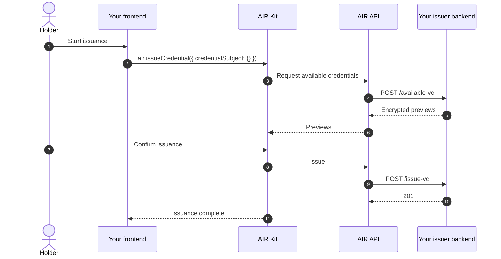
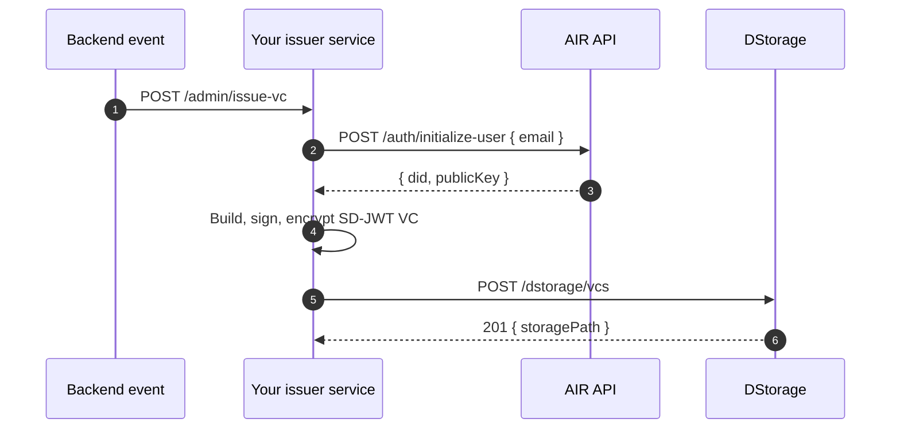

As an Issuer, you own your source data and signing keys. You build the credential, sign it with issuer-controlled keys, encrypt it to the holder's public key, and store the encrypted envelope in DStorage. AIR stores opaque ciphertext and metadata — it never handles your plaintext data.

You host a single **Issuer Backend**. The [AIR issuer service](https://github.com/MocaNetwork/air-issuer-service/tree/main) is the reference implementation. Whoever hosts it holds the issuer keys, the data source, and the API keys. There are two issuance paths on that backend:

- **SDK issuance** — the user is present. Your frontend calls `air.issueCredential`; AIR calls your backend's `available-vc` and `issue-vc` endpoints.
- **Direct issuance** — no user interaction with AIR. Your backend resolves the holder by email and issues the credential itself.

<Info>
**Credential format**

New issuance programs use the `SD_JWT_VC` signature type. SD-JWT issuance is self-serve in sandbox and production. Iden3 (`BJJ_SIG_2021`) credentials are an advanced option that the AIR team enables; see [Credential formats](/airkit/usage/credential/credential-formats) and [Iden3 credentials](/airkit/usage/credential/iden3-credentials).
</Info>

## Dashboard setup

Credential services are gated. When you first sign up, the **Issuer and Verifier menus (schemas, programs, and DID settings) stay hidden** until your Issuer DID is registered.

Sandbox and production use separate Dashboards, and both are self-serve for SD-JWT issuers:

- **Sandbox:** [developers.sandbox.air3.com](https://developers.sandbox.air3.com/dashboard)
- **Production:** [developers.air3.com](https://developers.air3.com/dashboard)

In the Dashboard for your target environment:

1. Deploy the SD-JWT branch of the [AIR issuer service](https://github.com/MocaNetwork/air-issuer-service/tree/main) at a stable public HTTPS origin. Your Issuer DID is `did:web:<host of ISSUER_ORIGIN>`; the service publishes it at `/.well-known/did.json`. See [Issuer backend hosting](/airkit/usage/backend-hosting).
2. Open **Issuer → Settings** and register the issuer:
   - Issuer DID (`did:web:…`) and the issuer **API key**
   - Supported signature type: `SD_JWT_VC`
   - JWKS URL for your partner keys
   - `availableVcApiUrl`, `issueVcApiUrl`, and `revocationStatusApiUrl`, pointing at `POST /available-vc`, `POST /issue-vc`, and `GET /revocation-status/:nonce` on your backend
3. Select or create a schema, then create an issuance program.

<Warning>
  Treat the issuer host as permanent once you issue your first credential. The host is part of the `did:web` Issuer DID, so changing it changes your issuer identity, and credentials issued under the old host no longer resolve to you.
</Warning>

> **Important**: Sandbox and production are separate environments. Configuration created in sandbox does not carry over. Register the issuer, schemas, and programs again in the production Dashboard.

To issue Iden3 credentials, contact the AIR team; see [Iden3 credentials](/airkit/usage/credential/iden3-credentials).

## Technical integration

| Capability | Endpoint | Notes |
| --- | --- | --- |
| Initialize / resolve user | `POST /auth/initialize-user` | Partner-authenticated call using the user identifier (typically email). Returns the user DID and public key, creating or resolving the AIR account as needed. Used for on-demand issuance when the user has no active session. |
| Store encrypted VC | `POST /dstorage/vcs` | Stores the issuer-signed, holder-encrypted VC envelope in DStorage. Returns a DStorage path / storage reference. Called by your backend as part of `issue-vc`. |
| Available credentials | `POST /available-vc` (issuer-hosted) | AIR calls it during SDK issuance. Your backend lists eligible credentials for the holder and returns encrypted previews. |
| Issue credential | `POST /issue-vc` (issuer-hosted) | AIR calls it after the holder confirms. Your backend builds, signs, encrypts, and stores the credential. |
| Direct issuance | `POST /admin/issue-vc` (issuer-hosted) | Your own servers call it to issue without a user session. Protected by `x-admin-api-key`. |
| Revoke | `POST /admin/revoke` (issuer-hosted) | Your own servers call it to revoke. See [Revoke credentials](/airkit/usage/credential/revocation). |

The first two rows are AIR API endpoints. Every row marked issuer-hosted runs on your issuer service at `ISSUER_ORIGIN`.

See [Issuance API Reference](/airkit/usage/credential/issuance-api) for request and response details.

## Configure the backend

Set up your issuer backend / environment with:

- A stable public `ISSUER_ORIGIN` (it defines your `did:web` Issuer DID) and partner signing keys
- Schema and program configuration
- API keys / partner auth
- DStorage endpoint configuration
- Issuer data source connection
- A generated **private API key** (`API_KEY`) that protects your issuer-hosted endpoints via the `x-api-key` header
- A separate **admin API key** (`ADMIN_API_KEY`) for the `/admin/*` routes your own servers call

### Expose `available-vc`

Your backend exposes `POST /available-vc` and accepts the holder identity:

```json
{
  "holderDID": "did:air:...",
  "pubKey": "0x...",
  "userId": "<partner primary identifier>",
  "schemaId": "<optional schema filter>",
  "proofType": "SD_JWT_VC"
}
```

- Retrieves the user's eligible credential data from your data source.
- Returns `{ data: [...] }`, with each credential subject encrypted to the holder's `pubKey`.
- Accepts optional `schemaId` and `proofType` filters.

### Expose `issue-vc`

Your backend exposes `POST /issue-vc` with the same `holderDID`, `pubKey`, and `userId`, plus the required `schemaId`, optional `proofType`, and the holder's `signingKey`:

- Retrieves the final user data.
- Builds the SD-JWT VC and signs it with issuer-controlled keys. When AIR sends `signingKey.jwk`, it becomes the credential's `cnf` claim, binding the credential to the holder.
- Encrypts the VC to the user's public key.
- Stores the encrypted VC via DStorage.
- Returns an empty response body after successful issuance. The issuer backend stores the DStorage response in its issuance record.

Both endpoints require `x-api-key: <issuerBackendApiKey>`. Use `userId`—not `holderDID` alone—to retrieve partner-owned eligibility and claim data.

## SDK issuance

Use this path when the user is present in your app and should confirm issuance through AIR Kit.

1. Your frontend calls `air.issueCredential` with the Partner JWT, issuer DID, and program ID, passing `{}` as `credentialSubject`.
2. AIR logs the user in if needed and calls your backend's `POST /available-vc`. Your backend returns encrypted previews of the credentials the holder can claim.
3. The holder reviews the preview and confirms.
4. AIR calls your backend's `POST /issue-vc`. Your backend builds, signs, encrypts, and stores the credential, and stays authoritative over the claims.


```mermaid
sequenceDiagram
    autonumber
    actor Holder
    participant App as Your frontend
    participant SDK as AIR Kit
    participant AIR as AIR API
    participant Backend as Your issuer backend
    Holder->>App: Start issuance
    App->>SDK: air.issueCredential({ credentialSubject: {} })
    SDK->>AIR: Request available credentials
    AIR->>Backend: POST /available-vc
    Backend-->>AIR: Encrypted previews
    AIR-->>SDK: Previews
    Holder->>SDK: Confirm issuance
    SDK->>AIR: Issue
    AIR->>Backend: POST /issue-vc
    Backend-->>AIR: 201
    SDK-->>App: Issuance complete
```

The user's raw data never leaves your control in plaintext. Previews are encrypted to the holder, and the browser never sees your issuer API key.

### Waiting for issuance to complete

By default, `issueCredential` resolves once the credential has been issued and stored, without waiting for its on-chain record (hashes and status metadata, not the credential itself) to be confirmed. Pass `waitForOnchainCompletion: true` when your next step depends on that record already being confirmed:

```jsx
await airService.issueCredential({
  authToken,
  issuerDid,
  credentialId,
  credentialSubject,
  waitForOnchainCompletion: true,
});
```

| Value | Behavior |
| --- | --- |
| `false` (default) | Resolves as soon as issuance completes. The on-chain record may still be pending, so an immediate verification can fail. |
| `true` | Polls until the on-chain record is confirmed before resolving. Rejects if confirmation fails or times out. |

Use `true` when you verify right after issuing, or when you show the user a confirmed state. Keep the default when issuance is a background step and the user does not wait on it — confirmation adds latency proportional to block time.

<Note>
  `waitForOnchainCompletion` replaced the earlier `offchain` parameter. Whether a program writes on-chain at all is configured on the program in the Developer Dashboard, not on the call.
</Note>

## Direct issuance

Use this path when a **backend event** should issue a credential with no user interaction with AIR — the end user does not need to be in a session, open a wallet, or interact with any UI. Your backend does the full issuance job.

Typical triggers:

- Issuing a KYC credential the moment a user passes identity verification
- Issuing an attendance credential when a venue scan detects a fan's check-in
- Issuing a subscriber tier credential at the end of each billing cycle
- Issuing a loyalty credential triggered by a purchase event

### How it works

The SD-JWT issuer service exposes `POST /admin/issue-vc` for this path. It runs on your issuer service, not on the AIR API, and only your own servers should call it.

1. A backend event fires — KYC passed, purchase confirmed, check-in scanned — or your batch job begins.
2. Your server calls `POST {ISSUER_ORIGIN}/admin/issue-vc` with the `x-admin-api-key` header.
3. The issuer service calls AIR `POST /auth/initialize-user` with the recipient's email to resolve or create their AIR Account, receiving the holder DID and public key.
4. It signs the SD-JWT VC, encrypts it to the holder's public key, and stores it through `POST /dstorage/vcs`.
5. The user presents the credential later to any AIR verifier; no action needed at issuance time.

```bash
curl -X POST "$ISSUER_ORIGIN/admin/issue-vc" \
  -H "x-admin-api-key: $ADMIN_API_KEY" \
  -H "content-type: application/json" \
  -d '{
    "userId": "member@example.com",
    "schemaId": "<SCHEMA_ID>",
    "vct": "<SCHEMA_ID>",
    "expiration": "2030-01-01T00:00:00Z",
    "credentialSubject": { "tier": "Gold" },
    "disclosureFrame": { "_sd": ["tier"] }
  }'
```

- `userId` must be the email AIR knows the user by.
- `expiration` is an ISO 8601 date in the future.
- `credentialSubject` must not contain reserved claims: `cnf`, `exp`, `iat`, `id`, `iss`, `nonce`, `status`, `sub`, `vct`, `vct#integrity`.
- `disclosureFrame` is optional. By default every top-level claim is selectively disclosable.
- No registered schema class is needed.

<Note>
  Directly issued credentials carry no `cnf` holder key, because the holder is not present to provide one. Their presentations cannot include a key-binding JWT, so verifiers receive bearer presentations. Use SDK issuance when you need holder binding. See [Verify SD-JWT on your backend](/airkit/usage/credential/verify-sd-jwt).
</Note>

Issuance is recorded in `GET /admin/issuance-history` and revoked the same way as claimed credentials.


```mermaid
sequenceDiagram
    autonumber
    participant Event as Backend event
    participant Backend as Your issuer service
    participant AIR as AIR API
    participant DS as DStorage
    Event->>Backend: POST /admin/issue-vc
    Backend->>AIR: POST /auth/initialize-user { email }
    AIR-->>Backend: { did, publicKey }
    Backend->>Backend: Build, sign, encrypt SD-JWT VC
    Backend->>DS: POST /dstorage/vcs
    DS-->>Backend: 201 { storagePath }
```

### Prerequisites

1. **Credential services enabled** — Register your `did:web` Issuer DID in **Issuer → Settings** to unlock issuer functionality.
2. **Partner ID and Issuer DID** — Partner ID from the Developer Dashboard (Accounts → General). Your Issuer DID comes from your issuer host; AIR does not generate it for you.
3. **Issuance program** — A published credential program in the dashboard (Issuer → Programs).
4. **JWKS endpoint** — A public URL serving your public key for JWT verification. See [Partner Authentication](/airkit/usage/partner-authentication).

## View Issued Credential Records

You can review the records of every credential you have issued in the <a href="https://developers.sandbox.air3.com/dashboard" target="_blank" rel="noreferrer">Developer Dashboard</a> by going to **Issuer -> Usage Records**.

<Frame caption="Issuer -> Usage Records in the Developer Dashboard">
  
</Frame>

## Best Practices for Issuers (SDK)

- Only issue credentials after thorough validation of submitted evidence or claims.
- Keep source data and signing keys under issuer control; never expose plaintext user data to AIR.
- Minimize personally identifiable information — issue privacy-preserving credentials whenever possible.
- Adopt open, standardized schemas to maximize compatibility across apps.
- Implement robust expiry and [revocation](/airkit/usage/credential/revocation) processes, and keep holders and verifiers informed of credential status.
- Treat bulk imports as an operational process for large backfills, not the default integration path.

## Next steps

- [Issuance API Reference](/airkit/usage/credential/issuance-api)
- [Revoke credentials](/airkit/usage/credential/revocation)
- [Verifying Credentials](/airkit/usage/credential/verify)
- [Quickstart: Issue Credentials](/airkit/quickstart/issue-credentials)
