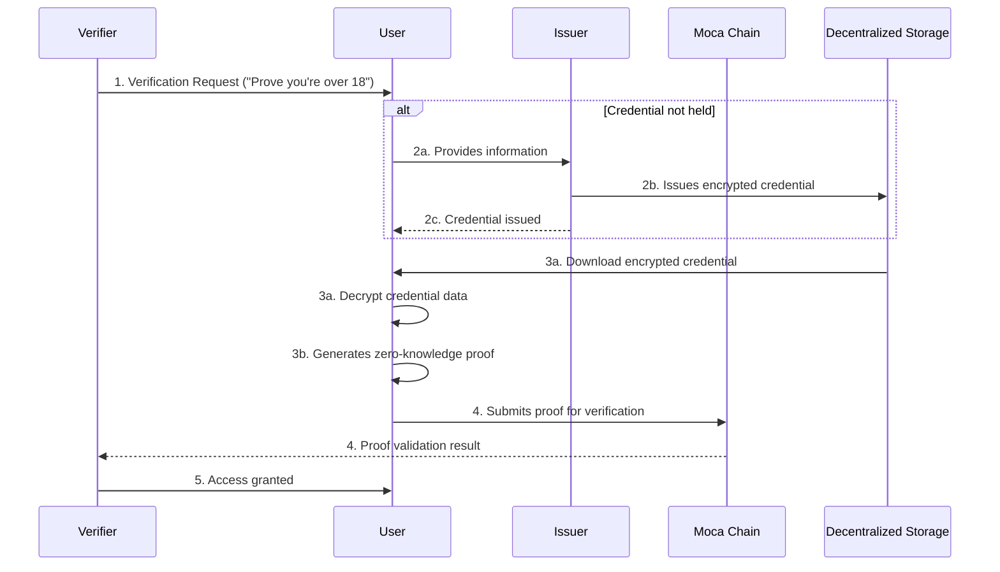

As a Verifier, your role is to verify the authenticity of user credentials and ensure they meet the required conditions. Follow these steps to integrate and operate the verification process.

## Verification Flow

The AIR Credential verification process follows these simplified steps:

1. **Verification Request** - Verifier presents a verification requirement to the user (e.g., "Prove you're over 18")
2. **Credential Issuance** (if needed) - If the user lacks the required credential, a trusted Issuer validates their information and issues an encrypted verifiable credential stored in decentralized storage
3. **Zero-Knowledge Proof Generation** - User generates a cryptographic proof from their credential that answers the verifier's query without revealing personal data
4. **On-Chain Verification** - The proof is submitted to Moca Chain's smart contract, which validates it and records the verification result
5. **Access Granted** - Upon successful verification, the user gains access to the requested service or resource



## Implementation

### **Step 1: Set Up a Verification Program**

1.  Use the <a href="https://developers.sandbox.air3.com/dashboard" target="_blank" rel="noreferrer">Developer Dashboard</a> to create a verification program (Verifier -> Program).
2.  While creating the program, search for the schema for the credentials you intend to verify, and check the attributes to be included (e.g., name, age, nationality, etc.).
3.  Use the **Define Query** module to set up specific verification conditions, such as:
    - Attributes to verify (e.g., age, nationality).
    - Operators (e.g., Equals, Not Equals, Includes, Excludes).
    - Attribute values to match.
4.  Specify the Issuer’s DID to ensure the credentials being verified originate from a trusted issuer. (optional)
5.  Provide a program name and review all configured details before saving.
6.  Publish the program on-chain and take note of the program ID. You will need $MOCA in your Fee Wallet (Verifier -> Fee Wallet).

### **Step 2: Generate Auth Token**

Generate a [Partner JWT](/airkit/usage/partner-authentication) securely with your backend server, and include `scope=verify` to limit its scope.

### **Step 3: Initiate Verification Request**

To verify a user's Verified Credentials, simply call the verifyCredentials() function in AIR Kit to verify a VC on-chain.


<Tabs>
<Tab title="Web">

```jsx
public async verifyCredential({
    authToken,
    programId,
    redirectUrl,
  }: {
    authToken: string;
    programId: string;
    redirectUrl?: string;
  }): Promise<CredentialVerificationResult>
```

### Input Parameters

| Name          | Type   | Required | Description                                                                           |
| ------------- | ------ | -------- | ------------------------------------------------------------------------------------- |
| `authToken`   | string | Yes      | Your signed Partner JWT, with scope=verify.                                           |
| `programId`   | string | Yes      | Identifier for the verification program.                                              |
| `redirectUrl` | string | No       | Optional URL to redirect the user if the user has not issued the relevant credential. |

### Response

The function returns a `Promise<CredentialVerificationResult>`. The `CredentialVerificationResult` is a discriminated union type with the following structure:

**For non-compliant statuses** (`"Non-Compliant"`, `"Pending"`, `"Revoking"`, `"Revoked"`, `"Expired"`, `"NotFound"`):

| Field    | Type   | Description                                |
| -------- | ------ | ------------------------------------------ |
| `status` | string | The result of the credential verification. |

**For compliant status** (`"Compliant"`):

| Field             | Type                     | Description                                                                                                                                                                                                       |
| ----------------- | ------------------------ | ----------------------------------------------------------------------------------------------------------------------------------------------------------------------------------------------------------------- |
| `status`          | `"Compliant"`            | Indicates the credential is valid and meets all verification requirements.                                                                                                                                        |
| `zkProofs`        | `Record<string, string>` | Zero-knowledge proofs generated for the verification, keyed by proof identifier.                                                                                                                                  |
| `transactionHash` | `string`                 | On-chain transaction hash of the verification.                                                                                                                                                                    |
| `cakPrivateKey`   | `string`                 | Optional. Compliance encryption private key. Only present when compliance encryption is enabled. Used to decrypt compliance data that was encrypted with the corresponding public key during credential issuance. |

</Tab>
<Tab title="Flutter">

Not supported yet


Under the hood, AIR Kit retrieves the encrypted credentials from **Decentralized Storage** based on the user's wallet address and program configuration. After the user approves the verification process, a Zero-knowledge Proof (ZKP) is generated on the client side without exposing the raw data to the verifier or Moca's servers. At the same time, the credentials are checked against any revocation statuses or expiration. Once the ZKP is generated, it is submitted on-chain for verification.

### Compliance Encryption Private Key

When a verification result is `"Compliant"` and compliance encryption was enabled during credential issuance, the verification response includes a `cakPrivateKey` (Compliance Encryption User Private Key). This private key corresponds to the public key (`cakPublicKey`) that was returned during credential issuance.

This feature enables verifiers to:

- **Decrypt compliance data** that was encrypted by the issuer using the corresponding public key
- **Access regulated disclosure information** or participate in threshold decryption workflows
- **Retrieve compliance data** only after successful credential verification

The private key is only provided when:

- The verification status is `"Compliant"` (credential is valid and meets requirements)
- Compliance encryption was enabled for the issuance program
- The verifier has proper authorization

<Card title="Full CAK Verifier Guide" icon="arrow-right" href="/airkit/usage/credential/cak-verifier-guide">
  For complete details on handling user consent, receiving the private key, decrypting user data, and security best practices, see the dedicated CAK Verifier Guide.
</Card>
</Tab>
</Tabs>
<Tip>
- Use the **Chain Explorer** to find the record of the on-chain transaction related to verification (Credentials -> Verification)
- The `cakPrivateKey` is only available for compliant verifications, ensuring compliance data can only be decrypted after successful verification
</Tip>
