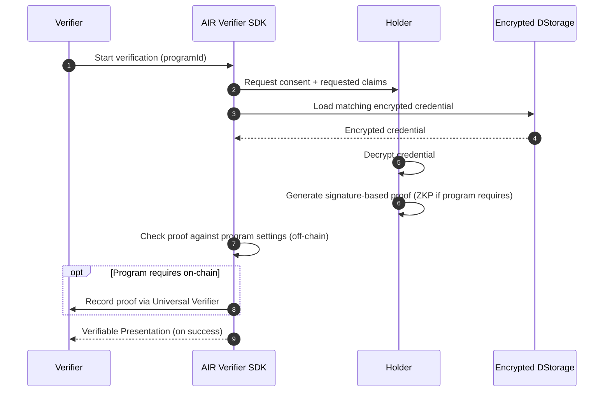

As a Verifier, your role is to verify the authenticity of user credentials and ensure they meet your requirements. Verification is **program-driven**: a Verification Program configured in the Developer Dashboard centrally controls the proof type, whether a zero-knowledge proof is required, selective disclosure, and off-chain or on-chain mode. Your integration mainly passes a `programId` and optional disclosure parameters; the SDK handles credential discovery, consent, proof generation, and result handling.

## Verification Flow

1. **Start verification** — the verifier starts a session with a `programId`. The program defines what to check and how.
2. **Consent + discovery** — the SDK requests the holder's consent and loads the matching encrypted credential from DStorage.
3. **Proof generation** — the holder decrypts the credential and generates a signature-based proof, including a zero-knowledge proof where the program requires one, disclosing only the requested claims.
4. **Verification** — the proof is checked against the program's settings off-chain by default, or recorded on-chain through the Universal Verifier when the program requires it.
5. **Result** — on success the SDK returns a W3C **Verifiable Presentation** containing the disclosed claims and proof material.


```mermaid
sequenceDiagram
    autonumber
    participant Verifier
    participant SDK as AIR Verifier SDK
    participant User as Holder
    participant DS as Encrypted DStorage
    Verifier->>SDK: Start verification (programId)
    SDK->>User: Request consent + requested claims
    SDK->>DS: Load matching encrypted credential
    DS-->>SDK: Encrypted credential
    User->>User: Decrypt credential
    User->>User: Generate signature-based proof (ZKP if program requires)
    SDK->>SDK: Check proof against program settings (off-chain)
    opt Program requires on-chain
        SDK->>Verifier: Record proof via Universal Verifier
    end
    SDK-->>Verifier: Verifiable Presentation (on success)
```

Every verification attempt is recorded as a **verification session** — a server-side record of the result, mode, holder context, and usage data — giving you consistent reporting across integrations.

## Verifier integration checklist

1. Create or select a **Verification Program** in the <a href="https://developers.sandbox.air3.com/dashboard" target="_blank" rel="noreferrer">Developer Dashboard</a> (Verifier → Program).
2. Configure the program:
   - Accepted proof type (`BJJ_SIG_2021`, `IDEN3_MTP`, or `SD_JWT_VC`)
   - Requested claims and whether selective disclosure is required
   - Whether ZKP is required
   - Off-chain vs on-chain verification
   - The Issuer's DID to constrain trusted issuers (optional)
3. Publish the program and take note of the `programId`.
4. Integrate the AIR Verifier SDK.
5. Start verification with the `programId`.
6. Handle outcomes: Compliant, Non-compliant, No matching credential, User declined consent, or proof/verification failure.
7. On success, consume the returned Verifiable Presentation.

<Note>
  The dashboard link above uses Sandbox for development. For production launches, use the [production Developer Dashboard](https://developers-mainnet.air3.com/dashboard). Moca Chain is on private Mainnet stage. Contact us for access and required \$MOCA gas tokens before launching on production. See [Production mainnet access](/airkit/environments#production-mainnet-access).
</Note>

## Start verification

Generate a [Partner JWT](/airkit/usage/partner-authentication) with `scope=verify`, then start verification with the SDK. Proof type, ZKP requirement, and off-chain / on-chain mode come from the program configuration, so your call stays minimal.

<Tabs>
<Tab title="Web">

```jsx
public async verifyCredential({
    authToken,
    programId,
    redirectUrl,
    fieldsToDisclose,
    nonce,
  }: {
    authToken: string;
    programId: string;
    redirectUrl?: string;
    fieldsToDisclose?: "*" | string[];
    nonce?: string;
  }): Promise<CredentialVerificationResult>
```

### Input Parameters

| Name | Type | Required | Description |
| ------------- | ------ | -------- | ------------------------------------------------------------------------------------- |
| `authToken` | string | Yes | Your signed Partner JWT, with `scope=verify`. |
| `programId` | string | Yes | Identifier for the verification program. Drives proof type, ZKP, and chain mode. |
| `redirectUrl` | string | No | Optional URL to redirect the user if they have not yet been issued the relevant credential. |
| `fieldsToDisclose` | `"*"` \| `string[]` | No | Request disclosed credential fields after a successful proof. Required for `SD_JWT_VC` programs. See [Selective Disclosure](/airkit/early-access/selective-disclosure). |
| `nonce` | string | No | Challenge bound into the key-binding proof. Required for `SD_JWT_VC` programs; ignored for other proof types. |

### Response

The function returns a `Promise<CredentialVerificationResult>`, a discriminated union on `status`.

**For non-compliant statuses** (`"Non-Compliant"`, `"Pending"`, `"Revoking"`, `"Revoked"`, `"Expired"`, `"NotFound"`):

| Field    | Type   | Description                                |
| -------- | ------ | ------------------------------------------ |
| `status` | string | The result of the credential verification. |

**For compliant status** (`"Compliant"`):

```ts
type CredentialVerificationResult = {
  status: "Compliant";
  verifiablePresentation?: {
    "@context": string[];
    type: string[];
    holder: string;
    verifiableCredential: Array<PresentationVerifiableCredential | string>;
    proof?: VerifiablePresentationProof | VerifiablePresentationProof[];
  };
  cakPrivateKey?: string;
};
```

| Field | Type | Description |
| ----------------- | ------------------------ | ----------- |
| `status` | `"Compliant"` | The credential is valid and meets all verification requirements. |
| `verifiablePresentation` | `object` | W3C [Verifiable Presentation](https://www.w3.org/TR/vc-data-model/#presentations) carrying the disclosed claims and any proof material. |
| `cakPrivateKey` | `string` | Present only when compliance encryption (CAK) is enabled for the issuance program. Used to decrypt compliance data. |

Inside the presentation:

| Field | Description |
| --- | --- |
| `holder` | The holder's DID. |
| `verifiableCredential` | The disclosed credential(s). For `BJJ_SIG_2021` and `IDEN3_MTP` programs these are W3C Verifiable Credential objects whose `credentialSubject` holds the disclosed claims. For `SD_JWT_VC` programs the entry is a compact string instead, so type-check each entry before treating it as an object. |
| `proof` | Present only when the program requires a zero-knowledge proof. Carries the Groth16 `proofValue` and `publicSignals`, plus `transactionHash` for on-chain programs. Programs with multiple ZK queries return an array with one entry per query. |

<Warning>
  When a verification program is **not** configured to require a zero-knowledge proof, the presentation has no `proof` block. It is an unsigned presentation and carries no cryptographic guarantee — the verification session status is the only trust anchor. If you need an attested result, ask the verifier owner to enable the ZKP requirement on the program.
</Warning>

See [Selective Disclosure](/airkit/early-access/selective-disclosure) for how requested fields populate the presentation.

</Tab>
<Tab title="Flutter">

```dart
Future<CredentialVerificationResult> verifyCredential({
  required String authToken,
  required String programId,
  String? redirectUrl,
});
```

| Name | Type | Required | Description |
| ------------- | ------ | -------- | ------------------------------------------------------------------------------------- |
| `authToken` | `String` | Yes | Your signed Partner JWT, with `scope=verify`. |
| `programId` | `String` | Yes | Identifier for the verification program. |
| `redirectUrl` | `String?` | No | Optional URL to redirect the user if they have not yet been issued the relevant credential. |

See [Reference](/airkit/usage/reference) (Flutter tab) for response models.

</Tab>
</Tabs>

Under the hood, the SDK loads the holder's matching encrypted credential from DStorage, obtains consent, and generates the proof on the client side without exposing raw data to the verifier or to AIR. The proof is checked against the program's settings — off-chain by default, or recorded on-chain when the program requires it. A successful result returns the compliant payload above, whose `verifiablePresentation` contains the disclosed claims and any proof material.

### Compliance encryption private key

When a result is `"Compliant"` and compliance encryption was enabled at issuance, the response includes a `cakPrivateKey` corresponding to the `cakPublicKey` returned during issuance. This lets verifiers decrypt regulated disclosure data or participate in threshold decryption, only after a successful verification.

<Card title="Full CAK Verifier Guide" icon="arrow-right" href="/airkit/usage/credential/cak-verifier-guide">
  For handling user consent, receiving the private key, decrypting user data, and security best practices, see the dedicated CAK Verifier Guide.
</Card>

## Recommended verification modes

| Use case | Recommended mode |
| --- | --- |
| Fast eligibility check with no cryptographic proof requirement | Off-chain, no ZKP |
| Privacy-preserving claim proof | Off-chain Sig ZKP |
| Strongest auditability / settlement requirement | Sig ZKP + on-chain verification |