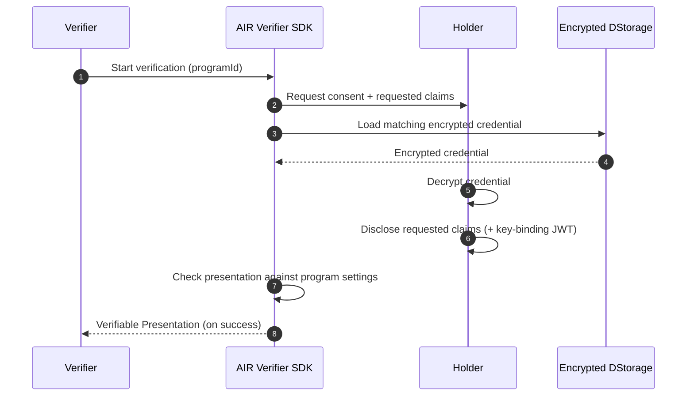

As a Verifier, your role is to verify the authenticity of user credentials and ensure they meet your requirements. Verification is **program-driven**: a Verification Program configured in the Developer Dashboard centrally controls the accepted credential format, the requested claims, and selective disclosure. Your integration passes a `programId`, the fields to disclose, and a `nonce`; the SDK handles credential discovery, consent, and result handling.

Most programs accept SD-JWT VC credentials, the default format. Iden3 programs add zero-knowledge proofs and on-chain verification; see [Iden3 credentials](/airkit/usage/credential/iden3-credentials).

## Verification Flow

1. **Start verification** — the verifier starts a session with a `programId`. The program defines what to check and how.
2. **Consent + discovery** — the SDK requests the holder's consent and loads the matching encrypted credential from DStorage.
3. **Presentation** — the holder decrypts the credential and discloses only the requested claims. For SD-JWT credentials with a holder key, the holder also signs a key-binding JWT over your `nonce`. Iden3 programs generate a zero-knowledge proof instead where required.
4. **Verification** — the presentation is checked against the program's settings off-chain. Iden3 programs can also record the proof on-chain.
5. **Result** — on success the SDK returns a W3C **Verifiable Presentation** containing the disclosed credential. Verify it again on your backend before you act on it.


```mermaid
sequenceDiagram
    autonumber
    participant Verifier
    participant SDK as AIR Verifier SDK
    participant User as Holder
    participant DS as Encrypted DStorage
    Verifier->>SDK: Start verification (programId)
    SDK->>User: Request consent + requested claims
    SDK->>DS: Load matching encrypted credential
    DS-->>SDK: Encrypted credential
    User->>User: Decrypt credential
    User->>User: Disclose requested claims (+ key-binding JWT)
    SDK->>SDK: Check presentation against program settings
    SDK-->>Verifier: Verifiable Presentation (on success)
```

Every verification attempt is recorded as a **verification session** — a server-side record of the result, mode, holder context, and usage data — giving you consistent reporting across integrations.

## Verifier integration checklist

1. Create or select a **Verification Program** in the <a href="https://developers.sandbox.air3.com/dashboard" target="_blank" rel="noreferrer">Developer Dashboard</a> (Verifier → Program).
2. Configure the program:
   - Accepted proof type: `SD_JWT_VC` (default), or `BJJ_SIG_2021` for [Iden3 programs](/airkit/usage/credential/iden3-credentials)
   - Requested claims and whether selective disclosure is required
   - Whether to check issuer revocation status
   - The Issuer's DID to constrain trusted issuers (optional)
   - For Iden3 programs only: whether a ZKP is required, and off-chain vs on-chain verification
3. Publish the program and take note of the `programId`.
4. Integrate the AIR Verifier SDK.
5. Start verification with the `programId`.
6. Handle outcomes: Compliant, Non-compliant, No matching credential, User declined consent, or proof/verification failure.
7. On success, send the returned Verifiable Presentation to your backend and [verify it there](/airkit/usage/credential/verify-sd-jwt) before granting access or rewards.

<Note>
  The dashboard link above uses Sandbox for development. For production launches, use the [production Developer Dashboard](https://developers.air3.com/dashboard). Moca Chain mainnet is live, and SD-JWT verification programs are self-serve in production. See [Production mainnet access](/airkit/environments#production-mainnet-access).
</Note>

## Start verification

Generate a [Partner JWT](/airkit/usage/partner-authentication) with `scope=verify` and a fresh `nonce` on your backend, then start verification with the SDK. The credential format and requested claims come from the program configuration, so your call stays minimal.

<Tabs>
<Tab title="Web">

```jsx
public async verifyCredential({
    authToken,
    programId,
    redirectUrl,
    fieldsToDisclose,
    nonce,
  }: {
    authToken: string;
    programId: string;
    redirectUrl?: string;
    fieldsToDisclose?: "*" | string[];
    nonce?: string;
  }): Promise<CredentialVerificationResult>
```

### Input Parameters

| Name | Type | Required | Description |
| ------------- | ------ | -------- | ------------------------------------------------------------------------------------- |
| `authToken` | string | Yes | Your signed Partner JWT, with `scope=verify`. |
| `programId` | string | Yes | Identifier for the verification program. Drives the accepted format and requested claims. It is also the `aud` of the key-binding JWT. |
| `redirectUrl` | string | No | Optional URL to redirect the user if they have not yet been issued the relevant credential. |
| `fieldsToDisclose` | `"*"` \| `string[]` | Required for `SD_JWT_VC` | Credential fields to disclose. `"*"` discloses every field. Use dotted paths for nested fields, such as `address.city`. See [Selective Disclosure](/airkit/usage/credential/selective-disclosure). |
| `nonce` | string | No | A random value from your backend, at least 128 bits. For SD-JWT credentials with a holder key (`cnf.jwk`), the holder signs a key-binding JWT over it, so the presentation cannot be replayed. Without it the presentation is a bearer token. Ignored for Iden3 programs. |

### Response

The function returns a `Promise<CredentialVerificationResult>`, a discriminated union on `status`.

**For non-compliant statuses** (`"Non-Compliant"`, `"Pending"`, `"Revoking"`, `"Revoked"`, `"Expired"`, `"NotFound"`):

| Field    | Type   | Description                                |
| -------- | ------ | ------------------------------------------ |
| `status` | string | The result of the credential verification. |

**For compliant status** (`"Compliant"`):

```ts
type CredentialVerificationResult = {
  status: "Compliant";
  verifiablePresentation?: {
    "@context": string[];
    type: string[];
    holder: string;
    verifiableCredential: Array<PresentationVerifiableCredential | string>;
    proof?: VerifiablePresentationProof | VerifiablePresentationProof[];
  };
};
```

| Field | Type | Description |
| ----------------- | ------------------------ | ----------- |
| `status` | `"Compliant"` | The credential is valid and meets all verification requirements. |
| `verifiablePresentation` | `object` | W3C [Verifiable Presentation](https://www.w3.org/TR/vc-data-model-2.0/#verifiable-presentations) carrying the disclosed credential. |

Inside the presentation:

| Field | Description |
| --- | --- |
| `holder` | The holder's DID. Not signed; do not trust it on its own. |
| `verifiableCredential` | The disclosed credential. For `SD_JWT_VC` programs this is an `EnvelopedVerifiableCredential` whose `id` is `data:application/dc+sd-jwt,` followed by the compact SD-JWT (older results use `data:application/vc+sd-jwt,`). For Iden3 programs these are W3C Verifiable Credential objects; see [Iden3 credentials](/airkit/usage/credential/iden3-credentials#verify-iden3-credentials). Type-check each entry before reading it. |
| `proof` | Iden3 programs only, when a zero-knowledge proof is required. |

For an `SD_JWT_VC` program, the presentation looks like this:

```json
{
  "status": "Compliant",
  "verifiablePresentation": {
    "@context": ["https://www.w3.org/ns/credentials/v2"],
    "type": ["VerifiablePresentation"],
    "holder": "did:air:…",
    "verifiableCredential": [
      {
        "@context": ["https://www.w3.org/ns/credentials/v2"],
        "type": ["EnvelopedVerifiableCredential"],
        "id": "data:application/dc+sd-jwt,<Issuer-JWT>~<Disclosure-1>~…~<KB-JWT>"
      }
    ]
  }
}
```

<Warning>
  The presentation wrapper, including `holder`, is **not signed**. Only the compact SD-JWT inside `id` is. AIR checks it in the user's browser, so verify the SD-JWT on your backend before you rely on the result. See [Verify SD-JWT on your backend](/airkit/usage/credential/verify-sd-jwt).
</Warning>

See [Selective Disclosure](/airkit/usage/credential/selective-disclosure) for how requested fields populate the presentation.

</Tab>
<Tab title="Flutter">

```dart
Future<CredentialVerificationResult> verifyCredential({
  required String authToken,
  required String programId,
  String? redirectUrl,
});
```

| Name | Type | Required | Description |
| ------------- | ------ | -------- | ------------------------------------------------------------------------------------- |
| `authToken` | `String` | Yes | Your signed Partner JWT, with `scope=verify`. |
| `programId` | `String` | Yes | Identifier for the verification program. |
| `redirectUrl` | `String?` | No | Optional URL to redirect the user if they have not yet been issued the relevant credential. |

See [Reference](/airkit/usage/reference) (Flutter tab) for response models.

</Tab>
</Tabs>

Under the hood, the SDK loads the holder's matching encrypted credential from DStorage, decrypts it locally, and obtains consent for disclosure. AIR handles ciphertext and metadata; the verifier receives the user-approved disclosures. A successful result returns the compliant payload above.

## Next steps

- [Verify SD-JWT on your backend](/airkit/usage/credential/verify-sd-jwt)
- [Selective disclosure](/airkit/usage/credential/selective-disclosure)
- [Iden3 verification modes](/airkit/usage/credential/iden3-credentials#verify-iden3-credentials)