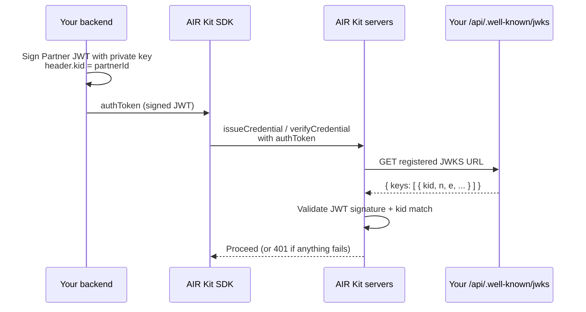

import JwksBlockingWarning from "/snippets/jwks-blocking-warning.mdx";

<JwksBlockingWarning />

JWKS URL is a **mandatory dashboard account field** — peer-tier with Partner ID, Issuer DID, and Verifier DID. AIR Kit fetches your JWKS over HTTPS to validate every Partner JWT you sign, so no credential SDK call can succeed until JWKS is live, registered, and matches your signing key.

## When this is required

| Operation | Where it runs | JWKS required? |
| --- | --- | --- |
| `airService.issueCredential` | Client SDK | **Yes** |
| `airService.verifyCredential` | Client SDK | **Yes** |
| Issue on Behalf (REST) | Server-to-server | **Yes** |
| `airService.login` (account only) | Client SDK | Only when you use [bring your own auth](/airkit/usage/user-authentication#custom-auth-bring-your-own-auth) |

All credential operations share the same Partner JWT trust model — so a single JWKS setup unblocks all of them.

## What AIR does with your JWKS



If AIR cannot fetch your JWKS, or the `kid` in your JWT header does not appear in `keys[]`, you get a `401` and the credential flow halts.

## Three-part checklist

You must complete all three. Each one alone is not enough.

<Steps>
  <Step title="Implement the JWKS route">
    Host a public HTTPS endpoint that returns a JWKS JSON document containing your Partner JWT public key. The canonical Next.js path used across [`air-examples`](https://github.com/MocaNetwork/air-examples) is `GET /api/.well-known/jwks`.
  </Step>
  <Step title="Register the full URL in the dashboard">
    In the [Developer Dashboard](https://developers.sandbox.air3.com/dashboard) go to **Account → General Settings → JWKS URL** and paste the **full HTTPS URL** that your app actually serves (for example `https://issuer.example.com/api/.well-known/jwks`).
  </Step>
  <Step title="Sign Partner JWTs with a matching `kid`">
    The JWT header must include `kid` set to a key id that also appears as `keys[].kid` in the JSON your endpoint returns. The shipped examples use `kid === partnerId`.
  </Step>
</Steps>

## Implement the route (Next.js)

This is the exact route shipped in every issuer and verifier app in [`air-examples`](https://github.com/MocaNetwork/air-examples). It reads your public key from an environment variable, converts PEM → JWK using [`jose`](https://github.com/panva/jose), and sets `kid` to your Partner ID.

```ts app/api/.well-known/jwks/route.ts
import { NextResponse } from "next/server";
import * as jose from "jose";

export async function GET() {
  try {
    const publicKeyPEM = `-----BEGIN PUBLIC KEY-----\n${process.env.PARTNER_PUBLIC_KEY!}\n-----END PUBLIC KEY-----`;
    const publicKey = await jose.importSPKI(publicKeyPEM, process.env.SIGNING_ALGORITHM!);
    const jwk = await jose.exportJWK(publicKey);

    return NextResponse.json(
      {
        keys: [
          {
            ...jwk,
            kid: process.env.NEXT_PUBLIC_PARTNER_ID!,
            use: "sig",
            alg: process.env.SIGNING_ALGORITHM!,
          },
        ],
      },
      {
        headers: {
          "Content-Type": "application/json",
          "Cache-Control": "public, max-age=3600",
        },
      },
    );
  } catch {
    return NextResponse.json({ error: "Failed to generate JWKS" }, { status: 500 });
  }
}
```

Required environment variables (server-side only — never expose `PARTNER_PRIVATE_KEY`):

| Variable | Used for |
| --- | --- |
| `PARTNER_PUBLIC_KEY` | The base64 body of your RS256 or ES256 public key (between the BEGIN/END markers). |
| `PARTNER_PRIVATE_KEY` | The matching private key used to sign your Partner JWT. **Server-only.** |
| `SIGNING_ALGORITHM` | `RS256` or `ES256`. Must match the key type. |
| `NEXT_PUBLIC_PARTNER_ID` | Your Partner ID. Used as `kid` so the JWKS key matches the JWT header. |

Generate the key pair with OpenSSL — see [Partner Authentication → Generating an RS256 Key Pair](/airkit/usage/partner-authentication#generating-an-rs256-key-pair).

## Register the URL in the Developer Dashboard

1. Open the [Developer Dashboard](https://developers.sandbox.air3.com/dashboard) and connect your EOA wallet.
2. Navigate to **Account → General Settings**.
3. Paste the **full URL** into the **JWKS URL** field. Examples:
   - `https://issuer.example.com/api/.well-known/jwks` (air-examples path)
   - `https://issuer.example.com/jwks.json` (plug-and-play template path)
4. Save the settings.

<Info>
  Register the **exact URL your app actually serves**. AIR fetches this exact URL — there is no path discovery or fallback.
</Info>

## Local development (HTTPS tunnel)

AIR servers cannot reach `http://localhost:3000`. You must expose your local dev server over public HTTPS before issue/verify will work.

<Tabs>
  <Tab title="ngrok">

```bash
ngrok http 3000
# → forwarding https://abc123.ngrok.app -> http://localhost:3000
```

Register `https://abc123.ngrok.app/api/.well-known/jwks` in the dashboard.

  </Tab>
  <Tab title="cloudflared">

```bash
cloudflared tunnel --url http://localhost:3000
# → trycloudflare https://random-words.trycloudflare.com
```

Register `https://random-words.trycloudflare.com/api/.well-known/jwks` in the dashboard.

  </Tab>
</Tabs>

Before running an end-to-end issue/verify flow, gate on a `curl` check:

```bash
curl https://your-tunnel-host/api/.well-known/jwks
# → { "keys": [ { "kty": "...", "kid": "<your-partner-id>", "alg": "RS256", ... } ] }
```

If you do not see a `keys` array with a matching `kid`, fix this before touching the SDK.

## The `kid` rule

The `kid` (Key ID) glues the JWT to the JWKS. It must match in two places.

| Location | Value | Source |
| --- | --- | --- |
| JWT header `kid` | `partnerId` | The header you set when signing the Partner JWT in your backend. |
| JWKS `keys[].kid` | `partnerId` | Returned by your `/api/.well-known/jwks` route. |

The shipped examples set both to your Partner ID. If you use a different convention (for example, key rotation IDs), the rule is the same — whatever value you put in the JWT header must appear in `keys[]`.

## Path matrix (do not blindly copy)

Two MocaNetwork-published references ship JWKS at **different paths**. There is no single canonical URL — you must register the one your deployment actually serves.

| Source | Path served | Where it comes from |
| --- | --- | --- |
| [`air-examples`](https://github.com/MocaNetwork/air-examples) (Next.js apps) | `/api/.well-known/jwks` | `src/app/api/.well-known/jwks/route.ts` |
| [Plug-and-play issuer template](/airkit/templates/plug-and-play-issuer) | `/jwks.json` | Generated at build time, served as a static asset |

**Rule:** look at what your app actually exposes, then register that exact URL.

## One Partner ID = one registered JWKS URL

Each Partner ID has a single JWKS URL slot in the dashboard. When your issuer and verifier apps share a Partner ID — which is the standard layout — you only need **one** JWKS endpoint registered.

- Register the **issuer's** JWKS URL (it is the side that always needs public hosting first).
- The verifier signs its own Partner JWTs locally using the same `partnerId` and a `kid` that appears in the issuer's published JWKS. AIR fetches the registered URL regardless of which app produced the JWT.
- If issuer and verifier are deployed at different hosts but share a Partner ID, make sure both sign with a `kid` that the registered JWKS exposes.

If you genuinely need separate JWKS per service, request a second Partner ID.

## Troubleshooting

When something fails after this checklist looks done, jump to the matching block in [Common errors](/airkit/troubleshooting/common-errors#jwt-and-jwks-errors):

- [JWKS endpoint unreachable](/airkit/troubleshooting/common-errors#jwks-endpoint-unreachable) — AIR cannot fetch your URL.
- [Invalid signature](/airkit/troubleshooting/common-errors#invalid-signature-or-jwt-verification-failed) — JWKS reachable but signature does not validate.
- [kid not found](/airkit/troubleshooting/common-errors#kid-not-found) — JWT header `kid` is not present in `keys[]`.

## Related

- [Partner Authentication (Partner JWT)](/airkit/usage/partner-authentication) — how to sign the JWTs that this JWKS validates.
- [Setting Up Your Partner Account](/airkit/usage/getting-started) — the four mandatory account fields, including JWKS URL.
- [AIR Kit Developer Dashboard](/airkit/airkit-dashboard) — where the JWKS URL field lives in the dashboard UI.
