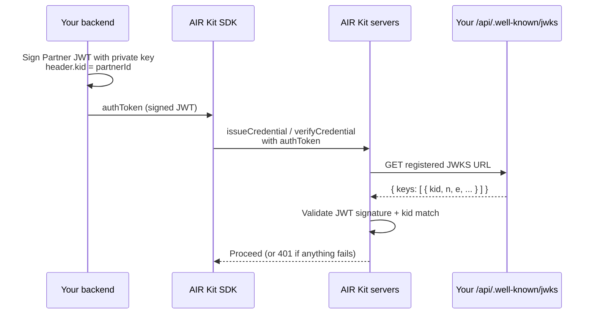

A JWKS (JSON Web Key Set) endpoint publishes the public key that matches the private key you sign [Partner JWTs](/get-started/authentication/sdk-auth) with. AIR fetches it to check every Partner JWT, so credential calls fail until it is live and registered.

| Operation | JWKS required? |
| --- | --- |
| `issueCredential` and `verifyCredential` (SDK) | Yes |
| [Direct issuance](/products/identity/issuing-credentials#direct-issuance) (AIR API) | Yes |
| `login` with a Partner JWT (Flutter, [Custom Auth](/get-started/authentication/custom-auth), or optionally on Web) | Yes |
| `login` without a Partner JWT (Web) | No |

## How AIR uses your JWKS



If AIR cannot fetch your JWKS, or no key in it matches the JWT's `kid`, the request fails with `401`.

## Step 1: Implement the route

This Next.js route is the one used by every issuer and verifier app in [`air-examples`](https://github.com/MocaNetwork/air-examples). It converts your public key from PEM to JWK with [`jose`](https://github.com/panva/jose) and sets `kid` to your Partner ID.

```ts app/api/.well-known/jwks/route.ts
import { NextResponse } from "next/server";
import * as jose from "jose";

export async function GET() {
  try {
    const publicKeyPEM = `-----BEGIN PUBLIC KEY-----\n${process.env.PARTNER_PUBLIC_KEY!}\n-----END PUBLIC KEY-----`;
    const publicKey = await jose.importSPKI(publicKeyPEM, process.env.SIGNING_ALGORITHM!);
    const jwk = await jose.exportJWK(publicKey);

    return NextResponse.json(
      {
        keys: [
          {
            ...jwk,
            kid: process.env.NEXT_PUBLIC_PARTNER_ID!,
            use: "sig",
            alg: process.env.SIGNING_ALGORITHM!,
          },
        ],
      },
      {
        headers: {
          "Content-Type": "application/json",
          "Cache-Control": "public, max-age=3600",
        },
      },
    );
  } catch {
    return NextResponse.json({ error: "Failed to generate JWKS" }, { status: 500 });
  }
}
```

Required environment variables (server-side only — never expose `PARTNER_PRIVATE_KEY`):

| Variable | Used for |
| --- | --- |
| `PARTNER_PUBLIC_KEY` | The base64 body of your RS256 or ES256 public key (between the BEGIN/END markers). |
| `PARTNER_PRIVATE_KEY` | The matching private key used to sign your Partner JWT. **Server-only.** |
| `SIGNING_ALGORITHM` | `RS256` or `ES256`. Must match the key type. |
| `NEXT_PUBLIC_PARTNER_ID` | Your Partner ID. Used as `kid` so the JWKS key matches the JWT header. |

Generate the key pair as described in [SDK authentication](/get-started/authentication/sdk-auth#generating-an-rs256-key-pair).

## Step 2: Register the URL in the Dashboard

1. Open the [Developer Dashboard](https://developers.sandbox.air3.com/dashboard).
2. Go to **Account → General Settings**.
3. Paste the full HTTPS URL into **JWKS URL**, for example `https://app.example.com/api/.well-known/jwks`, and save.

AIR fetches exactly this URL, with no path discovery or fallback. Register the path your app actually serves: `/api/.well-known/jwks` for the route above, or whatever route you defined yourself.

Each Partner ID has one JWKS URL. If your issuer and verifier apps share a Partner ID, register one JWKS and sign all Partner JWTs with a `kid` it contains. If you need separate JWKS per service, request a second Partner ID.

## Step 3: Match the `kid`

The `kid` in each Partner JWT header must appear as a `keys[].kid` in your JWKS. The examples use your Partner ID for both. If you use another convention, such as key-rotation IDs, the rule is the same.

Check the endpoint before you call the SDK:

```bash
curl https://app.example.com/api/.well-known/jwks
# → { "keys": [ { "kty": "RSA", "kid": "<your-partner-id>", "alg": "RS256", ... } ] }
```

## Local development (HTTPS tunnel)

AIR servers cannot reach `localhost`. Expose your dev server over public HTTPS and register the tunnel URL:

<Tabs>
  <Tab title="ngrok">

```bash
ngrok http 3000
# → forwarding https://abc123.ngrok.app -> http://localhost:3000
```

Register `https://abc123.ngrok.app/api/.well-known/jwks` in the dashboard.

  </Tab>
  <Tab title="cloudflared">

```bash
cloudflared tunnel --url http://localhost:3000
# → trycloudflare https://random-words.trycloudflare.com
```

Register `https://random-words.trycloudflare.com/api/.well-known/jwks` in the dashboard.

  </Tab>
</Tabs>

## Troubleshooting

If AIR still rejects your Partner JWT, see [Common issues](/help/common-issues#jwt-and-jwks-errors):

- [JWKS endpoint unreachable](/help/common-issues#jwks-endpoint-unreachable) — AIR cannot fetch your URL.
- [Invalid signature](/help/common-issues#invalid-signature-or-jwt-verification-failed) — JWKS reachable but signature does not validate.
- [kid not found](/help/common-issues#kid-not-found) — JWT header `kid` is not present in `keys[]`.
