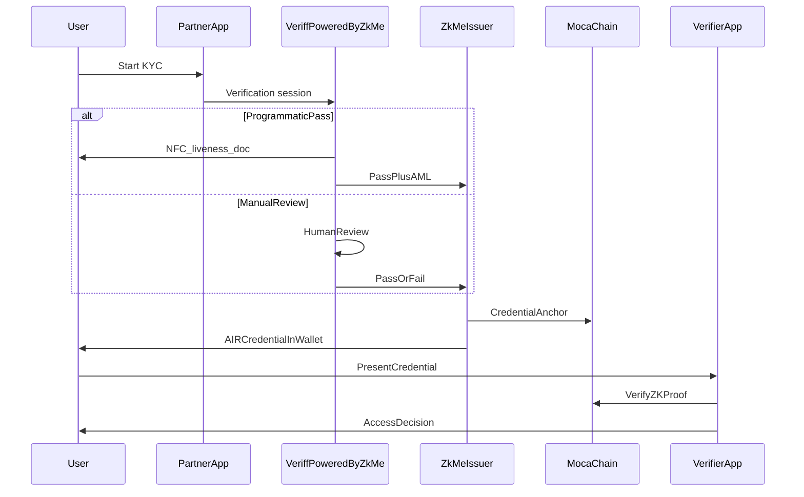

---

## End-to-end flow

<Steps>
  <Step title="User starts verification in your app">
    The user launches the **Veriff powered by zkMe** experience inside your application (AIR Kit surfaces the flow; your product does not host raw KYC storage).
  </Step>
  <Step title="Programmatic path (default)">
    The user completes document capture, **NFC chip read** where the document supports it (electronic passport / eID), **liveness**, and **face matching**. On supported documents, **zkPassport** establishes cryptographic authenticity of the chip (ICAO-style passive authentication) and can derive attribute proofs on-device so relying parties receive proofs rather than full document payloads for those steps.
  </Step>
  <Step title="AML and sanctions screening">
    Screening runs as part of the regulated pipeline so the resulting credential reflects both **identity** and **financial crime compliance** signals your programs require.
  </Step>
  <Step title="Manual reverification (when needed)">
    If the automated path cannot complete — for example unreadable chip, document edge case, or biometric mismatch — the session moves to **human review** under **Veriff powered by zkMe**. From the user's perspective this matches a traditional eKYC outcome: approved, rejected, or more information requested.
  </Step>
  <Step title="Credential issuance (AIR)">
    On success, **zkMe** (as Issuer) issues an **AIR Credential** into the user's **AIR Account**. Cryptographic commitments anchor on **Moca Chain**; sensitive payloads remain under zkMe's protection model (see [Data collection & sharing](/kyc/data-collection-and-sharing) and [zkMe security architecture](/kyc/zkme-security-architecture)).
  </Step>
  <Step title="Verification at any partner">
    When the user presents the credential elsewhere in the ecosystem, the verifier calls AIR Kit verification and receives a **ZK-backed COMPLIANT / NON_COMPLIANT** result — not passport images or national ID numbers.
  </Step>
</Steps>

---

## Sequence overview

---

## Geographic coverage (zkPassport)

For **electronic passport** flows that rely on published country signing keys, **zkPassport** supports a large set of issuing countries. Documents from other jurisdictions may still be verified through the **document-and-biometric** path without NFC, subject to **Veriff powered by zkMe** coverage rules.

For the authoritative country list, see zkMe documentation: [Supported countries](https://docs.zk.me/hub/how-built/id-infra/zkpassport/supported-countries).

---

## Related reading

<CardGroup cols={2}>
  <Card title="Data collection & sharing" icon="database" href="/kyc/data-collection-and-sharing">
    What is collected, what partners see, what lands on Moca Chain, and optional CAK access.
  </Card>
  <Card title="zkMe security architecture" icon="shield-halved" href="/kyc/zkme-security-architecture">
    zkPassport, zkVault, homomorphic face matching, and credential cryptography — in Moca context.
  </Card>
</CardGroup>
