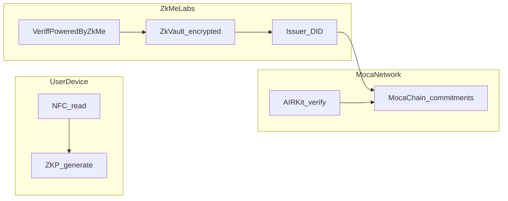

Behind Moca Network's **on-chain IDV/KYC solution**, **zkMe** contributes the cryptographic stack summarized below. The content below summarizes **public zkMe Protocol documentation** in language consistent with Moca Network. It explains how **zkMe** under **Veriff powered by zkMe** acts as a **credential Issuer** and how cryptographic components support **pass/fail**, **selective**, and **CAK-gated full-raw** disclosure models on AIR Kit. For the canonical technical detail, see [zkMe docs — Architecture](https://docs.zk.me/hub/how-works/architecture) and [zkPassport](https://docs.zk.me/hub/how-built/id-infra/zkpassport).

---

## zkPassport: cryptographic trust for documents

Traditional document verification infers authenticity from **images**. **zkPassport** instead anchors trust in **sovereign-issued public key infrastructure** (PKI) embedded in ICAO-style **electronic passports** and compatible eIDs:

- The chip stores **signed data groups** and a **Security Object Document (SOD)** chaining to the issuing country's **Document Signer** and **Country Signing Certification Authority (CSCA)**.
- **Passive authentication** proves chip data was signed by a legitimate national issuer and was not tampered with since issuance — without a "confidence score," only pass or fail.
- **zkPassport** reads the chip over **NFC on the user's device**, validates the certificate chain against known trust material (for example ICAO PKD and related registries), and builds **zero-knowledge proofs** so relying parties learn **attribute statements** (for example nationality band, age threshold, document not expired) rather than full plaintext chip payloads.

This directly mitigates **synthetic document** risk for the NFC path: a convincing image does not forge a valid **CSCA-backed** signature.

---

## zkVault: encrypted secrets and regulated payloads

zkMe's **zkVault** is an encrypted storage and execution model for sensitive material (including secrets relevant to **AI agent** scenarios in zkMe's broader roadmap). For identity, the important properties are:

- **AES-256-GCM** encryption for data at rest.
- **Threshold encryption** and **Shamir secret sharing** so no single operator party can arbitrarily decrypt user payloads.
- **Trusted Execution Environments (TEEs)** — Intel SGX / AMD SEV — so decryption and high-risk operations occur inside **attested enclaves** rather than in ordinary application memory.

Partners on Moca still receive **AIR Credentials** and **program-configured verification outcomes** (pass/fail, selective attributes, or CAK-mediated raw payloads as defined per verification program); they do not host zkVault.

---

## Face binding without exposing raw biometrics

zkMe documentation describes using **fully homomorphic encryption (FHE)** in the **CKKS** family to compare **encrypted facial feature vectors** — enabling **face-to-identity** binding with reduced plaintext biometric handling compared to naive pipelines. This is complementary to liveness vendors and document portraits in **Veriff powered by zkMe**.

---

## Credentials: Merkle commitments and ZK verification

zkMe's credential system (W3C Verifiable Credentials style, JSON-LD claims) uses:

- **Sparse Merkle trees** and **Poseidon** hashing on the **Baby JubJub** curve for compact commitments.
- **Groth16** zk-SNARKs for efficient on-chain verification of proofs.
- **Selective disclosure** patterns so a verification program can request a specific subset of attributes; for **full raw-data** access at the verifier, AIR Kit uses **Compliance Access Key (CAK)** with explicit user consent — see [CAK overview](/airkit/usage/credential/cak-overview).
- **Anti-sybil** tooling such as **nullifiers** where "one person, one action" guarantees matter.

On **Moca Network**, your integration still lands as an **AIR Credential** with on-chain anchoring and AIR Kit verifier flows — the zkMe cryptographic stack sits **behind** Issuance operated by zkMe for this product bundle.

---

## How this connects to AIR Kit on Moca

---

## Compliance Access Key (CAK)

When a verifier must access **plaintext regulated fields** with **user consent**, combine this Issuer model with CAK as documented for AIR Kit:

<CardGroup cols={2}>
  <Card title="Pricing & FAQ" icon="circle-dollar" href="/kyc/pricing-and-faq" />
  <Card title="CAK overview" icon="key" href="/airkit/usage/credential/cak-overview" />
  <Card title="Privacy & compliance" icon="scale-balanced" href="/learn/advanced-topics/privacy-and-compliance" />
</CardGroup>

---

## External references

- [zkMe — Architecture overview](https://docs.zk.me/hub/how-works/architecture)
- [zkMe — zkPassport](https://docs.zk.me/hub/how-built/id-infra/zkpassport)
- [zkMe — Supported countries (zkPassport)](https://docs.zk.me/hub/how-built/id-infra/zkpassport/supported-countries)
