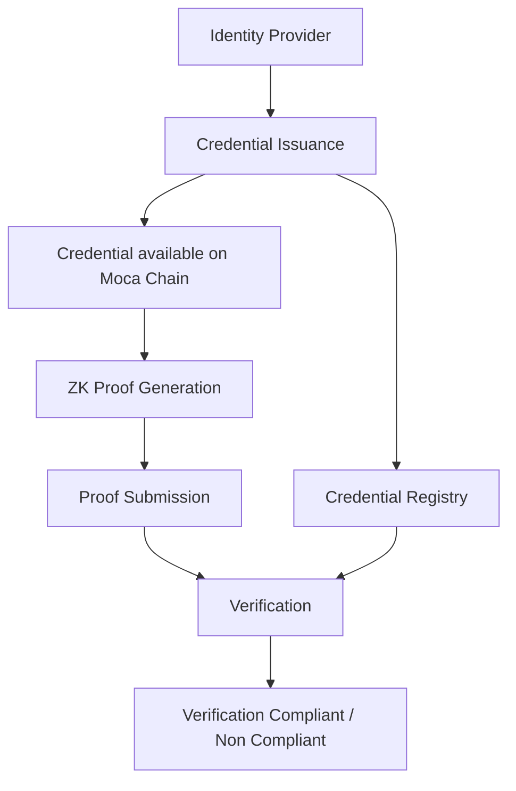

This guide provides a comprehensive overview of the credential lifecycle in AIR Kit, from issuance through verification, with a focus on zero-knowledge proof generation and validation.

## Overview of the Credential Flow

The AIR Kit credential system follows a three-phase lifecycle:

1. **Issuance Phase**: Creating and issuing verifiable credentials
2. **Storage & Management Phase**: Secure storage and lifecycle management
3. **Verification Phase**: Privacy-preserving verification using zero-knowledge proofs

For detailed implementation guides, see the [Credential Services](/airkit/usage/credential/credentials-flow) documentation.
