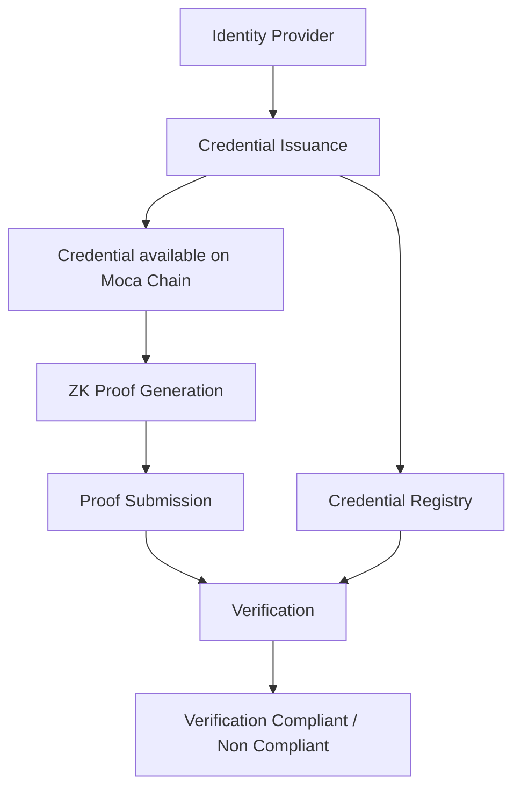

This guide provides a comprehensive overview of the credential lifecycle in AIR Kit, from issuance through verification, with a focus on zero-knowledge proof generation and validation.

## Overview of the Credential Flow

The AIR Kit credential system follows a three-phase lifecycle:

1. **Issuance Phase**: Creating and issuing verifiable credentials
2. **Storage & Management Phase**: Secure storage and lifecycle management
3. **Verification Phase**: Privacy-preserving verification using zero-knowledge proofs

### Trust layer (read this first)

Every issuance and verification call is authenticated by a Partner JWT that AIR validates against a JWKS endpoint you host and register in the Developer Dashboard. Until that endpoint is live and registered, none of the phases below can run. See [JWKS endpoint setup](/airkit/usage/jwks-setup) for the one-time configuration.

```mermaid
graph TD
    A[Identity Provider] --> B[Credential Issuance]
    B --> C[Credential available on Moca Chain]
    C --> D[ZK Proof Generation]
    D --> E[Proof Submission]
    E --> F[Verification]
    F --> G[Verification Compliant / Non Compliant]

    B --> H[Credential Registry]
    H --> F
```

For detailed implementation guides, see the [Credential Services](/airkit/usage/credential/credentials-flow) documentation.
