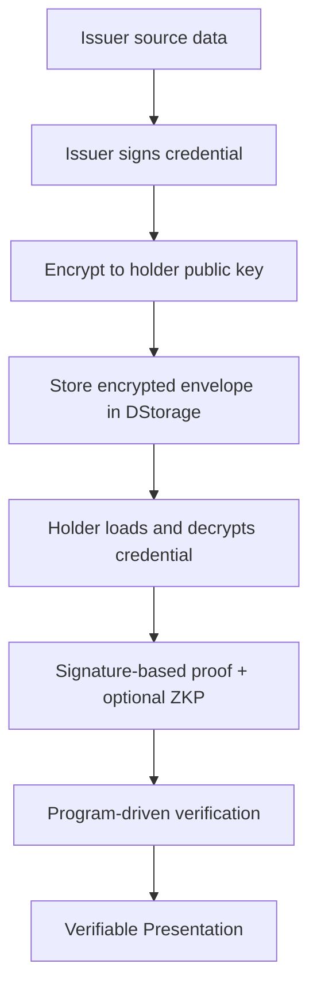

This guide provides a comprehensive overview of the credential lifecycle in AIR Kit, from issuance through verification, using signature-based proofs and encrypted decentralized storage.

## Overview of the Credential Flow

The AIR Kit credential system follows a three-phase lifecycle:

1. **Issuance Phase**: The issuer builds, signs, and encrypts the credential, then stores the encrypted envelope in DStorage.
2. **Storage & Management Phase**: AIR stores and routes opaque ciphertext and metadata as a blind facilitator; only the holder can decrypt.
3. **Verification Phase**: Program-driven verification generates a signature-based proof — with a zero-knowledge proof where the program requires it — and returns a Verifiable Presentation.

### Trust layer (read this first)

Every issuance and verification call is authenticated by a Partner JWT that AIR validates against a JWKS endpoint you host and register in the Developer Dashboard. Until that endpoint is live and registered, none of the phases below can run. See [JWKS endpoint setup](/airkit/usage/jwks-setup) for the one-time configuration.

```mermaid
graph TD
    A[Issuer source data] --> B[Issuer signs credential]
    B --> C[Encrypt to holder public key]
    C --> D[Store encrypted envelope in DStorage]
    D --> E[Holder loads and decrypts credential]
    E --> F[Signature-based proof + optional ZKP]
    F --> G[Program-driven verification]
    G --> H[Verifiable Presentation]
```

Key properties of the flow:

- **Issuer sovereignty** — issuers own their source data and signing keys; AIR is not a data custodian.
- **Blind facilitation** — AIR stores encrypted credential objects and metadata, never plaintext issuer data.
- **Signature-based proofs** — credentials use `BJJ_SIG_2021`, with zero-knowledge proofs where a program requires them.
- **Program-driven verification** — proof type, ZKP requirement, selective disclosure, and off-chain / on-chain mode are configured centrally in a Verification Program.

For detailed implementation guides, see the [Credential Services](/airkit/usage/credential/credentials-flow) documentation.
