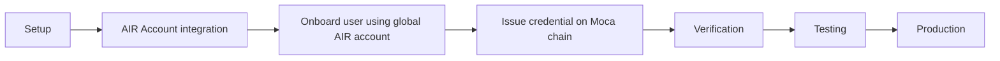

This guide provides a step-by-step workflow for integrating AIR Kit into your application. Whether you're building a new application or adding identity features to an existing one, this workflow will help you get up and running quickly.

## Prerequisites

Before starting the integration, ensure you have:

- **Node.js 18+** or your preferred runtime environment
- **Basic understanding** of your application's authentication flow
- **Development environment** set up for your chosen platform

## Integration Overview

The AIR Kit integration follows a structured approach:

1. **Setup & Configuration** - Install SDKs and configure your environment
2. **Issuer Integration** - Set up credential issuance capabilities
3. **User Wallet Integration** - Enable users to store and manage credentials
4. **Verification Integration** - Implement privacy-preserving verification
5. **Testing & Deployment** - Test your integration and deploy to production

Learn more about how to integrate the SDKs in the [Quickstart](/airkit/quickstart/) section.

Once you've successfully integrated AIR Kit into your application, here are some next steps to consider:

1. **Explore Advanced Features**: Read more about [advanced topics](/learn/advanced-topics/zktls) for more sophisticated use cases
2. **Understand the Flow**: Deep dive into [Credential Issuance, Verification & ZK Proof Flow](/airkit/how-to-use)
3. **Join the Community**: Connect with other developers and get support on [Discord](https://discord.com/invite/mocaversenft)
4. **Support**: [support@moca.network](mailto:support@moca.network)
