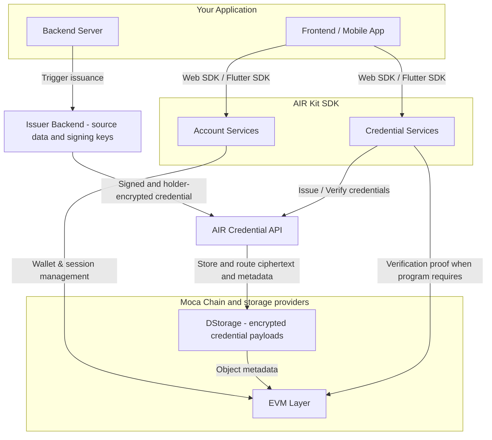
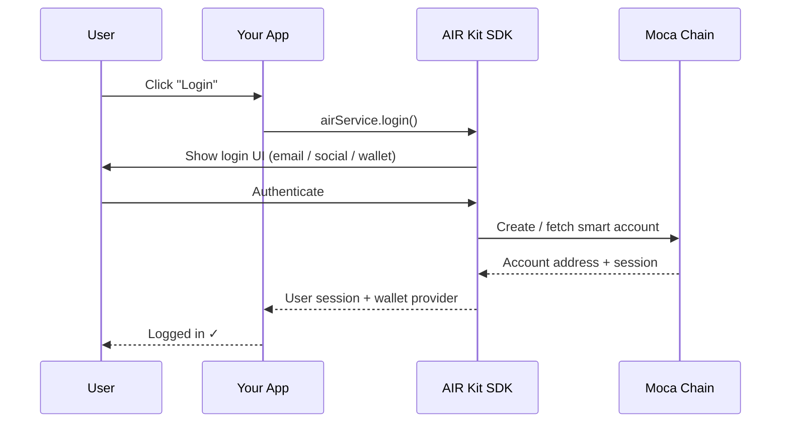
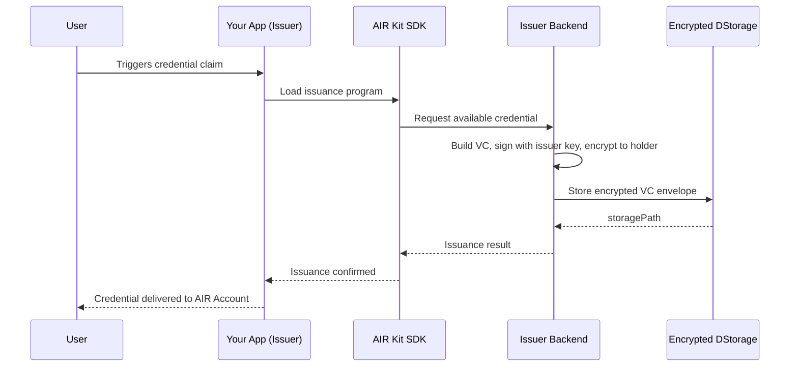
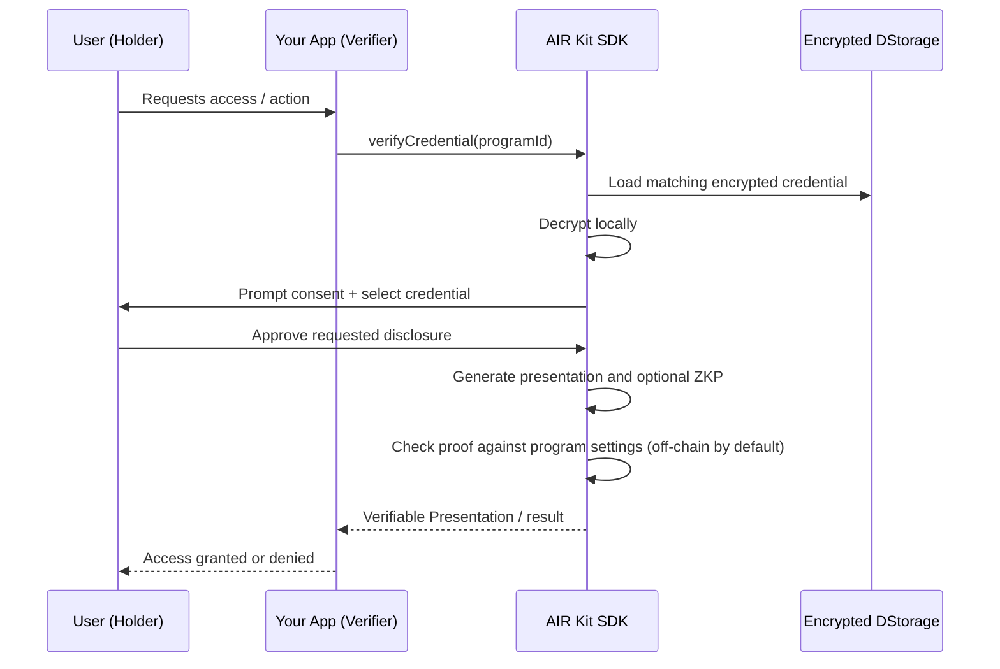
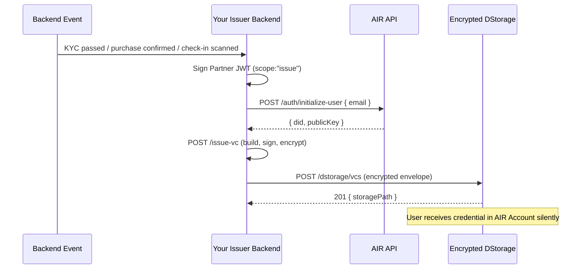
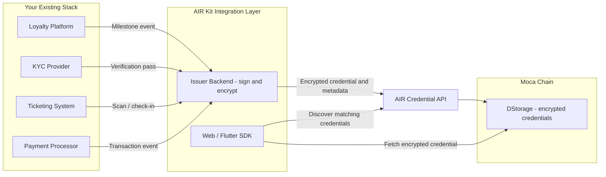

AIR Kit is a modular SDK that sits between your application and Moca Chain. It exposes two independent service surfaces — **Account Services** and **Credential Services** — that can be used together or independently.

## System Overview

Raw source documents remain with the issuer. Encrypted credential payloads may be stored in DStorage, while users control decryption and disclosure. Storage metadata and optional on-chain verification records are separate from the encrypted payloads.

## Account Services Flow

Account Services handles user authentication, smart account creation, and wallet operations.

## Credential Issuance Flow (User-Initiated)

The standard issuance path — the user is present and triggers the credential claim.

## Credential Verification Flow

## On-demand Issuance Flow

Use this path when a **backend event** should trigger issuance without the user being present. Your issuer backend resolves the holder and calls its own `issue-vc` — the end user does not interact with AIR.

## Multi-Vendor Stack Integration

AIR Kit is **additive** — it does not replace your existing infrastructure. The diagram below shows how it slots into a typical enterprise stack alongside loyalty platforms, KYC providers, ticketing systems, and payment processors.

## Service Independence

Account Services and Credential Services are decoupled — integrate one, both, or mix server-side and client-side patterns.

| Feature | Account Services | Credential Services | Requires Both |
|---------|:---:|:---:|:---:|
| User login / SSO | ✓ | — | — |
| Smart account / wallet | ✓ | — | — |
| Gas sponsorship (Paymaster) | ✓ | — | — |
| Wagmi connector | ✓ | — | — |
| Issue credentials (user-initiated) | — | ✓ | ✓ user must be logged in |
| On-demand issuance | — | ✓ | — |
| Verify credentials | — | ✓ | — |

## Next Steps

<Columns cols={2}>
  <Card title="Quick Setup" icon="bolt" href="/airkit/usage/getting-started">
    Install and initialize the SDK in minutes.
  </Card>
  <Card title="Solutions by vertical" icon="puzzle-piece" href="/solutions">
    Business overview and developer guide for Loyalty, Identity, Fintech, Gaming, Ticketing, Telco, and Advertising.
  </Card>
  <Card title="Quickstart: Issue Credentials" icon="badge-check" href="/airkit/quickstart/issue-credentials">
    Step-by-step credential issuance walkthrough.
  </Card>
  <Card title="On-demand Issuance" icon="server" href="/airkit/usage/credential/issuing-credentials#on-demand-issuance">
    On-demand issuance without user presence.
  </Card>
</Columns>
