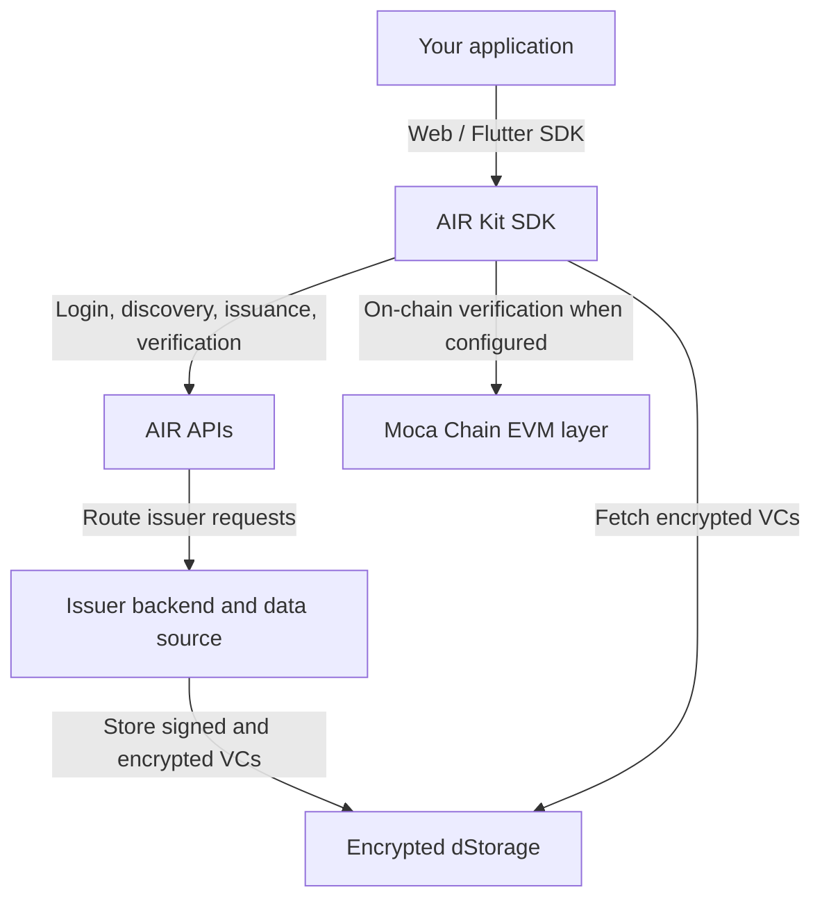
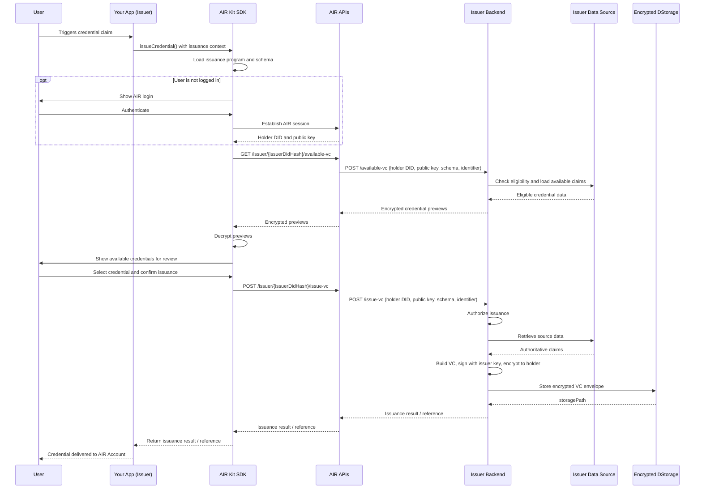

AIR Kit connects your application to AIR services and Moca Chain. It exposes **Account Services** for authentication and wallet operations and **Credential Services** for orchestrating issuance and verification. Your issuer backend owns credential authorization, source data, signing, encryption, and storage.

## System overview

The SDK manages user interaction and calls AIR APIs. AIR routes issuance requests to the registered issuer backend. The issuer backend owns authorization, source data, credential creation and signing, encryption, and storage. Credential storage and on-chain proof verification are separate operations. See [Account Services](/airkit/usage/user-authentication) for login and wallet details.

## Issuance modes

| Mode | User presence | How it works |
| --- | --- | --- |
| **On-demand issuance** | User present | The user reviews available credentials and confirms issuance through the SDK. |
| **Direct issuance** | Can run without the user present | The issuer creates and stores the credential; the user claims it when they log in to AIR. |
| **Pre-issue** | Can run before the user logs in | Uses Direct Issuance to prepare credentials for the user to claim later. |

## On-demand issuance flow (user-initiated)

Your app calls `issueCredential()` with the issuance program/schema context and an optional identifier. This is the client-side entry point: the SDK ensures AIR login, discovers available credentials, obtains the user's confirmation, and requests issuance through AIR.

The issuance program identifies the configured flow; the schema defines the credential's data structure. They are distinct identifiers. The sequence below describes the orchestration, rather than an SDK parameter signature.

`available-vc` discovers credentials and returns encrypted previews. It does not issue a credential. The SDK calls `issue-vc` only after the user confirms. The issuer backend remains responsible for authorization, data retrieval, VC generation and signing, encryption, and storage; `issueCredential()` orchestrates these steps without creating or signing the VC itself.

## Credential verification flow

The SDK loads the verification program and ensures the user is logged in to AIR. It discovers matching credentials through AIR, fetches and decrypts the selected credential, and displays the requested data for consent. After the user agrees, the SDK records consent and generates the verifiable presentation and any required proof.

<Steps>
  <Step title="Start verification">
    The partner app calls `verifyCredential()` with a verification program. The SDK loads the program and ensures the holder is logged in to AIR.
  </Step>
  <Step title="Find a matching credential">
    The SDK requests matching credential metadata and dStorage paths. If no credential exists, the SDK can start the accepted issuer's on-demand issuance flow, including user confirmation.
  </Step>
  <Step title="Decrypt and review">
    The SDK fetches the encrypted credential, decrypts it on the holder's device, and shows the requested claims.
  </Step>
  <Step title="Get consent and create the presentation">
    The user consents to verification and sharing. The SDK records consent, generates the verifiable presentation, and creates any proof required by the program.
  </Step>
  <Step title="Verify and return the result">
    The SDK runs the configured verification mode and returns the result and applicable presentation or proof material to the partner app.
  </Step>
</Steps>

If the user declines consent, the flow stops before generating or sharing the presentation. If no matching credential can be issued, verification cannot proceed with that credential.

### Off-chain and on-chain verification

The verification program selects the mode. Both paths use the credential discovery, decryption, and consent steps above.

| Mode | Where verification runs | What the app receives |
| --- | --- | --- |
| **Off-chain** | The proof or presentation is checked outside a blockchain transaction against the program's requirements. | Verification status and the presentation/proof material applicable to the program. |
| **On-chain** | The proof is submitted for verification on-chain. This mode is available only for BJJ credentials. | The verification outcome and applicable on-chain transaction information. |

Using dStorage or anchoring issuer state does not, by itself, mean that verification runs on-chain. The verification mode describes where the proof is checked. The app uses the returned outcome to decide whether to grant access.

{/* TODO: Confirm detailed proof-verification contracts and the consent-recording endpoint when the V2 integration specification defines them. */}

## Direct issuance and pre-issue flow

Use Direct Issuance when a backend event or batch job should issue a credential without requiring the user to be present. The issuer backend resolves the recipient's holder DID and public key, authorizes issuance, retrieves the source data, then builds, signs, encrypts, and stores the VC. The user claims the credential when they log in to AIR.

**Pre-issue uses Direct Issuance** to prepare credentials ahead of that login and claim step.

<Steps>
  <Step title="Trigger issuance">
    A backend event or batch job starts the flow, such as a completed KYC check, purchase, or check-in.
  </Step>
  <Step title="Resolve the recipient">
    The issuer backend uses the AIR API to resolve or create the recipient's holder DID and public key. No active user session is required.
  </Step>
  <Step title="Create and store the credential">
    The issuer authorizes issuance, retrieves source data, creates and signs the VC, encrypts it to the holder, and stores the encrypted envelope in dStorage.
  </Step>
  <Step title="Claim later">
    The user logs in to AIR later and claims the credential. Pre-issue follows this same Direct Issuance path, ahead of the user's login.
  </Step>
</Steps>

## Integrating with existing systems

Your issuer backend can connect to loyalty platforms, KYC providers, ticketing systems, and payment processors. Those systems can trigger Direct Issuance, while the SDK supports user-present issuance, later claims, and verification. See the [vertical integration guides](/airkit/guides/air-for-loyalty) for examples.

## Service independence and login requirements

Choose the service capabilities your app needs. An AIR login is required for the user-present credential flows below; it does not imply that your app must also integrate wallet operations, gas sponsorship, or other Account Services features.

| Credential flow | Service | AIR login requirement |
| --- | --- | --- |
| On-demand issuance | Credential Services | User logs in before reviewing and confirming issuance. |
| Direct issuance | Credential Services | No active user session required to issue; user logs in to claim later. |
| Pre-issue | Credential Services, using Direct Issuance | No active user session required to pre-issue; user logs in to claim later. |
| SDK verification | Credential Services | User logs in before reviewing the requested data and consenting. |

## Next steps

<Columns cols={2}>
  <Card title="Quick Setup" icon="bolt" href="/airkit/usage/getting-started">
    Install and initialize the SDK in minutes.
  </Card>
  <Card title="Solutions by vertical" icon="puzzle-piece" href="/solutions">
    Business overview and developer guide for Loyalty, Identity, Fintech, Gaming, Ticketing, Telco, and Advertising.
  </Card>
  <Card title="Quickstart: Issue Credentials" icon="badge-check" href="/airkit/quickstart/issue-credentials">
    Step-by-step credential issuance walkthrough.
  </Card>
  <Card title="Direct Issuance and Pre-issue" icon="server" href="/airkit/guides/overview#direct-issuance-and-pre-issue-flow">
    Issue without an active user session; users claim credentials when they log in.
  </Card>
</Columns>
