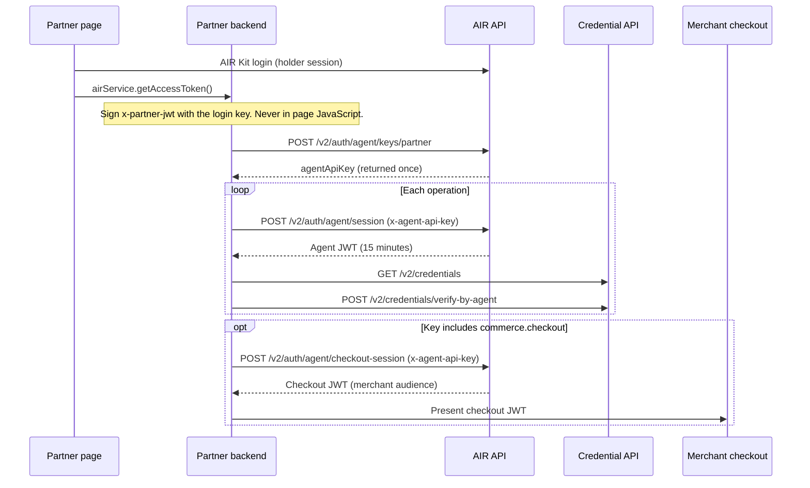

The Agent APIs let your backend act for a signed-in user through a bound agent. You bind the agent once while the user has an AIR Kit session. After that, the agent mints a 15-minute JWT for each operation and uses it to list or verify the user's credentials. If the agent's key includes `commerce.checkout`, the agent can also mint a token for a supported merchant checkout.

This guide walks through the full flow. For every field and response code, see the [Agent APIs reference](/api-reference/agents/introduction).

## Before you start

- A Partner ID and a partner login key with a published JWKS endpoint. See [SDK authentication](/get-started/authentication/sdk-auth).
- AIR Kit installed in your frontend, with users signing in through [`login`](/get-started/authentication/login).
- A consent screen in your product where the user approves the agent and its scopes. The bind request has no approval step of its own. See [Ask for consent before binding](/products/agents/delegation-and-consent#ask-for-consent-before-binding).
- Agent keys enabled for your partner account. Otherwise, AIR API calls return `403 AGENT_KEYS_DISABLED`. Contact the AIR team to enable them and confirm environment access.

The Agent APIs use two hosts. Use the pair for the same environment.

| Environment | `AIR_API` (keys, session, checkout) | `CREDENTIAL_API` (list, verify) |
| --- | --- | --- |
| Sandbox | `https://air.api.sandbox.air3.com` | `https://credential-testnet.api.sandbox.air3.com` |
| Production | `https://air.api.air3.com` | `https://credential-mainnet.api.air3.com` |

## How the flow fits together



## Bind and use an agent

<Steps>
  <Step title="Get the user's approval and AIR Kit session">
    After the user signs in and approves the agent on your consent screen, get their partner access token in the frontend. Send it to your backend over your authenticated channel, along with the scopes they approved.

    ```ts
    const { token } = await airService.getAccessToken();
    await fetch("/api/agent/bind", {
      method: "POST",
      headers: { "Content-Type": "application/json" },
      body: JSON.stringify({ partnerAccessToken: token }),
    });
    ```

    The token identifies the user. Everything else in this guide runs on your backend.
  </Step>

  <Step title="Bind the agent once">
    From your backend, call [Bind an agent](/api-reference/agents/bind-agent-key) with the user's session and a freshly signed partner JWT. Request only the scopes the user approved.

    <CodeGroup>
    ```bash cURL
    curl -X POST "$AIR_API/v2/auth/agent/keys/partner" \
      -H "Content-Type: application/json" \
      -H "x-partner-id: $PARTNER_ID" \
      -H "x-partner-access-token: $PARTNER_ACCESS_TOKEN" \
      -H "x-partner-jwt: $PARTNER_JWT" \
      -d '{
        "scope": "credentials.read credentials.verify",
        "nickname": "Shopping agent"
      }'
    ```

    ```ts TypeScript
    const res = await fetch(`${AIR_API}/v2/auth/agent/keys/partner`, {
      method: "POST",
      headers: {
        "Content-Type": "application/json",
        "x-partner-id": PARTNER_ID,
        "x-partner-access-token": partnerAccessToken,
        "x-partner-jwt": partnerJwt,
      },
      body: JSON.stringify({
        scope: "credentials.read credentials.verify",
        nickname: "Shopping agent",
      }),
    });
    const agent = await res.json();
    ```
    </CodeGroup>

    The response is `201` and includes `agentApiKey`. AIR adds `openid` to the scope.

    ```json
    {
      "id": "3f1a9c8e-2b7d-4f60-a1c5-e9b8d7f6a4c2",
      "publicKey": null,
      "createdAt": "2026-08-19T12:00:00.000Z",
      "scope": "openid credentials.read credentials.verify",
      "nickname": "Shopping agent",
      "partnerId": "11111111-2222-4333-8444-555555555555",
      "agentApiKey": "air_ag_<secret>"
    }
    ```

    <Warning>
      `agentApiKey` is returned only once. Store it encrypted on your backend with the key `id`. If you lose it, [rotate the key](/api-reference/agents/rotate-agent-key) to get a new one.
    </Warning>

    Add `commerce.checkout` only if the user approved the agent starting merchant checkouts. Scopes are fixed at bind time; to add one later, get approval, bind a new key, and revoke the old one.
  </Step>

  <Step title="Create a session for each operation">
    Exchange the API key for a short-lived agent JWT with [Create an agent session](/api-reference/agents/create-agent-session). Request a subset of the bound scopes, or omit `scope` to receive all of them.

    <CodeGroup>
    ```bash cURL
    curl -X POST "$AIR_API/v2/auth/agent/session" \
      -H "Content-Type: application/json" \
      -H "x-partner-id: $PARTNER_ID" \
      -H "x-agent-api-key: $AGENT_API_KEY" \
      -d '{ "scope": "openid credentials.read credentials.verify" }'
    ```

    ```ts TypeScript
    const res = await fetch(`${AIR_API}/v2/auth/agent/session`, {
      method: "POST",
      headers: {
        "Content-Type": "application/json",
        "x-partner-id": PARTNER_ID,
        "x-agent-api-key": agentApiKey,
      },
      body: JSON.stringify({ scope: "openid credentials.read credentials.verify" }),
    });
    const { accessToken, user } = await res.json();
    ```
    </CodeGroup>

    ```json
    {
      "accessToken": "<jwt>",
      "user": {
        "id": "018f9a2b-7c3d-7e10-9a4b-2c1d5e6f7a8b",
        "abstractAccountAddress": "0x…"
      }
    }
    ```

    The JWT expires after 15 minutes and has no refresh token. Create a new session when it expires.
  </Step>

  <Step title="List the user's credentials">
    With `credentials.read`, call [List credentials](/api-reference/agents/list-credentials) on the Credential API. Filter by `schemaId`, `issuerDid`, or `vct` (each repeatable), and page with `limit` (1–100) and `cursor`.

    <CodeGroup>
    ```bash cURL
    curl "$CREDENTIAL_API/v2/credentials?limit=20" \
      -H "Authorization: Bearer $AGENT_JWT"
    ```

    ```ts TypeScript
    const res = await fetch(`${CREDENTIAL_API}/v2/credentials?limit=20`, {
      headers: { Authorization: `Bearer ${accessToken}` },
    });
    const { items, hasMore, nextCursor } = await res.json();
    ```
    </CodeGroup>

    ```json
    {
      "items": [
        {
          "storagePath": "vc/3f1a9c8e2b7d4f60a1c5e9b8d7f6a4c2/018f9a2b-7c3d-7e10-9a4b-2c1d5e6f7a8b",
          "schemaId": "<schema-id>",
          "issuerDid": "did:iden3:…",
          "createdAt": "2026-08-01T00:00:00.000Z"
        }
      ],
      "hasMore": false
    }
    ```

    When `hasMore` is `true`, pass `nextCursor` as `cursor` to get the next page.
  </Step>

  <Step title="Verify a credential">
    With `credentials.verify`, call [Verify a credential](/api-reference/agents/verify-credential-by-agent) with a verification program ID. This endpoint accepts agent JWTs only.

    <CodeGroup>
    ```bash cURL
    curl -X POST "$CREDENTIAL_API/v2/credentials/verify-by-agent" \
      -H "Content-Type: application/json" \
      -H "Authorization: Bearer $AGENT_JWT" \
      -d '{
        "programId": "<verification-program-id>",
        "fieldsToDisclose": "*"
      }'
    ```

    ```ts TypeScript
    const res = await fetch(`${CREDENTIAL_API}/v2/credentials/verify-by-agent`, {
      method: "POST",
      headers: {
        "Content-Type": "application/json",
        Authorization: `Bearer ${accessToken}`,
      },
      body: JSON.stringify({
        programId: "<verification-program-id>",
        fieldsToDisclose: "*",
      }),
    });
    const { verificationResult } = await res.json();
    ```
    </CodeGroup>

    ```json
    {
      "verificationResult": {
        "status": "Compliant",
        "verifiablePresentation": {
          "@context": ["https://www.w3.org/2018/credentials/v1"],
          "type": ["VerifiablePresentation"],
          "holder": "did:…",
          "verifiableCredential": []
        }
      }
    }
    ```

    - `status` is `Compliant`, `Non-Compliant`, or `NotFound`. `verifiablePresentation` is present only when `Compliant`.
    - `fieldsToDisclose` can be omitted, `"*"`, or a list such as `["birthday", "documentType"]`. What each option returns depends on the credential format; see the [endpoint reference](/api-reference/agents/verify-credential-by-agent).
    - For SD-JWT programs, pass a `nonce` to bind the presentation to your challenge. It is required when the credential was issued with `cnf.jwk`.

    Verification runs offchain, without a zero-knowledge proof, and the presentation has no proof block of its own. Before you pass a result to a merchant, see [What a verification result proves](/products/agents/how-it-works#what-a-verification-result-proves).

    A `502 CREDENTIAL_STORAGE_UNAVAILABLE` means storage was unavailable, not that the user lacks the credential.
  </Step>

  <Step title="Optional: start a merchant checkout">
    If the key includes `commerce.checkout`, call [Create a checkout session](/api-reference/agents/create-checkout-session) to get a token for a supported merchant. The request `scope` names the merchant checkout target. `pivota.checkout` is currently the only supported value.

    <CodeGroup>
    ```bash cURL
    curl -X POST "$AIR_API/v2/auth/agent/checkout-session" \
      -H "Content-Type: application/json" \
      -H "x-agent-api-key: $AGENT_API_KEY" \
      -d '{ "scope": "pivota.checkout" }'
    ```

    ```ts TypeScript
    const res = await fetch(`${AIR_API}/v2/auth/agent/checkout-session`, {
      method: "POST",
      headers: {
        "Content-Type": "application/json",
        "x-agent-api-key": agentApiKey,
      },
      body: JSON.stringify({ scope: "pivota.checkout" }),
    });
    const { accessToken: checkoutJwt } = await res.json();
    ```
    </CodeGroup>

    The response has the same shape as a session. The token's `aud` is the merchant, and it carries the user's AIR Account address. Pass it to the merchant's checkout flow. The merchant must verify `aud`; AIR and Credential APIs reject this token.

    The merchant may need buyer identity settings configured on its side before it accepts the token. Confirm the setup with the AIR team.
  </Step>
</Steps>

## Manage bound agents

All key routes need `x-partner-id` and the user's `x-partner-access-token`. Routes that change a key's access also need `x-partner-jwt`.

| Task | Endpoint | Needs `x-partner-jwt` | Effect |
| --- | --- | --- | --- |
| List agents | [`GET /v2/auth/agent/keys/partner`](/api-reference/agents/list-agent-keys) | No | Returns the keys your partner bound for this user, without `agentApiKey`. |
| Rename | [`PATCH /v2/auth/agent/keys/partner/{id}`](/api-reference/agents/update-agent-key-nickname) | No | Sets or clears the nickname. |
| Rotate | [`POST /v2/auth/agent/keys/partner/{id}/rotate`](/api-reference/agents/rotate-agent-key) | Yes | Returns a new `agentApiKey` once and invalidates agent JWTs already issued. |
| Revoke | [`DELETE /v2/auth/agent/keys/partner/{id}`](/api-reference/agents/revoke-agent-key) | Yes | Removes the key. New sessions for it fail. |

Each user can have a limited number of agent keys. Binding past the limit returns `409 CONFLICT_REQUEST`.

## Use a public key instead of an API key

If the agent holds its own P-256 key pair, send `publicKey` (PEM or base64 DER) at bind. The agent can then create sessions with a `signedMessage` in the body instead of the `x-agent-api-key` header. Send exactly one of the two.

```json
{
  "scope": "openid credentials.read",
  "signedMessage": {
    "message": "<agent_pubkey>:<userId>:<unixEpochSeconds>",
    "signature": "<base64 ECDSA P-256 signature over message>",
    "publicKey": "-----BEGIN PUBLIC KEY-----\n…\n-----END PUBLIC KEY-----"
  }
}
```

The signature can be DER or IEEE P1363 (ES256), in standard base64 or base64url. Checkout sessions accept the same `signedMessage`.

## Security checklist

- Keep `agentApiKey`, the partner login key, and `x-partner-jwt` on your backend.
- Request only the scopes the agent's task needs. Sessions can narrow them further.
- Create a session per operation, and don't cache agent JWTs beyond their 15-minute lifetime.
- Rotate a key if it may have leaked. When the user disconnects the agent, rotate and then revoke the key so sessions already issued end too.
- Send checkout JWTs only to the merchant named in their `aud`.

For consent, disconnect flows, and how scopes relate to delegation credentials, see [Delegation and consent](/products/agents/delegation-and-consent).
