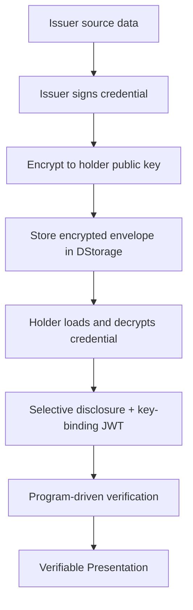

## What are AIR Credentials?

**AIR Credentials** are verifiable credentials that issuers sign with their own keys and that holders carry in their AIR Account to any app using AIR verification. Credential payloads are encrypted to the holder before storage, and AIR stores and routes only opaque ciphertext and metadata — it never sees the underlying data. Holders prove claims (such as age, qualifications, or affiliations) by disclosing only the fields a verifier requests. The result is privacy-preserving, issuer-sovereign identity.

## How it works at a glance

- **SD-JWT credentials.** Credentials use the `SD_JWT_VC` proof type by default: issuer-signed, selectively disclosable, and optionally bound to the holder's key. Verification checks a signature and hashes, so it is fast and runs off-chain. Iden3 credentials with zero-knowledge proofs are an [advanced option](/products/identity/credential-formats).
- **Issuer sovereignty.** Issuers control their own source data and signing keys through an Issuer Backend. The Issuer DID (`did:web:<your host>`) is published from the issuer's own domain and registered with AIR — AIR never holds issuer keys, signs on the issuer's behalf, or sees plaintext data.
- **Encrypted decentralized storage.** The issuer signs the credential, encrypts the payload to the holder's public key, and stores the encrypted envelope in DStorage, Moca Chain's decentralized storage layer. AIR acts as a blind facilitator — it stores and routes ciphertext and metadata, never plaintext.
- **Program-driven verification.** Verifiers configure a Verification Program that centrally controls the accepted format, requested claims, and selective disclosure. Successful verification returns a W3C Verifiable Presentation.
- **Fast.** Issuance and verification typically complete in ~1–4 seconds.

## The credential lifecycle

A credential goes through three phases:

1. **Issuance.** The issuer builds, signs, and encrypts the credential, then stores the encrypted envelope in DStorage.
2. **Storage.** AIR stores and routes the ciphertext and metadata. Only the holder can decrypt it.
3. **Verification.** The holder discloses only the fields a Verification Program requests, and the verifier receives a Verifiable Presentation to check.

<Note>
  Every issuance and verification call is authenticated with a Partner JWT, which AIR checks against a JWKS endpoint you host and register in the Developer Dashboard. None of these phases can run until that endpoint is live. See [JWKS endpoint setup](/get-started/authentication/jwks-endpoint).
</Note>

## Who's Who: Issuer, Holder, Verifier

|                 | **Issuer**                                                                                  | **Holder**                                                                                                        | **Verifier**                                                                                                                                                          |
| --------------- | ------------------------------------------------------------------------------------------- | ----------------------------------------------------------------------------------------------------------------- | --------------------------------------------------------------------------------------------------------------------------------------------------------------------- |
| **Role**        | The entity that creates and vouches for the verifiable credential.                          | The individual or entity that receives and stores the encrypted credential in their AIR Account.                  | The party that requests and checks for proof of specific claims or attributes.                                                                                        |
| **Key Actions** | Owns source data, signs and encrypts credentials                                            | Receives, holds, and presents credentials                                                                         | Configures verification programs and consumes proofs                                                                                                                  |
| **Details**     | The issuer structures the data, signs it with issuer-controlled keys, encrypts it to the holder, and stores the encrypted envelope in DStorage. | The holder receives an encrypted payload only they can decrypt, and controls how their credentials are shared. | Instead of accessing the full credential, the verifier receives only the claims it requested, signed by the issuer and bound to the holder. |
| **Examples**    | Universities, governments, protocols, DAOs, gaming platforms, community managers            | Students, citizens, gamers, employees, community members                                                          | Employers, service providers, event organizers, online platforms, access-controlled communities                                                                       |

## AIR as a blind facilitator

In the AIR model, the trust boundary sits with the issuer, not with AIR:

- Issuer user data remains with the issuer.
- The issuer signs credentials with issuer-controlled keys.
- Credential payloads are encrypted to the holder's public key before storage.
- AIR stores encrypted credential objects and metadata — not plaintext issuer data.
- Only the holder can decrypt the credential and generate proofs from it.

This keeps AIR out of the plaintext data path while still providing storage, routing, discovery, and program-driven verification.

## Choose your integration role

| Role | Primary integration | Notes |
| --- | --- | --- |
| **Issuer** | Issuer Backend + AIR Dashboard setup | Best path for on-demand issuance, privacy, revocation, and issuer-controlled data. |
| **Verifier** | Verification Program + AIR Verifier SDK | Verifiers use program-driven verification behavior. |
| **Issuer site** | Self-hosted frontend + AIR Issuer SDK | Recommended when issuers want full UX/auth control. |
| **Verifier site** | Self-hosted frontend + AIR Verifier SDK | Recommended when verifiers want full UX/auth control. |
| **Bulk migration** | Operational bulk import | For large backfills; coordinate early because it may require manual operations. |

## Issuer Process

1. Set up a Partner Account in the <a href="https://developers.sandbox.air3.com/dashboard" target="_blank" rel="noreferrer">Developer Dashboard</a>.
2. Deploy your issuer service and register its `did:web` Issuer DID with AIR. Because the DID is published from your domain with your keys, you own it — AIR does not generate it for you. Registering your DID enables credential services on your account.
3. Configure the supported signature type (`SD_JWT_VC`) and JWKS / key information.
4. Create or search for a relevant Credential Schema.
5. Create an issuance program.
6. Integrate an Issuer Backend that AIR calls through `available-vc` and `issue-vc` when your frontend calls `air.issueCredential` — or use [direct issuance](/products/identity/issuing-credentials#direct-issuance) when a backend event should issue without a user session.
7. Issue encrypted credentials to your users.

See [Issuing Credentials](/products/identity/issuing-credentials) for both the SDK and on-demand issuance paths.

## Verifier Process

1. Set up a Partner Account in the <a href="https://developers.sandbox.air3.com/dashboard" target="_blank" rel="noreferrer">Developer Dashboard</a>.
2. Configure General Partner settings and obtain a Verifier DID.
3. Search for relevant Credential Schemas and Issuers.
4. Create a Verification Program and configure the accepted proof type, requested claims, and selective disclosure.
5. Integrate the AIR Verifier SDK and start verification with a `programId` and a `nonce`.
6. On success, [verify the returned presentation on your backend](/products/identity/verify-sd-jwt).

See [Verifying Credentials](/products/identity/verify) for the full verifier integration.
