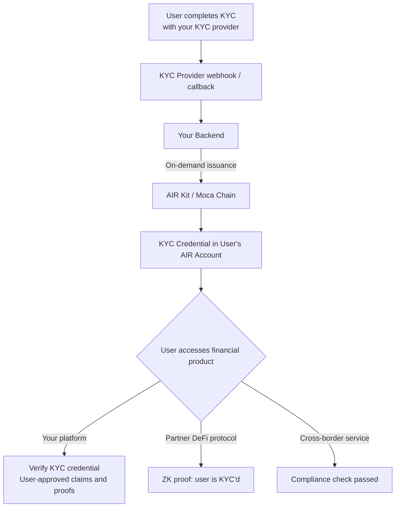

Traditional KYC and compliance verification requires every platform to collect, store, and protect sensitive personal data — creating liability, compliance risk, and repeated friction for users. AIR Kit lets you **issue a KYC credential once**, and any partner platform can verify it via zero-knowledge proof without ever accessing raw PII.

<Tabs>
<Tab title="For business">

## The Problem

Financial services carry the heaviest identity verification burden of any industry. Every new product, every new partner integration, every new regulatory jurisdiction demands another round of KYC — costs running $5–$50 per user, abandonment rates averaging 30%, and a growing database of sensitive documents that represents liability, not value.

## What Changes With AIR Kit

- **KYC costs fall per partner onboarded** — Your first KYC verification is the only one your customers need. Partners accept the credential, not a new document submission
- **Limit verifier data collection** — A ZK proof can confirm eligibility without disclosing identity documents. Programs may also request user-approved claims or CAK access; verifiers must protect the data they receive
- **Age and accreditation gates with limited disclosure** — Prove a user is 18+, 21+, or an accredited investor without disclosing the underlying values to the verifier
- **Cross-border compliance without bilateral agreements** — One KYC credential, presentable to partners across the Moca ecosystem. Partner acceptance depends on their regulatory requirements

## Specific Use Cases

**KYC Re-use Across Partners**
Your bank onboards a customer, passes KYC, issues a credential. That customer opens an account with a partner fintech. The partner verifies the credential in one SDK call — no new document submission, no re-KYC cost, no waiting period.

**DeFi and Financial Product Access**
Gate access to financial products, DeFi pools, or high-value transactions behind a KYC credential check. Users who have already verified are admitted instantly. Users who haven't are prompted to verify once.

**Accredited Investor Verification**
Issue an income or net worth attestation on your platform. Any partner offering private placements, alternative investments, or regulated financial products can verify it via ZK proof — without ever seeing the income figures.

**Age Gating**
Prove `isOver18` or `isOver21` without revealing the user's birthdate to the verifier. Regulatory requirements for age-restricted financial products are met without creating a new data storage obligation.

## What Compliance Will Ask

**Does this satisfy our AML/KYC obligations?**
Your KYC obligations remain with your KYC provider. AIR Kit converts the pass result into a portable credential — it does not replace or modify the KYC process itself.

**What does the credential contain?**
The schema defines the claims. For this example, use KYC level, provider name, pass date, country of verification, and boolean age checks. Raw source documents remain with the issuer. Encrypted credential payloads may be stored in DStorage, while users control decryption and disclosure.

**Who is liable if a credential is fraudulent?**
You, as the issuer, are responsible for the KYC process that underlies the credential — the same as today. AIR Kit provides the credential infrastructure; the compliance process is yours.

**Can we revoke credentials immediately?**
Issuers can revoke credentials. Subsequent verification checks reject the credential once the updated status is available. Revocation does not erase stored or previously disclosed data.

## Integration at a Glance

| | |
|---|---|
| **What your team builds** | One API call in your KYC webhook |
| **Engineering effort** | 1 backend engineer |
| **Timeline to live** | 2–3 weeks |
| **User flow changes** | None |
| **Partner integration** | 3 lines of SDK code |

<CardGroup cols={2}>
  <Card title="Compliance FAQ" icon="shield-check" href="/solutions/compliance-faq">
    Full regulatory and data handling answers.
  </Card>
  <Card title="Partner Economics" icon="coins" href="/solutions/partner-economics">
    Revenue model, fee structure, and rewards.
  </Card>
</CardGroup>

</Tab>
<Tab title="For developers">

## What You Can Build

- **KYC credentials** — Issue a verified identity attestation the moment a user passes KYC; partner platforms accept it without re-running the check
- **Income / accreditation proofs** — Issue an "Accredited Investor" credential backed by income verification, provable via ZK proof
- **Compliance gating** — Gate DeFi pools, financial products, or high-value transactions behind credential checks
- **Age verification** — Prove a user is 18+ or 21+ without revealing their birthdate to the verifier
- **Cross-border compliance** — One credential, accepted at every partner service in the ecosystem

## Architecture



## Recommended Schema

### KYC Attestation

```json
{
  "title": "KYC Attestation",
  "description": "Identity verification attestation — no raw PII included",
  "properties": {
    "kycLevel": {
      "type": "string",
      "enum": ["basic", "enhanced", "institutional"],
      "description": "Level of KYC verification completed"
    },
    "kycProvider": {
      "type": "string",
      "description": "Name of the KYC provider (e.g. 'Jumio', 'Onfido')"
    },
    "verifiedAt": {
      "type": "string",
      "format": "date-time"
    },
    "countryCode": {
      "type": "string",
      "description": "ISO 3166-1 alpha-2 country code"
    },
    "isOver18": {
      "type": "boolean"
    },
    "isOver21": {
      "type": "boolean"
    }
  },
  "required": ["kycLevel", "kycProvider", "verifiedAt", "isOver18"]
}
```

<Warning>
  Never include raw PII — full name, passport number, date of birth, address — in `credentialSubject`. Store only **attestations and derived facts**. ZK proofs let verifiers confirm `isOver18 === true` without seeing any underlying data.
</Warning>

## Implementation

### Step 1 — Issue KYC credential from your KYC webhook

```javascript
// kyc-webhook.js  — called when your KYC provider sends a completion event
const { getPartnerJwt } = require('./lib/jwt');
// issuer-controlled helpers backed by your signing keys
const { buildVc, signVc, encryptToHolder } = require('./lib/credential');

const BASE_URL = 'https://api.sandbox.mocachain.org/v1';

async function issueKycCredential({ userEmail, kycResult }) {
  if (kycResult.status !== 'APPROVED') return; // only issue on success

  const token = await getPartnerJwt();

  // Resolve the user's AIR Account
  const init = await fetch(`${BASE_URL}/auth/initialize-user`, {
    method: 'POST',
    headers: { 'Content-Type': 'application/json', 'x-partner-auth': token },
    body: JSON.stringify({ email: userEmail }),
  }).then((r) => r.json());

  // Build, sign (BJJ_SIG_2021), and encrypt the credential to the holder
  const schemaId = process.env.KYC_CREDENTIAL_ID;
  const vc = buildVc({
    holderDid: init.did,
    schemaId,
    credentialSubject: {
      kycLevel: kycResult.level,             // "basic" | "enhanced" | "institutional"
      kycProvider: 'YourKYCProvider',
      verifiedAt: new Date().toISOString(),
      countryCode: kycResult.countryCode,    // e.g. "US", "GB"
      isOver18: kycResult.age >= 18,
      isOver21: kycResult.age >= 21,
    },
  });
  const encrypted = encryptToHolder(signVc(vc), init.publicKey);

  // Store the encrypted envelope in DStorage
  const res = await fetch(`${BASE_URL}/dstorage/vcs`, {
    method: 'POST',
    headers: { 'Content-Type': 'application/json', 'x-partner-auth': token },
    body: JSON.stringify({
      holderDid: init.did,
      schemaId,
      expiresAt: vc.expirationDate,
      data: encrypted.encryptedData,
      iv: encrypted.iv,
      authTag: encrypted.authTag,
      encryptedKey: encrypted.dataEncPublicKey,
      externalId: vc.id,
    }),
  });
  if (!res.ok) throw new Error(`KYC credential issuance failed: ${res.status}`);
  return res.json(); // { storagePath }
}

// Express webhook endpoint
app.post('/webhooks/kyc', async (req, res) => {
  const { userEmail, kycResult } = req.body;
  await issueKycCredential({ userEmail, kycResult });
  res.json({ ok: true });
});
```

### Step 2 — Gate financial products with credential verification

```javascript
// fintech-gate.js  (frontend)
import { AirService } from '@mocanetwork/airkit';

import { AirService, BUILD_ENV } from "@mocanetwork/airkit";

const airService = new AirService({ partnerId: process.env.PARTNER_ID });
await airService.init({ buildEnv: BUILD_ENV.SANDBOX });

async function requireKyc() {
  const result = await airService.verifyCredential({
    programId: process.env.KYC_VERIFY_PROGRAM_ID,
    // Verifier program rule: kycLevel is "enhanced" or "institutional"
  });

  if (result.status !== 'COMPLIANT') {
    throw new Error('KYC_REQUIRED');
  }
  return result;
}

// Gate a high-value transaction
try {
  await requireKyc();
  proceedWithTransaction();
} catch (err) {
  if (err.message === 'KYC_REQUIRED') showKycOnboarding();
}
```

### Step 3 — Age verification gate (no birthdate exposed)

```javascript
// age-gate.js  (frontend)
async function requireAgeVerification() {
  const result = await airService.verifyCredential({
    programId: process.env.AGE_18_VERIFY_PROGRAM_ID,
    // Program checks: isOver18 === true  — verifier never sees the actual age/DOB
  });
  return result.status === 'COMPLIANT';
}
```

## Privacy Guarantee

A program configured for a ZK eligibility check can avoid disclosing raw KYC documents. Successful verification returns a Verifiable Presentation with user-approved claims and any required proof. Verifiers remain responsible for data they request and retain.

| What the Verifier Sees | What Stays Private |
|-----------------------|--------------------|
| `COMPLIANT / NON_COMPLIANT` | Full name, passport / ID number |
| Credential expiry date | Date of birth |
| KYC level (`basic` / `enhanced`) | Residential address |
| Issuer DID | Income figures, net worth |
| `isOver18: true` | Actual age |

## Examples

<CardGroup cols={2}>
  <Card title="KYC Passport — Issuer" icon="github" href="https://github.com/MocaNetwork/air-examples/tree/main/kyc-passport/issuer">
    KYC provider app: issues credentials once; user carries the proof to other platforms.
  </Card>
  <Card title="KYC Passport — Verifier" icon="github" href="https://github.com/MocaNetwork/air-examples/tree/main/kyc-passport/verifier">
    Lending platform app: verifies the credential and accepts the proof without re-running KYC.
  </Card>
  <Card title="ZK Age Verification — Issuer" icon="github" href="https://github.com/MocaNetwork/air-examples/tree/main/zk-age-verification/issuer">
    Identity provider app: issues age credential; user proves 18+ without revealing date of birth.
  </Card>
  <Card title="ZK Age Verification — Verifier" icon="github" href="https://github.com/MocaNetwork/air-examples/tree/main/zk-age-verification/verifier">
    iGaming platform app: verifies age-gate (e.g. 18+) via ZK proof; no birthdate disclosure required.
  </Card>
</CardGroup>

## Next Steps

<Columns cols={2}>
  <Card title="On-demand Issuance — Concepts" icon="book" href="/airkit/usage/credential/issuing-credentials#on-demand-issuance">
    On-demand issuance without user presence.
  </Card>
  <Card title="Architecture & Data Flow" icon="diagram-project" href="/learn/architecture">
    ZK proof flow end-to-end.
  </Card>
  <Card title="Partner Authentication" icon="key" href="/airkit/usage/partner-authentication">
    JWT signing setup for your backend.
  </Card>
  <Card title="Verifying Credentials" icon="shield-check" href="/airkit/usage/credential/verify">
    SDK verification reference.
  </Card>
</Columns>

</Tab>
</Tabs>
