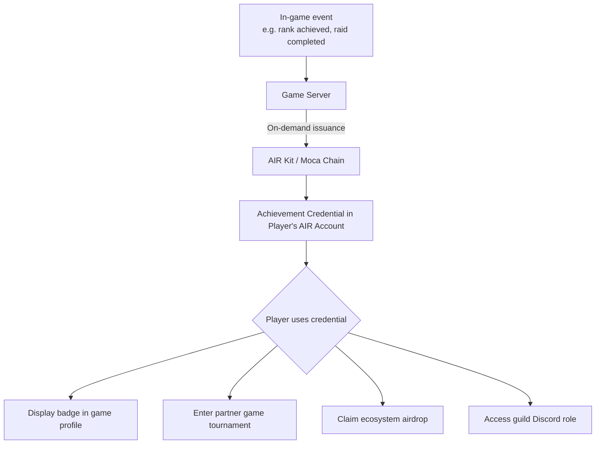

In gaming, players rebuild their reputation from zero every time they switch titles. AIR Kit lets you **make achievements, badges, and identities portable** — a player's rank in your game becomes a credential they carry to partner games, tournaments, communities, and airdrops.

<Tabs>
<Tab title="For business">

## The Problem

In gaming, players rebuild their reputation from zero every time they switch titles. A Diamond-ranked player in your game is nobody in the next one. Achievements don't transfer. Identities don't travel. Bot accounts create fake engagement metrics that poison every distribution event you run.

## What Changes With AIR Kit

- **Player achievements become portable** — A rank, badge, or title earned in your game is a verifiable credential the player carries to partner games, tournaments, and community platforms
- **Cross-game identity without account linking** — Players authenticate with their AIR Account in any game in the ecosystem. Same identity, no re-registration
- **Bot-resistant distribution** — Gate airdrops, whitelist spots, and in-game rewards to players who provably hold specific credentials — verified human, minimum playtime, achieved rank
- **Guild and DAO membership proofs** — Issue guild credentials that gate Discord roles, governance votes, and cross-game benefits without a separate verification tool

## How It Works

<Steps>
  <Step title="In-game event fires">
    A player reaches Diamond rank. Completes a raid. Achieves 100 hours of playtime. Your game server triggers the same event it always has.
  </Step>
  <Step title="Achievement credential issues automatically">
    Your backend calls AIR Kit with the achievement details. The credential lands in the player's AIR Account in the background. No wallet prompt, no UX interruption.
  </Step>
  <Step title="Player carries the credential anywhere">
    In tournament registration, partner game login, or airdrop claims — the player presents their credential. One tap. Verified instantly.
  </Step>
  <Step title="Partners verify with one call">
    Any partner game or platform calls one SDK method. They receive COMPLIANT or NON_COMPLIANT — plus the achievement tier. No account linking required.
  </Step>
</Steps>

## What Your Players Experience

Nothing changes at the moment of earning. The credential issues silently. Players see a notification: "You earned a Diamond Rank credential." When they arrive at a partner tournament or airdrop, they tap once to present it. No new account, no form, no ID.

## What Compliance Will Ask

**What data does the credential contain?**
Only game-specific identifiers and achievement facts: game ID, achievement name, tier, timestamp. No personal data, no real-world identity.

**Can players transfer or sell credentials?**
Credentials are tied to the user's AIR Account. They are not transferable — which is precisely what makes them useful for anti-cheat and anti-bot purposes.

**Do we need to change our terms of service?**
You are issuing your own achievement data in a portable format. No new data processing category is introduced. Review with your legal team for your jurisdiction, but in most cases this falls within existing gameplay data handling.

## Integration at a Glance

| | |
|---|---|
| **What your team builds** | One API call in your rank-up / achievement event handler |
| **Engineering effort** | 1 backend engineer |
| **Timeline to live** | 2–3 weeks |
| **Frontend changes** | None required for issuance |
| **Partner integration** | 3 lines of SDK to verify |

<CardGroup cols={2}>
  <Card title="Compliance FAQ" icon="shield-check" href="/solutions/compliance-faq">
    Data handling and GDPR answers.
  </Card>
  <Card title="Partner Economics" icon="coins" href="/solutions/partner-economics">
    Revenue model, fee structure, and rewards.
  </Card>
</CardGroup>

</Tab>
<Tab title="For developers">

## What You Can Build

- **Achievement badges** — Issue on-chain proof that a player reached Diamond rank, completed a raid, or earned a title
- **Cross-game identity** — Let players carry their AIR Account identity and credentials into any game in the Moca ecosystem
- **Anti-cheat / bot gating** — Verify a player holds a "verified human" or KYC credential before allowing tournament entry
- **Airdrop gating** — Reward only players who hold specific credentials (e.g. "played > 100 hrs", "held NFT for 90 days")
- **Guild / DAO membership** — Issue guild membership credentials that gate Discord roles, in-game benefits, and governance votes

## Architecture



## Recommended Schema

```json
{
  "title": "Game Achievement",
  "description": "On-chain proof of a player achievement or rank",
  "properties": {
    "gameId": {
      "type": "string",
      "description": "Unique identifier of the game"
    },
    "achievementId": {
      "type": "string",
      "description": "Unique identifier of the achievement"
    },
    "achievementName": {
      "type": "string",
      "description": "Display name — e.g. 'Diamond Rank Season 3'"
    },
    "tier": {
      "type": "string",
      "enum": ["Bronze", "Silver", "Gold", "Platinum", "Diamond"],
      "description": "Achievement tier"
    },
    "earnedAt": {
      "type": "string",
      "format": "date-time"
    },
    "season": {
      "type": "string",
      "description": "Game season, e.g. 'Season 3'"
    }
  },
  "required": ["gameId", "achievementId", "achievementName", "earnedAt"]
}
```

## Implementation

### Step 1 — Issue an achievement credential on rank-up

```javascript
// game-server.js
const { getPartnerJwt } = require('./lib/jwt');
// issuer-controlled helpers backed by your signing keys
const { buildVc, signVc, encryptToHolder } = require('./lib/credential');

const BASE_URL = 'https://api.sandbox.mocachain.org/v1';

async function issueAchievement({ playerEmail, achievement }) {
  const token = await getPartnerJwt();

  // Resolve the player's AIR Account
  const init = await fetch(`${BASE_URL}/auth/initialize-user`, {
    method: 'POST',
    headers: { 'Content-Type': 'application/json', 'x-partner-auth': token },
    body: JSON.stringify({ email: playerEmail }),
  }).then((r) => r.json());

  // Build, sign (BJJ_SIG_2021), and encrypt the credential to the holder
  const schemaId = process.env.ACHIEVEMENT_CREDENTIAL_ID;
  const vc = buildVc({
    holderDid: init.did,
    schemaId,
    credentialSubject: {
      gameId: process.env.GAME_ID,
      achievementId: achievement.id,
      achievementName: achievement.name,
      tier: achievement.tier,
      earnedAt: new Date().toISOString(),
      season: 'Season 3',
    },
  });
  const encrypted = encryptToHolder(signVc(vc), init.publicKey);

  // Store the encrypted envelope in DStorage
  const res = await fetch(`${BASE_URL}/dstorage/vcs`, {
    method: 'POST',
    headers: { 'Content-Type': 'application/json', 'x-partner-auth': token },
    body: JSON.stringify({
      holderDid: init.did,
      schemaId,
      expiresAt: vc.expirationDate,
      data: encrypted.encryptedData,
      iv: encrypted.iv,
      authTag: encrypted.authTag,
      encryptedKey: encrypted.dataEncPublicKey,
      externalId: vc.id,
    }),
  });
  if (!res.ok) throw new Error(`Achievement issuance failed: ${res.status}`);
  return res.json(); // { storagePath }
}

// Wire into your game's rank-up event system
gameEvents.on('player:rank_up', async ({ playerEmail, newRank }) => {
  await issueAchievement({
    playerEmail,
    achievement: {
      id: `rank-${newRank.toLowerCase()}`,
      name: `${newRank} Rank`,
      tier: newRank,
    },
  });
  console.log(`Achievement issued to ${playerEmail}: ${newRank}`);
});
```

### Step 2 — Gate tournament entry with credential check

```javascript
// tournament-gate.js  (frontend or server)
import { AirService } from '@mocanetwork/airkit';

import { AirService, BUILD_ENV } from "@mocanetwork/airkit";

const airService = new AirService({ partnerId: process.env.PARTNER_ID });
await airService.init({ buildEnv: BUILD_ENV.SANDBOX });

async function canJoinTournament() {
  const result = await airService.verifyCredential({
    programId: process.env.TOURNAMENT_VERIFY_PROGRAM_ID,
    // Verifier program rule: tier === "Diamond" AND gameId === process.env.GAME_ID
  });
  return result.status === 'COMPLIANT';
}

const eligible = await canJoinTournament();
if (!eligible) {
  showMessage('Reach Diamond rank to enter this tournament.');
}
```

### Step 3 — Cross-game SSO with AIR Account

Partner games authenticate using the same AIR Account — no new signup required.

```javascript
// partner-game.js  (any game integrating AIR Kit)
import { AirService } from '@mocanetwork/airkit';

const airService = new AirService({ partnerId: 'PARTNER_GAME_PARTNER_ID' });
await airService.init({ buildEnv: BUILD_ENV.SANDBOX });

await airService.login(); // player logs in with existing AIR Account
const user = await airService.getUserInfo();
// user.email is the same across all games — portable, unified identity
```

### Step 4 — Bot-resistant airdrop gating

Only distribute tokens to players who provably hold a real game achievement — filtered by verifiable credentials.

```javascript
// airdrop.js  (server-side)
async function getEligiblePlayers(allPlayers) {
  const eligible = [];
  for (const { email } of allPlayers) {
    // Verify each player against your achievement verification program.
    // In production, batch this with your own DB query first to reduce calls.
    const result = await verifyPlayer(email, process.env.ACHIEVEMENT_VERIFY_PROGRAM_ID);
    if (result.status === 'Compliant') eligible.push(email);
  }
  return eligible;
}
```

## Examples

<CardGroup cols={2}>
  <Card title="ZK Age Verification — Issuer" icon="github" href="https://github.com/MocaNetwork/air-examples/tree/main/zk-age-verification/issuer">
    Identity provider app: issues age credential; user proves 18+ without revealing date of birth.
  </Card>
  <Card title="ZK Age Verification — Verifier" icon="github" href="https://github.com/MocaNetwork/air-examples/tree/main/zk-age-verification/verifier">
    iGaming or age-gated app: verifies age via ZK proof and grants access; no PII received.
  </Card>
</CardGroup>

## Next Steps

<Columns cols={2}>
  <Card title="On-demand Issuance" icon="code" href="/airkit/usage/credential/issuance-api">
    Full endpoint reference and error codes.
  </Card>
  <Card title="Issuing Credentials (SDK)" icon="badge-check" href="/airkit/usage/credential/issuing-credentials">
    User-initiated issuance for in-game claim flows.
  </Card>
  <Card title="Schema Use Cases" icon="list" href="/airkit/usage/credential/schema-use-cases">
    More schema examples including event pass.
  </Card>
  <Card title="AIR for Ticketing & Events" icon="ticket" href="/solutions/ticketing">
    Attendance credentials for live events.
  </Card>
</Columns>

</Tab>
</Tabs>
