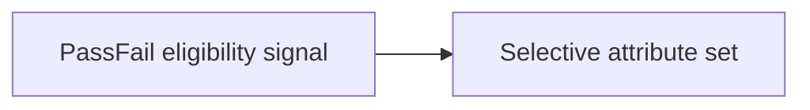

**Veriff powered by zkMe** is Moca Network's **on-chain IDV/KYC solution**. The bundled pipeline runs document, biometric, liveness, and AML checks; on success, **zkMe** issues a portable **AIR Credential** that any partner in the ecosystem can verify — without you running a separate KYC vendor procurement or holding raw identity data on your servers.

**Disclosure is configurable per verification program.** Verifiers can receive a simple pass/fail eligibility signal or a selective set of attributes.

---

## What the on-chain IDV/KYC bundle includes

- **Programmatic IDV** — including **zkPassport**-style NFC reading of ICAO-compliant electronic passports and national eIDs where supported, with **strong document authenticity** via NFC chip signatures — the same class of evidence as high-assurance eKYC, feeding whatever disclosure level your verification program defines.
- **Manual reverification** — if automated checks cannot reach a decision (poor NFC read, edge-case document, biometric mismatch), the case escalates to human review under the **Veriff powered by zkMe** operator workflow — the same review path as a classic eKYC session.
- **AML and sanctions screening** — bundled as part of the **on-chain IDV/KYC pipeline** (not optional add-ons you must source separately).
- **Face matching and liveness** — standard components of compliant identity verification.

---

## Disclosure flexibility

Each **verification program** in the Developer Dashboard defines what downstream verifiers receive. Typical patterns:

- **Pass/fail** — a single eligibility signal (for example **COMPLIANT** / **NON_COMPLIANT**) with no underlying document fields.
- **Selective disclosure** — an explicit subset of attributes (for example `kycLevel`, `isOver18`, country band) without sharing the full KYC packet.

For selective disclosure product detail on AIR Kit, see [Selective disclosure](/products/identity/selective-disclosure).

---

## Next steps

<CardGroup cols={2}>
  <Card title="How it works" icon="diagram-project" href="/solutions/kyc/how-it-works">
    Programmatic verification, manual fallback, AML, credential issuance, and verifier outcomes — end to end.
  </Card>
  <Card title="Data collection & sharing" icon="database" href="/solutions/kyc/data-collection-and-sharing">
    What is collected, what partners see, what lands on Moca Chain, and how disclosure modes work.
  </Card>
  <Card title="zkMe security architecture" icon="shield-halved" href="/solutions/kyc/zkme-security-architecture">
    zkPassport, zkVault, homomorphic face matching, and credential cryptography — in Moca context.
  </Card>
  <Card title="Pricing & FAQ" icon="circle-dollar" href="/solutions/kyc/pricing-and-faq">
    Per-check pricing, what is included, and how disclosure level is chosen per verification program.
  </Card>
</CardGroup>
