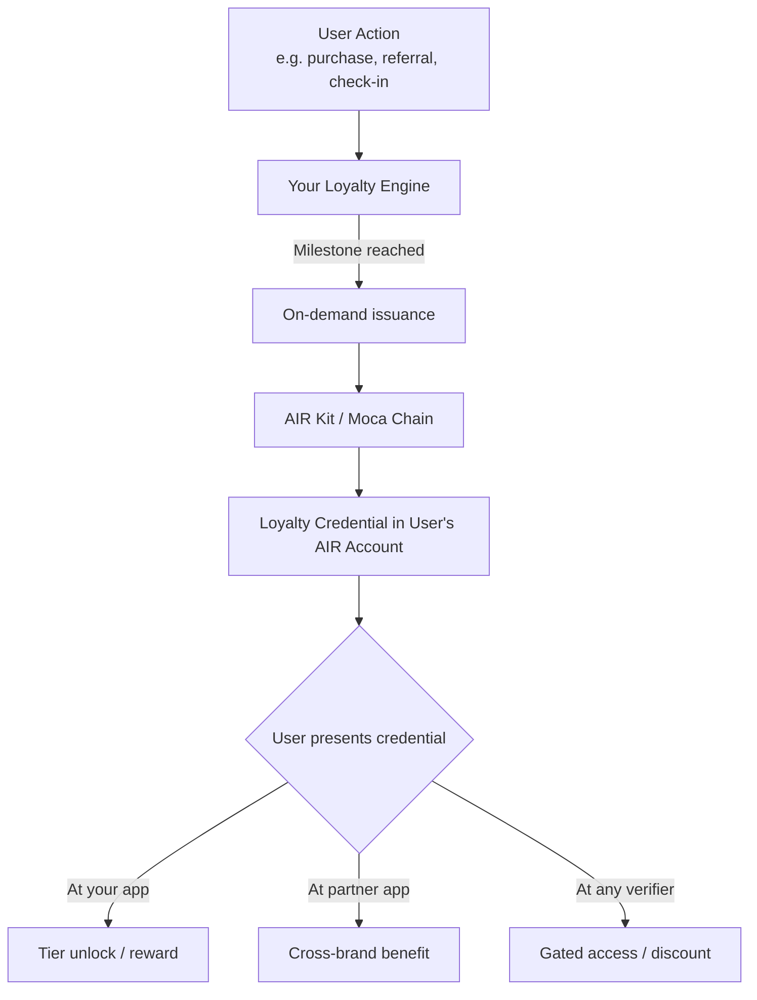

Loyalty programs today are siloed — a user's Gold status with one brand is invisible to another. AIR Kit lets you issue **verifiable loyalty credentials** that users carry in their AIR Account and present anywhere in the ecosystem, across brands, apps, and chains.

<Tabs>
<Tab title="For business">

## The Problem

Loyalty programs today are island economies. A customer's Gold status with your brand is invisible to every partner at the other end of their journey. Cross-brand benefits require bilateral API agreements between every pair of participating companies — expensive to build, fragile to maintain, and impossible to scale beyond a handful of partners.

The result: $100B in unredeemed loyalty points sitting in silos. Customers who don't bother earning because they can't use what they accumulate.

## What Changes With AIR Kit

- **Your customers carry their loyalty tier** — Gold earned with you is presentable at any partner in the Moca ecosystem, with no direct API between you and that partner
- **No bilateral integrations** — Partners verify the credential, not your API. You issue it once; every verifier accepts it
- **Zero friction for your existing pipeline** — Credentials issue automatically when your loyalty engine fires its existing events. No new user-facing flow required
- **Tier upgrades happen instantly** — When a customer reaches Platinum, the old credential is revoked and a new one issues. Partners see the current status, always
- **Retroactive migration** — Existing members can receive credentials in bulk. You don't start from zero users

## How It Works

<Steps>
  <Step title="Your loyalty engine fires an event">
    A customer reaches Gold. Your existing system triggers the same milestone event it always has — a database write, a webhook, an email. Nothing changes here.
  </Step>
  <Step title="AIR Kit issues a loyalty credential">
    Your backend makes one API call. A verifiable "Gold Member" credential lands in that customer's AIR Account. They don't need to open an app or take any action.
  </Step>
  <Step title="The customer presents the credential at a partner">
    At check-in, checkout, or app login at any partner in the ecosystem, the customer's credential is readable. No account linking. No API call to your platform.
  </Step>
  <Step title="The partner verifies — and gets only what they need">
    The partner's system calls one SDK method. A successful result includes a Verifiable Presentation. Configure the program to request only the tier information needed for the benefit, with the user's approval.
  </Step>
</Steps>

## What Your Users Experience

Nothing changes at the point of earning. Your app, your UX, your branding. The credential issues silently in the background.

At a partner: the customer authenticates with their AIR Account (the same login they use with you). The customer approves the requested disclosure, and the benefit unlocks after successful verification. No code to enter, no linking flow to complete.

## What Compliance Will Ask

**Do you store our customer data?**
Raw source documents remain with the issuer. Encrypted credential payloads may be stored in DStorage, while users control decryption and disclosure. Your schema determines the credential claims; for a tier check, include only the membership facts needed by partners.

**What happens when a customer closes their account?**
Revoke the credential so subsequent verification checks reject it once the revoked status is available. Handle deletion of source records, encrypted payloads, and previously disclosed data separately under your retention policy.

**Can partners see who our customers are?**
Partners receive the claims requested by their Verification Program and approved by the user. Request only tier status and expiry if that is all you need; credential and account identifiers may still link the interaction to a customer.

**Is this GDPR compliant?**
AIR Kit supports data minimisation through limited claims, encrypted storage, and user-controlled disclosure. Tier and status can still be personal data. Assess your implementation and handle deletion separately from revocation; see the [Compliance FAQ](/solutions/compliance-faq).

## Integration at a Glance

| | |
|---|---|
| **What your team builds** | One API call in your existing milestone event handler |
| **Engineering effort** | 1 backend engineer |
| **Timeline to live** | 2–4 weeks including testing |
| **Frontend changes** | None required |
| **What partners build** | 3 lines of SDK code to verify |

## Next Steps

<CardGroup cols={2}>
  <Card title="Compliance FAQ" icon="shield-check" href="/solutions/compliance-faq">
    Full GDPR, PII, and data residency answers.
  </Card>
  <Card title="Partner Economics" icon="chart-bar" href="/solutions/partner-economics">
    How the revenue model works for issuers and verifiers.
  </Card>
  <Card title="Talk to our team" icon="handshake" href="https://air3.com/partner-with-us">
    Start a partnership conversation.
  </Card>
</CardGroup>

</Tab>
<Tab title="For developers">

## What You Can Build

- **Tier credentials** — Issue a "Gold Member" or "VIP" badge that upgrades or revokes automatically as status changes
- **Milestone badges** — Issue a credential when a user reaches 1,000 points, 10 purchases, or any event-driven threshold
- **Cross-platform loyalty** — Allow partner apps to accept your loyalty credentials as proof of status, no API integration required
- **Zero-friction issuance** — Trigger credential issuance from your loyalty engine backend; the user doesn't need to open a wallet or take any action

## Architecture



## Recommended Schema

Create this schema in the [AIR Kit Dashboard](https://developers.sandbox.air3.com/dashboard) under **Issuer → Schema Builder**.

```json
{
  "title": "Loyalty Tier",
  "description": "Brand loyalty membership tier credential",
  "properties": {
    "tier": {
      "type": "string",
      "enum": ["Bronze", "Silver", "Gold", "Platinum"],
      "description": "Current loyalty tier"
    },
    "totalPoints": {
      "type": "number",
      "description": "Lifetime points accumulated"
    },
    "memberSince": {
      "type": "string",
      "format": "date",
      "description": "Date of first loyalty enrollment"
    },
    "brandId": {
      "type": "string",
      "description": "Issuing brand identifier"
    }
  },
  "required": ["tier", "totalPoints", "brandId"]
}
```

## Implementation

### Step 1 — Issue a loyalty credential on milestone

Use **On-demand issuance** to issue silently when a backend event fires. The user's session is not required.

```javascript
// loyalty-engine.js
const { getPartnerJwt } = require('./lib/jwt'); // see Partner Authentication
// issuer-controlled helpers backed by your signing keys
const { buildVc, signVc, encryptToHolder } = require('./lib/credential');

const BASE_URL = 'https://api.sandbox.mocachain.org/v1'; // swap for prod URL on launch

async function issueLoyaltyCredential({ userEmail, tier, totalPoints, memberSince }) {
  const token = await getPartnerJwt(); // JWT must include scope: "issue"

  // Resolve the member's AIR Account
  const init = await fetch(`${BASE_URL}/auth/initialize-user`, {
    method: 'POST',
    headers: { 'Content-Type': 'application/json', 'x-partner-auth': token },
    body: JSON.stringify({ email: userEmail }),
  }).then((r) => r.json());

  // Build, sign (BJJ_SIG_2021), and encrypt the credential to the holder
  const schemaId = process.env.LOYALTY_CRED_ID; // Dashboard → Issuer → Programs
  const vc = buildVc({
    holderDid: init.did,
    schemaId,
    credentialSubject: { tier, totalPoints, memberSince, brandId: process.env.BRAND_ID },
  });
  const encrypted = encryptToHolder(signVc(vc), init.publicKey);

  // Store the encrypted envelope in DStorage
  const res = await fetch(`${BASE_URL}/dstorage/vcs`, {
    method: 'POST',
    headers: { 'Content-Type': 'application/json', 'x-partner-auth': token },
    body: JSON.stringify({
      holderDid: init.did,
      schemaId,
      expiresAt: vc.expirationDate,
      data: encrypted.encryptedData,
      iv: encrypted.iv,
      authTag: encrypted.authTag,
      encryptedKey: encrypted.dataEncPublicKey,
      externalId: vc.id,
    }),
  });
  if (!res.ok) throw new Error(`Issuance failed: ${res.status}`);
  const { storagePath } = await res.json();
  return storagePath;
}

// Hook into your existing loyalty event pipeline
loyaltyEngine.on('tier:upgrade', async ({ userEmail, newTier, totalPoints }) => {
  const storagePath = await issueLoyaltyCredential({
    userEmail,
    tier: newTier,
    totalPoints,
    memberSince: new Date().toISOString().split('T')[0],
  });
  console.log(`Loyalty credential issued: ${storagePath}`);
});
```

### Step 2 — Verify loyalty tier at point of benefit

On your frontend, verify the user holds the required tier before granting access or rewards.

```javascript
// loyalty-gate.js  (frontend)
import { AirService } from '@mocanetwork/airkit';

import { AirService, BUILD_ENV } from "@mocanetwork/airkit";

const airService = new AirService({ partnerId: process.env.PARTNER_ID });
await airService.init({ buildEnv: BUILD_ENV.SANDBOX }); // or BUILD_ENV.PRODUCTION

async function checkLoyaltyTier() {
  const result = await airService.verifyCredential({
    programId: process.env.LOYALTY_VERIFY_PROGRAM_ID, // Dashboard → Verifier → Programs
  });
  // Your verifier program rule: tier === "Gold" (or higher)
  return result.status === 'COMPLIANT';
}

const hasGoldStatus = await checkLoyaltyTier();
if (hasGoldStatus) {
  unlockPremiumContent();
} else {
  showUpgradePrompt();
}
```

## Key Patterns

| Pattern | Reissue behavior | When to Use |
|---------|:-------------------:|-------------|
| Tier upgrade | Revoke + reissue | Always revoke old credential and issue new one |
| One-time milestone badge | Skip if exists | Don't re-issue if credential already held |
| Time-boxed VIP | Set `expirationDate` in subject | Seasonal or campaign-based access |
| Retroactive bulk issuance | Loop `issueLoyaltyCredential` | Migrating existing loyalty members |

## Issuance result

Issuance completes in ~1–4 seconds and returns a `storagePath` once the encrypted credential is stored in DStorage. Use that result to confirm success to the user — no status polling required. The credential is immediately available for the member to present at any verifier.

## Examples

<CardGroup cols={2}>
  <Card title="VIP Status Portability — Issuer" icon="github" href="https://github.com/MocaNetwork/air-examples/tree/main/vip-status-portability/issuer">
    Airline loyalty app: issues tier credential; user carries status to partner brands.
  </Card>
  <Card title="VIP Status Portability — Verifier" icon="github" href="https://github.com/MocaNetwork/air-examples/tree/main/vip-status-portability/verifier">
    Hotel chain app: verifies tier and grants equivalent perks (e.g. room upgrade, lounge).
  </Card>
</CardGroup>

## Next Steps

<Columns cols={2}>
  <Card title="On-demand Issuance — Concepts" icon="book" href="/airkit/usage/credential/issuing-credentials#on-demand-issuance">
    Understand when and why to use On-demand issuance.
  </Card>
  <Card title="On-demand Issuance — API" icon="code" href="/airkit/usage/credential/issuance-api">
    Full endpoint reference with error codes.
  </Card>
  <Card title="Schema Use Cases" icon="list" href="/airkit/usage/credential/schema-use-cases">
    More schema examples including membership and event pass.
  </Card>
  <Card title="Verifying Credentials" icon="shield-check" href="/airkit/usage/credential/verify">
    SDK verification flow reference.
  </Card>
</Columns>

</Tab>
</Tabs>
